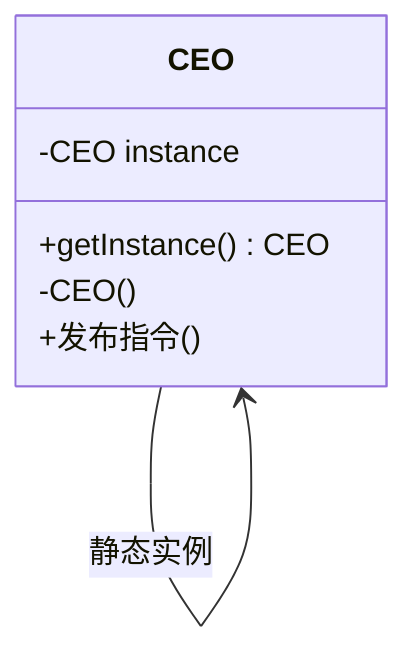
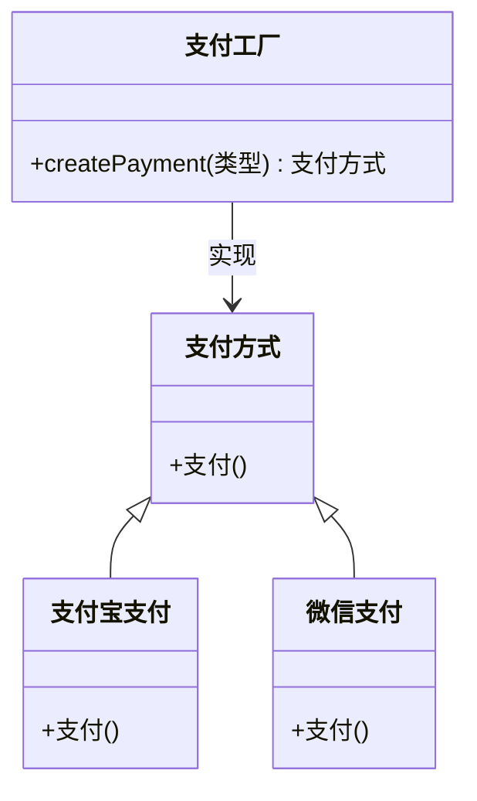
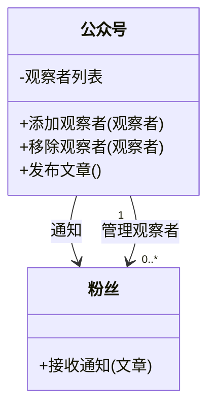

# Chapter 10: 设计模式

在前一章中，我们学习了**软件架构设计**，了解了如何像建筑师规划蓝图一样，设计软件系统的整体结构。但就像盖房子时，除了蓝图，还需要具体的工具（比如锤子、螺丝刀）来解决施工中的小问题，软件设计中也存在许多常见问题（如对象创建、类间通信），而**设计模式**就是解决这些问题的“工具箱”——它是经过验证的可重用解决方案，让代码更清晰、易维护。

## 10.1 为什么需要设计模式？

想象你要开发一个**在线书店系统**：  
- 需要确保“用户配置管理”类只有一个实例（避免多个实例导致数据混乱）；  
- 需要灵活创建不同类型的“支付方式”（如支付宝、微信支付），而不是硬编码；  
- 需要让“订单状态”变化时，自动通知“库存系统”和“用户APP”。  

如果没有设计模式，这些问题可能需要重复造轮子（比如每次都写单例代码），或者导致代码耦合（比如支付方式直接写在订单类里）。设计模式提供了现成的解决方案，像工具箱里的标准工具，帮你快速解决这些常见问题。

## 10.2 设计模式是什么？

根据源材料，设计模式是“解决常见软件设计问题的可重用方案，如同工具箱中的标准工具”。简单来说，它是对一类问题的通用解决方案，不是具体的代码，而是**思路**。比如：  
- 单例模式：确保一个类只有一个实例（解决“全局唯一对象”问题）；  
- 工厂模式：封装对象创建逻辑（解决“灵活创建对象”问题）；  
- 观察者模式：实现对象间松耦合通信（解决“状态变化通知”问题）。  

设计模式不是“必须用”，而是“用对了能省时间、降复杂度”。就像用锤子钉钉子，比用石头砸更高效。

### 10.2.1 设计模式的核心要素

每个设计模式都有四个关键部分，就像工具的“说明书”：  
1. **模式名称**：比如“单例模式”，方便记忆和交流；  
2. **问题**：它要解决什么场景（如“需要全局唯一对象”）；  
3. **解决方案**：如何实现（如“私有构造函数+静态实例”）；  
4. **效果**：用这个模式的好处（如“避免多实例导致的数据不一致”）。  

### 10.2.2 设计模式的分类

设计模式根据解决的问题分为三类，就像工具箱里的不同工具：  
- **创建型模式**：解决“如何创建对象”（如单例、工厂）；  
- **结构型模式**：解决“如何组织类和对象”（如适配器、装饰器）；  
- **行为型模式**：解决“如何通信”（如观察者、中介者）。  

## 10.3 常见设计模式示例：用例子理解

让我们通过三个简单模式，看看设计模式如何工作。

### 10.3.1 单例模式：确保“只有一个”  

**问题**：有些类需要全局唯一实例（如数据库连接池、日志管理器），多个实例会导致资源浪费或数据冲突。  
**解决方案**：让类自己控制实例创建，提供静态方法获取唯一实例。  
**例子**：公司的CEO只有一个，所有员工通过“CEO办公室”获取CEO的指令。  

**工作流程**：  
1. 类的构造函数设为私有（防止外部`new`）；  
2. 用静态变量存储唯一实例；  
3. 提供静态方法`getInstance()`返回实例。  

这样，无论多少地方调用`CEO.getInstance()`，得到的都是同一个CEO对象。

### 10.3.2 工厂模式：灵活创建对象  

**问题**：直接`new`对象会导致代码耦合（如`new 支付宝支付()`硬编码），更换支付方式需要修改多处代码。  
**解决方案**：用工厂类封装对象创建逻辑，客户端只需告诉工厂“需要什么”，工厂返回对应对象。  
**例子**：汽车工厂根据订单生产轿车、SUV，客户不用关心生产过程。  

**工作流程**：  
1. 定义“支付方式”接口（所有支付类实现它）；  
2. 创建“支付工厂”类，根据参数返回不同支付对象；  
3. 客户端调用`支付工厂.createPayment("支付宝")`，得到支付宝支付对象。  

这样，新增支付方式（如银联支付）只需新增类，无需修改工厂外的代码。

### 10.3.3 观察者模式：松耦合通知  

**问题**：对象状态变化时，需要通知多个相关对象（如订单状态变为“已发货”，通知库存和用户），硬编码会导致耦合（如订单类直接调用库存类）。  
**解决方案**：用“主题-观察者”模型，主题（被观察者）状态变化时，通知所有观察者。  
**例子**：公众号更新文章，所有粉丝（观察者）收到通知。  

**工作流程**：  
1. 公众号（主题）维护观察者列表；  
2. 粉丝（观察者）订阅公众号；  
3. 公众号发布文章时，遍历观察者列表，调用每个粉丝的`接收通知()`方法。  

这样，新增粉丝或公众号都不影响对方，实现松耦合。

## 10.4 设计模式与软件架构的关系

在第9章我们学了**软件架构设计**（如分层架构），而设计模式是架构的“细节工具”。比如：  
- 分层架构的“业务层”可能用工厂模式创建服务对象；  
- MVC架构的“模型-视图”通信用观察者模式。  

设计模式让架构更灵活，就像蓝图中的“水电管道设计”用标准工具实现。

## 10.5 使用设计模式的注意事项

设计模式不是“越多越好”，滥用会导致代码复杂。比如：  
- 简单类不需要用单例（如工具类用静态方法更合适）；  
- 小系统不用过度设计（如两个类通信不用中介者模式）。  

记住：**设计模式是解决问题的，不是增加复杂度的**。

## 总结

本章我们学习了设计模式，它是解决常见软件问题的“工具箱”，包括单例、工厂、观察者等模式。设计模式让代码更易维护、可复用，是面向对象设计的核心。就像盖房子时，工具箱里的锤子、螺丝刀帮你高效施工，设计模式帮你高效解决代码问题。

下一章我们将学习**企业应用集成**，了解如何让不同系统（如书店、支付、物流）协同工作。请继续阅读[企业应用集成](11_企业应用集成_.md)，探索系统间的“协作密码”！

---

Generated by [AI Codebase Knowledge Builder](https://github.com/The-Pocket/Tutorial-Codebase-Knowledge)