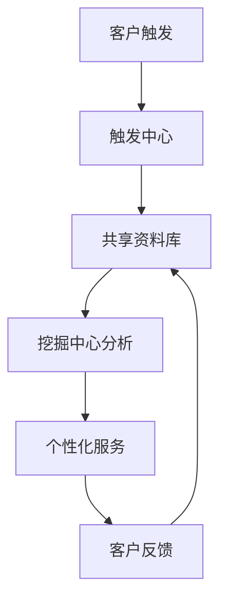

# Chapter 12: 客户关系管理

在上一章，我们学习了企业应用集成（EAI），了解了如何通过技术连接不同系统，消除“信息孤岛”。但系统连接后，如何让企业与客户的关系更紧密？比如，为什么有的公司客户愿意反复购买，而有的公司却不断流失客户？这就是本章要探讨的**客户关系管理（CRM）**——它像企业的“客户关系建筑师”，通过整合数据、优化流程，让企业与客户从“一次性交易”变成“长期伙伴”。

## 12.1 为什么需要客户关系管理？

想象一下，你是一家咖啡店的老板，顾客A经常来买拿铁，你知道他喜欢加双倍奶泡；顾客B是第一次来，你不知道他的偏好。如果用CRM，系统会记录顾客A的喜好，下次他来时，店员直接说“您的双倍奶泡拿铁好了”，顾客B则推荐热门的焦糖玛奇朵。这样的个性化服务，会让顾客A更忠诚，顾客B更愿意再次光顾。

CRM的核心问题就是：**如何通过数据和分析，让每个客户得到专属服务，从而提高满意度、保留客户，最终让企业盈利**。源材料中提到：“CRM的目标不仅要使业务流程自动化，而且要确保前台应用系统能够改进客户满意度、增加客户忠诚度，以达到使企业获利的最终目标。” 这句话点出了CRM的终极目标——**用客户关系赚钱**。

## 12.2 客户关系管理是什么？

根据源材料，CRM是“**管理企业与客户互动的策略和系统，旨在提高客户满意度和忠诚度**”。它不是单一软件，而是**理念+系统+流程**的结合：

- **理念**：以客户为中心，把客户当作“伙伴”而非“交易对象”；
- **系统**：整合销售、营销、服务数据的软件（比如 Salesforce、国内的企业微信CRM）；
- **流程**：重构客户互动的流程（比如从“被动响应”到“主动关怀”）。

简单来说，CRM就像企业的“客户档案库”，记录客户的购买历史、偏好、投诉记录，让每个员工都能快速了解客户，提供一致的服务。

## 12.3 CRM的核心内容：四大支柱

CRM不是空泛的概念，它有四大核心功能，就像房子的四根柱子，支撑起客户关系：

### 1. 客户服务：留住客户的“第一道门”
客户服务是CRM的关键，因为“68%的客户离开厂家是因为得不到令人满意的客户服务”（源材料数据）。传统客服可能只通过电话，但现在CRM整合了多种渠道：电话、邮件、网页、APP，甚至社交媒体。比如，当你用APP咨询客服，系统会自动调出你的购买记录，客服能快速回答“您上次的订单是XX，需要帮忙吗？”

源材料中提到：“客户服务已经超出传统的帮助平台，‘客户关怀’的术语如今用来拓展企业对客户的职责范围。” 这意味着，客服不仅要解决问题，还要主动关怀——比如在你生日时发送优惠券，或者在你购买后一周内询问使用体验。

### 2. 市场营销：精准吸引客户的“魔法棒”
市场营销不再是“大海捞针”，而是“精准打击”。CRM通过分析客户数据，实现**个性化营销**：比如，根据你的购买历史，推荐你可能喜欢的商品（比如买手机的客户，推荐耳机、手机壳）。源材料中提到：“个性化需求很快成为营销规范，客户的喜好和购买习惯都被列入商家关注的重点。” 比如，电商网站根据你的浏览记录，在首页展示“猜你喜欢”的商品，这就是CRM的市场营销功能。

### 3. 共享的客户资料库：消除“数据孤岛”
如果销售部有客户信息，客服部没有，就会导致客户重复询问，体验差。CRM的共享资料库整合了所有部门的客户数据（比如销售部的购买记录、客服部的投诉记录），让每个部门都能看到完整的客户画像。源材料中强调：“动态的、能够被不同部门共享的客户资料库则是企业的一种宝贵资源，同时，它也是CRM的基础和依托。” 比如，销售部知道客户A喜欢加奶泡，客服部就能在客户咨询时主动提供这个信息。

### 4. 分析能力：挖掘客户价值的“显微镜”
CRM不是只记录数据，还要**分析数据**。比如，通过分析客户的购买频率、金额，识别“高价值客户”（比如每月买1000元商品的客户），然后给予专属优惠，提高他们的忠诚度。源材料中提到：“CRM的一个重要方面在于它具有使客户价值最大化的分析能力。” 比如，银行通过分析客户的交易数据，发现某客户经常购买理财产品，就推荐更高收益的产品，增加客户价值。

## 12.4 CRM的解决方案：触发中心与挖掘中心

CRM的实现分为两部分，就像“客户互动的输入和输出”：

- **触发中心**：客户通过多种方式（电话、网页、邮件）联系企业，触发互动。比如，你通过APP下单，就是触发了订单系统；
- **挖掘中心**：分析触发中心收集的数据，提供个性化服务。比如，系统分析你的购买历史，推荐相关商品。

用mermaid画流程图，更直观：

举个例子：你通过网页下单（触发中心），系统记录你的订单（共享资料库），挖掘中心分析你的购买历史（比如你经常买运动鞋），然后推荐运动袜（个性化服务）。你收到推荐后，可能再次购买（客户反馈），系统更新你的资料库，下次推荐更精准。

## 12.5 CRM的价值：为什么企业要投入？

CRM不是“锦上添花”，而是“生存必需”。源材料中提到：“企业80%的收入来源于老客户”，而CRM能帮助保留老客户、吸引新客户：

- **提高满意度**：个性化服务让客户感觉“被重视”，比如店员记住你的喜好；
- **降低营销成本**：精准营销比“广撒网”更有效，比如只给高价值客户发优惠券，而不是所有人；
- **增加交叉销售**：比如买手机的客户，推荐耳机、手机壳，提高单客收入；
- **简化流程**：自动化的客户服务（比如自助查询订单）减少人工成本。

## 12.6 常见误解：CRM不是“万能药”

- **误解1**：“CRM只是软件，买来就能用”。实际上，CRM需要企业全员参与——从管理层到一线员工，都要接受“以客户为中心”的理念，否则软件再好也没用；
- **误解2**：“CRM只适合大企业”。中小企业也能用CRM，比如用企业微信的CRM功能，记录客户信息，提高服务效率；
- **误解3**：“CRM能解决所有客户问题”。CRM是工具，不是魔法，它需要结合实际业务流程，比如客服的响应速度还取决于员工培训。

## 检查你的理解
1. CRM的核心目标是什么？它如何帮助企业盈利？
2. CRM中的“触发中心”和“挖掘中心”分别负责什么？
3. 为什么说“共享的客户资料库”是CRM的基础？

## 结论

本章我们学习了客户关系管理：它是连接企业与客户的“桥梁”，通过整合数据、优化流程，让每个客户得到专属服务，从而提高满意度、保留客户，最终让企业盈利。理解CRM，能帮你明白为什么有的公司客户忠诚度高，有的却不断流失——关键在于是否用数据“懂”客户。

下一章我们将进入**知识管理与商业智能**，了解如何通过数据分析和知识共享，让企业做出更明智的决策。请继续阅读[第十三章：知识管理与商业智能](13_知识管理与商业智能_.md)。

---

Generated by [AI Codebase Knowledge Builder](https://github.com/The-Pocket/Tutorial-Codebase-Knowledge)