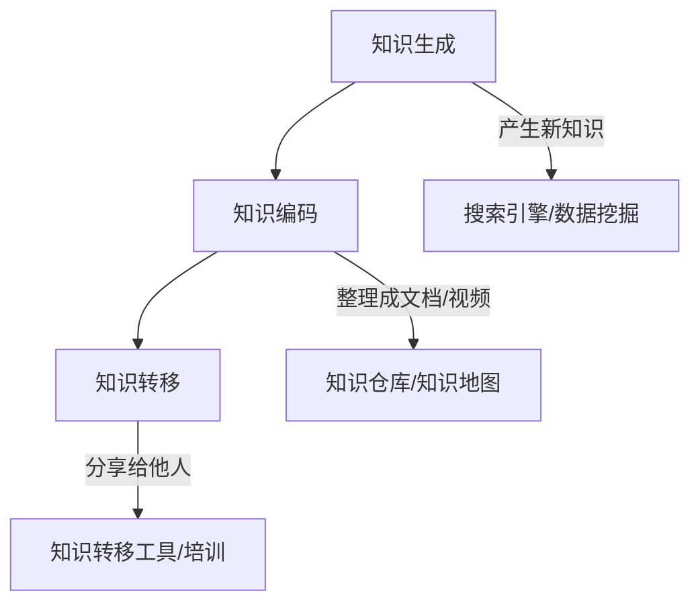
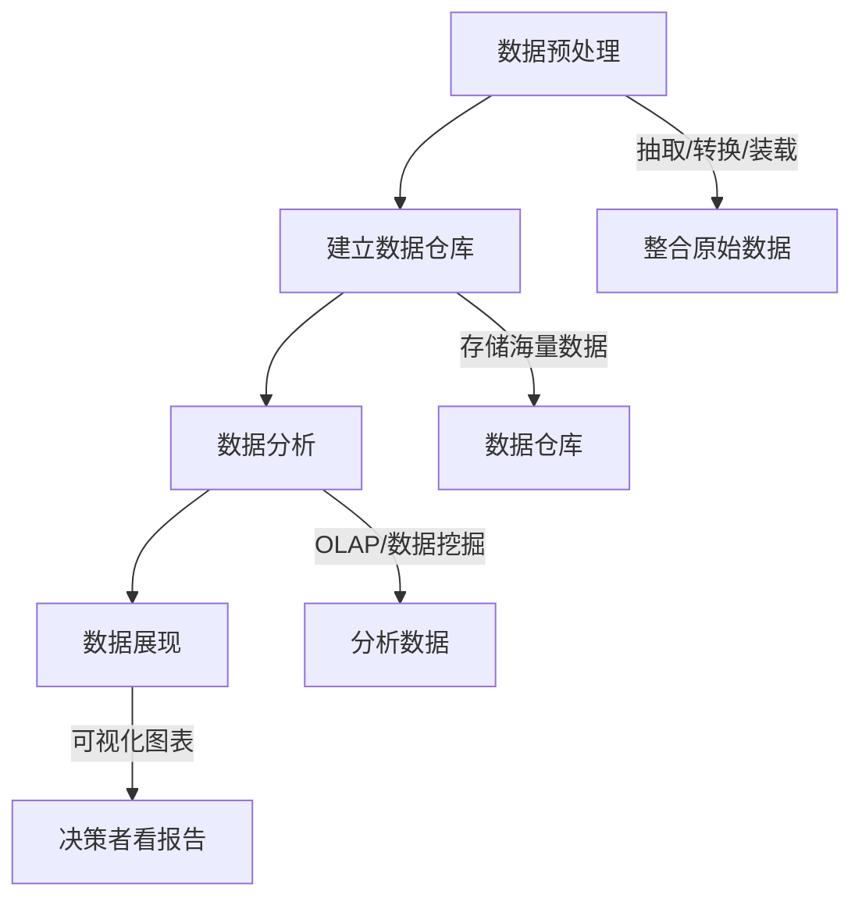

# Chapter 13: 知识管理与商业智能

在上一章，我们学习了客户关系管理（CRM），了解了如何通过整合数据提升客户满意度。但企业要持续发展，不仅需要管理客户，还需要管理内部的“知识”——比如员工的经验、市场数据、技术文档，以及如何从这些知识中提取“智慧”来做决策。这就是本章要探讨的**知识管理与商业智能**。

## 13.1 为什么需要知识管理与商业智能？

想象一下，你是一家科技公司，员工A有解决某类技术问题的经验（比如“如何优化数据库查询速度”），但员工A离职后，没人知道这个经验，导致新员工重复踩坑；或者，公司有大量销售数据，但没人分析，不知道“哪个区域的客户最愿意买新产品”。这些问题，知识管理和商业智能就能解决：

- **知识管理**：把员工的“隐性知识”（脑子里的经验）变成“显性知识”（文档、视频），让更多人能用；
- **商业智能**：把海量的业务数据（销售、库存）变成“洞察”（比如“上季度华东区销量增长20%”），帮助决策者做更明智的选择。

简单来说，知识管理是“存知识”，商业智能是“用知识”，两者结合让企业从“凭经验做事”变成“凭数据决策”。

## 13.2 知识管理：企业的“知识库”

知识管理不是简单的“建个文档库”，而是**系统化地收集、分享、利用知识**。根据源材料，知识管理是“在组织中建构一个人文与技术兼备的知识系统，让组织中的信息与知识，通过获得、创造、分享、整合、记录、存取、更新等过程，实现不断创新”。

### 13.2.1 知识的两种类型
知识分为**隐性知识**和**显性知识**：
- **隐性知识**：员工脑子里的经验，比如“如何安抚难缠的客户”“调试代码的技巧”，很难直接记录；
- **显性知识**：能被记录的知识，比如文档、视频、数据，比如“客户服务手册”“产品说明书”。

知识管理的目标，就是把隐性知识变成显性知识，避免“老员工离职，知识就没了”的情况。比如，员工A把“如何优化数据库查询”的经验写成文档，存到知识库，新员工就能直接学习，不用重复试错。

### 13.2.2 知识管理的生命周期
知识管理就像“知识的一生”，分为三个阶段：生成、编码、转移。用mermaid画流程图更直观：

- **知识生成**：产生新知识，比如通过数据挖掘发现“用户喜欢买手机壳”，或者员工A总结“调试代码的技巧”；
- **知识编码**：把知识整理成结构化的形式，比如写成文档、做成视频，或者存到知识仓库（像企业的“知识图书馆”）；
- **知识转移**：让知识被更多人使用，比如通过培训、内部论坛，或者知识地图（告诉你“谁懂这个知识”）。

### 13.2.3 知识管理的工具
知识管理需要工具支持，比如：
- **知识生成工具**：搜索引擎（帮你找到需要的信息）、数据挖掘（从数据中发现规律）；
- **知识编码工具**：知识仓库（存文档、视频）、知识地图（展示“谁懂什么”）；
- **知识转移工具**：内部论坛（员工分享经验）、培训系统（把知识教给新员工）。

比如，公司用知识仓库存“客户服务技巧”文档，新员工入职时，通过培训系统学习这些文档，就能快速掌握服务技巧。

## 13.3 商业智能：数据的“侦探”

商业智能（BI）不是“做报表”，而是**从数据中提取洞察，帮助决策**。根据源材料，“商业智能是企业对商业数据的搜集、管理和分析的系统过程，目的是使企业的各级决策者获得知识或洞察力”。

### 13.3.1 商业智能的流程
商业智能的流程分为四个步骤，就像“把数据变成决策”的过程：

1. **数据预处理**：把原始数据（比如销售系统的订单数据、库存系统的库存数据）整合起来，比如把“订单表”和“库存表”合并，方便分析；
2. **建立数据仓库**：把预处理后的数据存到“数据仓库”（像企业的“数据图书馆”），支持海量数据的存储和查询；
3. **数据分析**：用两种技术分析数据：
   - **OLAP（联机分析处理）**：像“数据切片”，比如从“时间、区域、产品”三个维度分析销量，比如“上季度华东区手机销量是多少”；
   - **数据挖掘**：像“数据侦探”，发现隐藏的规律，比如“买手机的客户常买手机壳”（关联分析）；
4. **数据展现**：把分析结果变成可视化图表（比如柱状图、饼图），让决策者能快速看懂，比如“上季度华东区销量增长20%”用柱状图展示。

### 13.3.2 商业智能的例子
电商公司用商业智能分析用户购买记录，发现“买手机的客户常买手机壳”，于是：
- 在手机产品页推荐手机壳；
- 给买过手机的客户发优惠券，鼓励他们买手机壳；
- 结果，手机壳的销量增长了30%。

这就是商业智能的价值——把数据变成“能赚钱的洞察”。

## 13.4 知识管理与商业智能的关系：从“存知识”到“用知识”

知识管理和商业智能不是孤立的，而是**互补的**：
- 知识管理把员工的“隐性知识”（比如“如何推荐手机壳”）变成“显性知识”（比如“推荐手机壳的技巧文档”）；
- 商业智能把“显性知识”和“业务数据”（比如销售数据）结合起来，分析出“推荐手机壳能提高销量”。

比如，员工A总结“推荐手机壳的技巧”（知识管理），商业智能分析销售数据，发现“推荐手机壳后，客户满意度提高了15%”（商业智能），这样企业就能推广这个技巧，提高整体业绩。

## 13.5 常见误解：别踩这些坑

- **误解1**：“知识管理就是建个文档库”。其实，知识管理还需要“让员工愿意分享”——比如通过奖励机制，鼓励员工写文档；
- **误解2**：“商业智能就是做报表”。其实，商业智能的核心是“预测未来”——比如通过数据挖掘，预测“下季度哪个产品会卖得好”；
- **误解3**：“知识管理和商业智能是两个独立的东西”。其实，它们是“存知识”和“用知识”的关系，缺一不可。

## 检查你的理解
1. 知识管理和商业智能的区别是什么？举例说明。
2. 商业智能的流程中，数据挖掘的作用是什么？请举一个生活中的例子。
3. 为什么说“知识管理是商业智能的基础”？

## 结论

本章我们学习了知识管理与商业智能：知识管理是“存知识”，把员工的隐性知识变成显性知识；商业智能是“用知识”，从数据中提取洞察帮助决策。两者结合，让企业能更聪明地做事——比如通过分析数据预测市场，通过知识共享提高效率。

下一章我们将进入**信息安全**，了解如何保护企业的数据和知识，避免被泄露或攻击。请继续阅读[第十四章：信息安全](14_信息安全_.md)。

---

Generated by [AI Codebase Knowledge Builder](https://github.com/The-Pocket/Tutorial-Codebase-Knowledge)