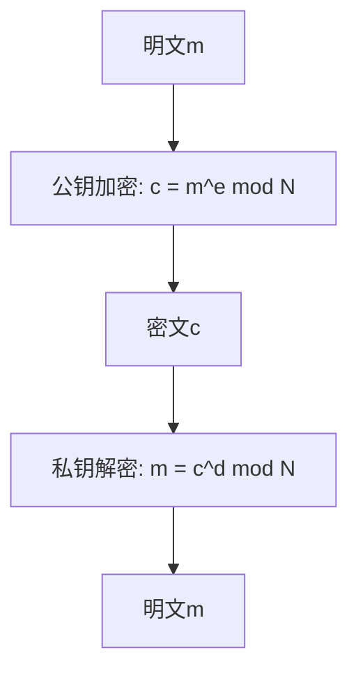
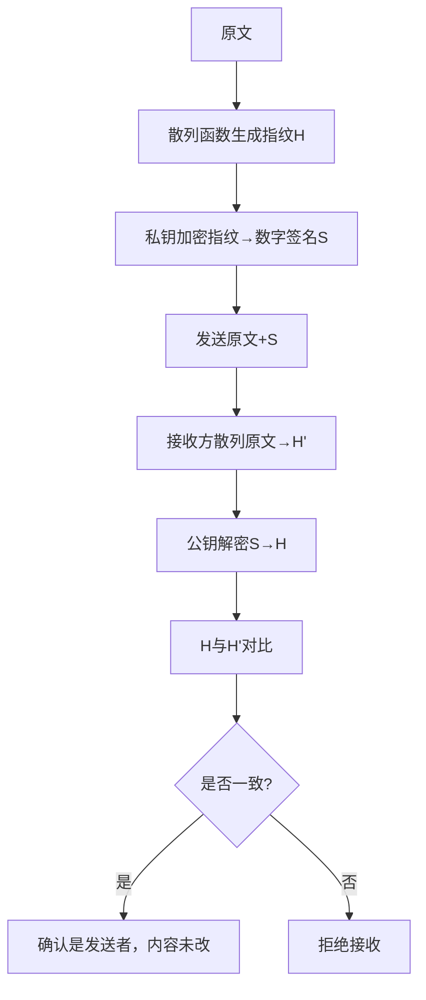
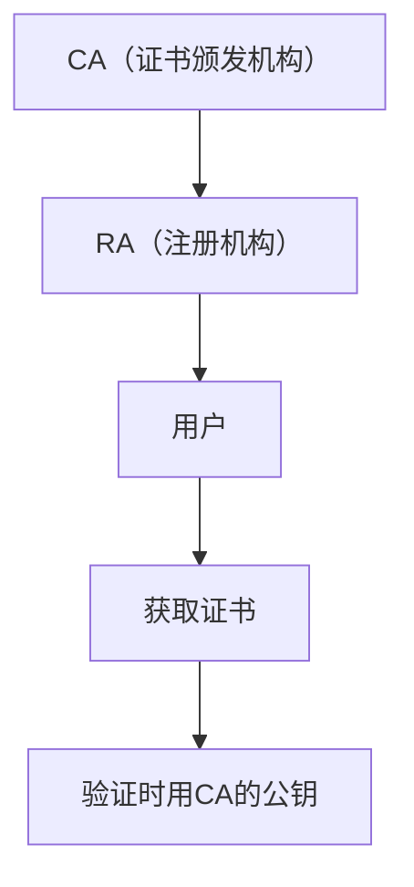

# Chapter 14: 信息安全

在上一章，我们学习了知识管理与商业智能，了解了如何通过数据分析和知识共享让企业更聪明地决策。但数据越多，风险也越大——比如黑客攻击、数据泄露、信息篡改，这些都会给企业带来巨大损失。那么，如何保护这些宝贵的数据和系统呢？这就是本章要探讨的**信息安全**，它像一把“数字盾牌”，守护着我们的数据和系统。

## 14.1 为什么需要信息安全？

想象一下，你是一家电商公司的老板，客户数据（比如购买记录、地址）被黑客窃取，可能导致客户流失；或者订单金额被篡改，导致财务损失。这些场景，信息安全都能解决。源材料中提到：“随着科技进步，网络攻击和入侵事件与日俱增，重要机构的信息系统遭黑客袭击的事件时有发生，给企业带来巨大经济损失。” 信息安全的核心目标，就是**让数据“只被授权的人访问，不被篡改，不被泄露”**。

## 14.2 信息安全是什么？

根据源材料，信息安全是“**保护数据和系统免受未经授权访问、破坏或泄露的措施，如同为数字资产设置多层防护**”。它包含四个关键属性，就像房子的“四扇门”，缺一不可：

| 属性       | 说明                                                                 | 例子                                                                 |
|------------|----------------------------------------------------------------------|----------------------------------------------------------------------|
| 保密性     | 确保数据不被未经授权的第三方获取                                       | 你的银行密码只有你能知道，别人无法查看                                 |
| 完整性     | 确保数据不被非法改动或删除                                             | 转账金额不能被黑客改成“100万”，必须是正确的金额                         |
| 真实性     | 确认信息发送者的身份，保证可信度                                       | 银行发来的短信，你能确认是银行发的，不是骗子                           |
| 占有性     | 保护存储数据的介质（比如硬盘、手机）不被盗用或窃取                       | 你的手机别被偷，否则里面的数据可能泄露                                 |

## 14.3 信息安全的“武器库”：关键技术与概念

信息安全不是单一技术，而是**加密、签名、证书**等技术的组合。下面我们逐一拆解，用简单例子理解：

### 14.3.1 加密与解密：数据的“隐形术”

加密就像给数据“穿隐形衣”，让未经授权的人看不懂。源材料中提到：“加密技术源远流长，通过对明文进行变换得到密文，解密则是还原明文。” 加密分为两种：

#### 1. 对称加密：用同一个密钥“锁”和“开”
对称加密就像用同一把钥匙锁门和开门——加密和解密用同一个密钥。比如，你用密钥“123”加密邮件，对方也用“123”解密。常见的对称算法有DES、IDEA。

**例子**：DES算法把明文分成64位一段，用密钥生成子密钥，经过16轮迭代加密，得到密文。解密时用相反的子密钥顺序，就能还原明文。

#### 2. 非对称加密：用“公钥”锁，“私钥”开
非对称加密像“公开的锁”和“私有的钥匙”——公钥公开，私钥自己保存。比如，你用对方的公钥加密邮件，只有对方的私钥能解密。常见的非对称算法有RSA（源材料重点介绍）。

**RSA加密流程**（源材料中的例子）：
- 明文`m`（比如“转账100元”）→ 用公钥`(N, e)`加密 → 密文`c = m^e mod N`；
- 密文`c` → 用私钥`(N, d)`解密 → 明文`m = c^d mod N`。

用mermaid画流程更直观：

### 14.3.2 数字签名：信息的“身份证明”

数字签名就像“电子盖章”，确保信息是发送者本人发的，且内容没被改。源材料中提到：“数字签名可以实现对原始信息完整性的鉴别和发送方发送信息的不可抵赖性。” 它的流程是：

1. 发送者用**散列函数**（比如MD5）生成信息的“指纹”（消息摘要）；
2. 用自己的**私钥**加密这个指纹，得到数字签名；
3. 把信息原文和数字签名一起发给接收者；
4. 接收者用发送者的**公钥**解密签名，得到指纹；
5. 接收者自己算信息的指纹，对比是否一致——一致则说明是发送者发的，且内容没改。

**例子**：你发邮件给朋友，用私钥签个名，朋友用你的公钥验证，确认是你发的，且邮件内容没被改。

用mermaid画流程：

### 14.3.3 数字证书：公钥的“信任证明”

非对称加密中，公钥需要公开，但怎么确保公钥是真的？比如，黑客可能冒充银行，发假的公钥。这时，**数字证书**就派上用场了——它由权威机构（CA）颁发，证明公钥属于谁。

**例子**：你访问银行网站，网站有CA颁发的证书，你验证后知道这是真银行，不是钓鱼网站。源材料中提到：“数字证书提供了一个在公钥和拥有相应私钥的实体之间建立关系的机制，PKI（公开密钥基础设施）是管理证书的系统。”

用mermaid画PKI结构：

## 14.4 常见误解：别踩这些坑

- **误解1**：“加密算法公开就不安全”。源材料中强调：“现代密码系统中，算法本身公开，安全依赖于密钥保密。” 比如，RSA算法公开，但私钥只有你自己知道，别人无法破解。
- **误解2**：“数字签名只是‘盖章’，没用”。实际上，数字签名能防止篡改和抵赖——比如你签了合同，不能否认自己签过。
- **误解3**：“信息安全是IT部门的事”。其实，信息安全需要全员参与——比如不点击不明链接，不泄露密码，都是保护信息安全的一部分。

## 14.5 信息安全的价值：为什么企业要投入？

源材料中提到：“信息安全确保数据的保密性、完整性和可用性，是现代信息系统的关键保障。” 它的价值包括：
- **保护资产**：防止数据泄露（比如客户信息），避免经济损失；
- **维护信任**：比如银行有安全措施，客户更愿意存款；
- **合规要求**：比如《电子签名法》规定，可靠的电子签名与手写签名有同等法律效力，信息安全是基础。

## 检查你的理解
1. 信息安全的四大属性是什么？请举例说明。
2. 对称加密和非对称加密的区别是什么？分别在什么场景下使用？
3. 数字签名如何保证信息不被篡改？

## 结论

本章我们学习了信息安全：它是保护数据的“数字盾牌”，通过加密、签名、证书等技术，确保数据的保密性、完整性、真实性和占有性。理解信息安全，能帮你明白为什么企业要重视数据保护，以及如何用技术手段防范风险。

下一章我们将进入**系统可靠性**，了解如何让系统稳定运行，避免崩溃。请继续阅读[第十五章：系统可靠性](15_系统可靠性_.md)。

---

Generated by [AI Codebase Knowledge Builder](https://github.com/The-Pocket/Tutorial-Codebase-Knowledge)