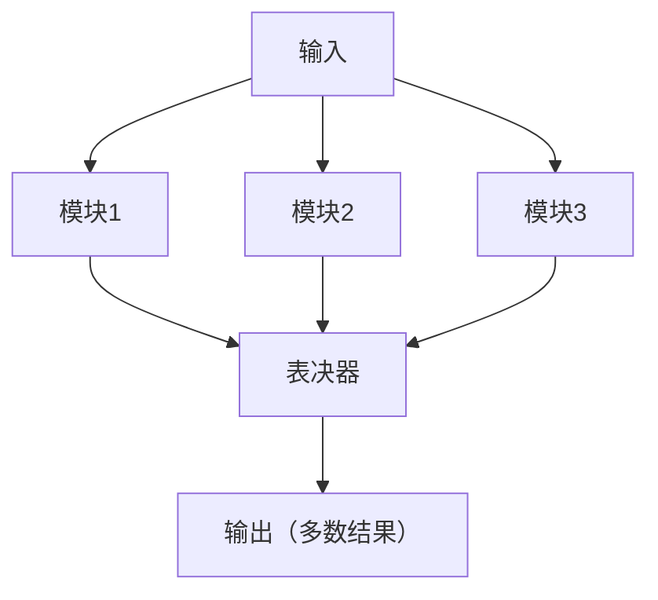

# Chapter 15: 系统可靠性


```markdown
# 第15章：系统可靠性

在上一章，我们学习了信息安全，了解了如何保护数据和系统免受攻击。但即使系统安全，如果它经常崩溃或无法正常工作，也会给企业带来巨大损失。比如，银行系统如果突然宕机，客户无法转账，不仅影响业务，还会失去信任。那么，如何让系统像“永不疲劳的工人”一样稳定运行呢？这就是本章要探讨的**系统可靠性**——它像系统的“健康保障”，确保系统在需要时能持续提供服务。


## 15.1 为什么需要系统可靠性？

想象一下，你是一家电商公司的老板，双11大促时，系统突然崩溃，导致客户无法下单，损失可能高达百万。而另一家公司用了可靠性技术，系统在高峰期依然稳定运行，销量翻倍。这两种情况的区别，就在于系统可靠性。源材料中提到：“系统的可靠性是系统在指定条件下持续正常运行的能力，如同设备的耐用性。” 它的核心问题就是：**如何让系统在故障发生时仍能正常工作，避免业务中断**。


## 15.2 系统可靠性是什么？

根据源材料，系统可靠性是“**系统在指定条件下持续正常运行的能力**”。它不是单一技术，而是**冗余设计、故障恢复、指标评估**的组合。简单来说，可靠性就像“系统的保险”——通过备份和冗余，让系统在部分组件故障时，仍能继续工作。

### 15.2.1 关键指标：如何衡量可靠性？
可靠性不是“感觉可靠”，而是有具体指标衡量的。源材料中提到几个关键指标：
- **MTBF（平均故障间隔时间）**：系统两次故障之间的平均时间。比如，MTBF=1000小时，意味着系统平均每1000小时发生一次故障。MTBF越长，系统越可靠。
- **MTTR（平均故障修复时间）**：系统从故障到恢复的平均时间。比如，MTTR=1小时，意味着故障后1小时就能恢复。MTTR越短，系统可用性越高。
- **可用度**：系统在任意时刻可运行的概率。可用度=MTBF/(MTBF+MTTR)。比如，MTBF=1000小时，MTTR=1小时，可用度≈99.9%，意味着系统99.9%的时间都能运行。

这些指标就像“系统的健康报告”，帮助企业评估可靠性水平。


### 15.2.2 故障模型：系统为什么会故障？
系统故障不是随机的，而是有规律的。源材料中提到几种故障类型：
- **永久性故障**：硬件损坏，比如硬盘坏了，需要更换。
- **间歇性故障**：不稳定的状态，比如偶尔无法连接网络，重启后恢复。
- **瞬时性故障**：暂时的环境问题，比如电压波动导致系统重启。

了解故障类型，才能对症下药——比如永久性故障需要冗余，瞬时性故障需要抗干扰设计。


## 15.3 提高系统可靠性的“魔法”：冗余与备份

源材料中强调：“可靠性通过冗余设计（如三模冗余）和故障恢复机制（如备份）来提高。” 下面我们用简单例子解释这两个关键方法：


### 15.3.1 冗余设计：用“备份”防故障
冗余就像“多准备一个备用轮胎”，当主轮胎坏了，备用轮胎能继续工作。常见的冗余方法有：
- **三模冗余（TMR）**：三个相同的模块同时工作，通过“多数表决”决定结果。比如，三个传感器测温度，两个说“30度”，一个说“35度”，系统取“30度”（多数正确）。这样，即使一个传感器坏了，系统仍能正常工作。
- **双机热备份**：两台服务器，一台主用，一台备用。主服务器故障时，备用服务器自动接管。比如，银行系统用双机热备份，主服务器宕机后，备用服务器1分钟内接管，客户无感知。

用mermaid画三模冗余的流程：



### 15.3.2 备份与恢复：故障后的“急救”
备份是“把数据复制到安全地方”，恢复是“故障后用备份还原”。源材料中提到两种备份方式：
- **冷备份（脱机备份）**：系统停止时备份，比如晚上关机后备份。优点是简单，缺点是备份期间无法服务。
- **热备份（联机备份）**：系统运行时备份，比如实时同步数据。优点是数据最新，缺点是复杂。

比如，电商系统用热备份，实时同步订单数据到备份服务器。主服务器故障时，备份服务器接管，客户数据不会丢失。


## 15.4 系统可靠性的“实战”：如何计算可靠性？
源材料中提到两种计算可靠性的模型：**组合模型**和**马尔柯夫模型**。我们用简单例子解释组合模型（更易理解）：


### 15.4.1 串联系统：一个模块故障，全系统故障
串联系统像“链条”，一个环节断了，整个链条失效。比如，系统由模块A和模块B串联，只有A和B都正常，系统才正常。假设A的可靠性是99%，B的可靠性是99%，则系统可靠性=99%×99%=98.01%。

### 15.4.2 并联系统：一个模块故障，系统仍正常
并联系统像“并联电路”，一个模块故障，其他模块继续工作。比如，系统由模块A和模块B并联，只要A或B正常，系统就正常。假设A的可靠性是99%，B的可靠性是99%，则系统故障概率=（1-99%）×（1-99%）=0.01%，系统可靠性=99.99%。

显然，并联系统比串联系统更可靠——这就是为什么关键系统用冗余（并联）。


## 15.5 常见误解：别踩这些坑
- **误解1**：“冗余越多越好”。实际上，冗余会增加成本和复杂度。比如，用五模冗余（五个模块）比三模冗余更可靠，但成本高很多，适合航天等极端场景，普通系统用三模冗余就够了。
- **误解2**：“备份=100%可靠”。备份也有风险，比如备份服务器和主服务器同时故障（比如地震）。因此，备份需要放在不同地点（异地备份）。
- **误解3**：“可靠性是IT部门的事”。实际上，可靠性需要全员参与——比如操作员不误操作，避免人为故障。


## 15.6 系统可靠性的价值：为什么企业要投入？
源材料中提到：“可靠性对关键系统（如金融、医疗）至关重要。” 它的价值包括：
- **避免业务中断**：比如医院系统宕机，可能影响患者治疗；银行系统宕机，可能影响资金流动。
- **提高客户信任**：比如电商系统稳定，客户愿意反复购买；系统经常崩溃，客户会流失。
- **降低成本**：故障修复成本远高于预防成本。比如，预防一个故障的成本是100元，修复故障的成本可能是1000元。


## 检查你的理解
1. 系统可靠性的核心是什么？请举例说明。
2. 三模冗余（TMR）如何提高系统可靠性？画一个简单的流程图。
3. 并联系统和串联系统的可靠性有什么区别？为什么关键系统用并联？


## 结论

本章我们学习了系统可靠性：它是系统的“健康保障”，通过冗余设计（如三模冗余）和备份机制，确保系统在故障时仍能正常工作。理解可靠性，能帮你明白为什么有些系统从不崩溃，而有些经常出问题——关键在于是否用了“备份”和“冗余”。记住，可靠性不是“成本”，而是“投资”，它能避免更大的损失。

下一章我们将进入**标准化知识**，了解如何让系统符合行业规范，提高互操作性。请继续阅读[第十六章：标准化知识](16_标准化知识_.md)。
```

---

Generated by [AI Codebase Knowledge Builder](https://github.com/The-Pocket/Tutorial-Codebase-Knowledge)