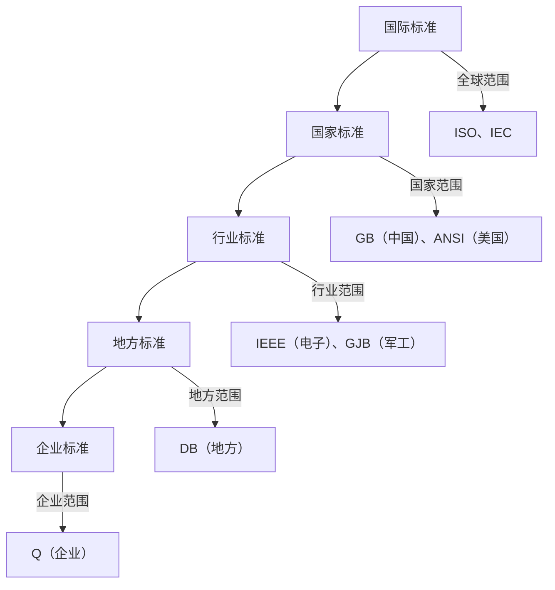

# Chapter 16: 标准化知识


在前一章中，我们学习了**系统可靠性**，了解了如何通过冗余设计和备份恢复确保系统稳定运行。但要让不同厂商的设备（如手机、电脑、充电器）能互相兼容，避免“各自为政”，还需要一个关键要素——**标准化**。就像交通规则让汽车、行人有序通行，标准化为技术产品制定了“共同语言”，让它们能协同工作，实现互操作性（比如USB接口让不同设备充电，HTTP协议让网页跨浏览器显示）。


## 16.1 为什么要关注标准化？

想象你买了一个品牌的充电器，却不能给另一个品牌的手机充电；或者不同公司的软件数据格式不同，无法共享。这些问题背后的核心是：**缺乏统一规则**。标准化解决了这个问题：通过制定共同规则，让产品、服务和流程保持一致，确保不同系统（如硬件、软件）能互相通信、协同工作。  

例如，USB（通用串行总线）标准让所有厂商的充电器、数据线通用；HTTP（超文本传输协议）标准让网页能在不同浏览器（Chrome、Firefox）上显示。如果没有标准化，每家厂商都用自己的“规则”，设备之间无法兼容，就像不同国家的语言不通，无法交流。


## 16.2 标准化是什么？

根据源材料，**标准化是制定和实施共同规则的过程，确保产品、服务和流程的一致性和互操作性**。简单来说，标准化就是“给技术制定规则”，让不同系统遵循同一套“语言”，实现协同。  

> 源材料中的描述：“为在一定的范围内获得最佳秩序，对活动或其结果规定共同的和重复使用的规则或特性的文件，称为标准。该文件经协商一致制定并经一个公认机构的批准。”  

解释：标准是“共同规则”，比如USB标准规定了充电器的接口形状、电压，所有厂商遵循后，充电器就能通用。标准化就是“制定并实施这些规则”的过程，目的是让技术发展更有序，避免混乱。


## 16.3 标准的“层级”：从全球到企业

标准不是单一的，而是分层的，就像行政体系（国家→省→市→企业）。根据制定机构和适用范围，标准分为**国际标准、国家标准、行业标准、地方标准、企业标准**。我们用日常例子理解：

### 16.3.1 国际标准：全球通用的“通用语”
国际标准是由国际组织制定，供各国参考的标准。比如：
- **ISO（国际标准化组织）**：制定质量管理标准（如ISO 9001，企业质量体系）；
- **IEC（国际电工委员会）**：制定电器安全标准（如IEC 60950，电器安全规范）。  

这些标准是全球通用的，比如ISO 9001让不同国家的企业都能用统一的质量管理方法，方便国际贸易。


### 16.3.2 国家标准：国家内的“统一规则”
国家标准是由国家机构制定，适用于全国的标准。比如：
- **GB（中华人民共和国国家标准）**：如GB 4943（电器安全标准），所有在中国销售的电器必须遵守；
- **ANSI（美国国家标准协会）**：如ANSI Z21.10（燃气设备标准）。  

国家标准是国家内统一技术要求的基础，比如中国的GB标准让国内电器厂商遵循同一安全规范。


### 16.3.3 行业标准：特定行业的“专业规则”
行业标准是由行业机构制定，适用于特定业务领域的标准。比如：
- **IEEE（电气电子工程师学会）**：制定电子设备标准（如IEEE 802.11，Wi-Fi标准）；
- **GJB（中华人民共和国国家军用标准）**：适用于国防部门的军用设备标准。  

行业标准是行业内的“专业语言”，比如IEEE的Wi-Fi标准让所有Wi-Fi设备能互相通信。


### 16.3.4 地方标准与企业标准：更细化的“规则”
- **地方标准**：由地方机构制定，仅适用于本地（如DB开头，如DB 31/ 2019，上海市环保标准）；
- **企业标准**：由企业自己制定，适用于内部（如Q开头，如Q/ XXXX，某企业的产品标准）。  

这些标准是更细化的规则，比如企业标准可能比国家标准更严格，确保产品品质。


### 标准分级的mermaid图表



## 16.4 标准的“强制力”：必须遵守 vs 鼓励采用

标准分为**强制性标准**和**推荐性标准**，就像“法律”和“建议”的区别：

### 16.4.1 强制性标准：必须遵守的“法律”
强制性标准是保障安全、健康等的“底线规则”，必须执行。比如：
- **电器安全标准（GB 4943）**：所有电器必须通过安全测试，否则禁止销售；
- **食品卫生标准（GB 2760）**：食品添加剂必须符合规定，否则违法。  

> 源材料中的描述：“保障人体健康，人身、财产安全的标准和法律、行政法规规定强制执行的标准是强制性标准。”  

解释：强制性标准像“交通规则中的红灯必须停”，违反会受处罚（如罚款、产品下架）。


### 16.4.2 推荐性标准：鼓励采用的“建议”
推荐性标准是鼓励企业自愿采用的“优化规则”，没有强制力。比如：
- **质量管理体系标准（GB/T 19001）**：企业自愿采用，提升管理水平；
- **节能标准（GB/T 23331）**：企业自愿采用，降低能耗。  

> 源材料中的描述：“推荐性标准，国家鼓励企业自愿采用。这类标准，不具有强制性，任何单位均有权决定是否采用。”  

解释：推荐性标准像“建议多吃蔬菜”，企业可以选择是否遵循，但遵循后能获得好处（如提升品牌形象、降低成本）。


## 16.5 标准化如何解决问题？用“USB充电”的例子

我们用“USB充电”的流程，看标准化如何让不同设备协同：

```mermaid
sequenceDiagram
    participant 厂商A as 厂商A（生产充电器）
    participant 标准组织 as 标准组织（制定USB标准）
    participant 厂商B as 厂商B（生产手机）
    participant 用户 as 用户
    
    厂商A->>标准组织： 遵循USB标准生产充电器
    厂商B->>标准组织： 遵循USB标准生产手机
    用户->>厂商A： 购买充电器
    用户->>厂商B： 购买手机
    用户->>厂商A： 用充电器给厂商B的手机充电
    厂商A-->>用户： 充电成功（因为遵循同一标准）
```

**流程解释**：  
1. 标准组织制定USB标准（规定了接口形状、电压）；  
2. 厂商A遵循标准生产充电器，厂商B遵循标准生产手机；  
3. 用户用A的充电器给B的手机充电，因为两者遵循同一标准，所以能兼容。  

如果没有标准化，厂商A的充电器接口是圆形，厂商B的手机接口是方形，用户就无法充电——这就是标准化的价值：**让不同系统协同工作**。


## 16.6 标准化的好处：为什么它重要？

源材料提到：“标准化降低成本，促进创新，并确保系统间的兼容性，是信息技术领域的基础。” 具体来说：

1. **降低成本**：企业不用为每个市场定制不同产品（如USB标准让充电器通用，企业不用生产多种接口的充电器）；  
2. **促进创新**：标准让企业专注于创新（如Wi-Fi标准让厂商专注于提升网速，而不是设计新接口）；  
3. **确保兼容性**：标准让不同系统（如电脑、手机、路由器）能互相通信，避免“信息孤岛”。  


## 总结

本章我们学习了**标准化知识**：它是技术发展的“交通规则”，通过制定共同规则，让不同系统、产品协同工作。我们了解了标准的层级（国际→国家→行业→地方→企业）、类型（强制/推荐），以及标准化如何解决“设备不兼容”的问题。  

标准化是现代信息系统的“基石”，与[信息安全](14_信息安全_.md)（保护数据）、[系统可靠性](15_系统可靠性_.md)（确保稳定）结合，让技术更安全、更高效。就像交通规则让城市更有序，标准化让技术发展更顺畅。  

通过本章学习，你明白了：**标准化不是“限制”，而是“统一”，让技术更易用、更兼容**。

---

Generated by [AI Codebase Knowledge Builder](https://github.com/The-Pocket/Tutorial-Codebase-Knowledge)