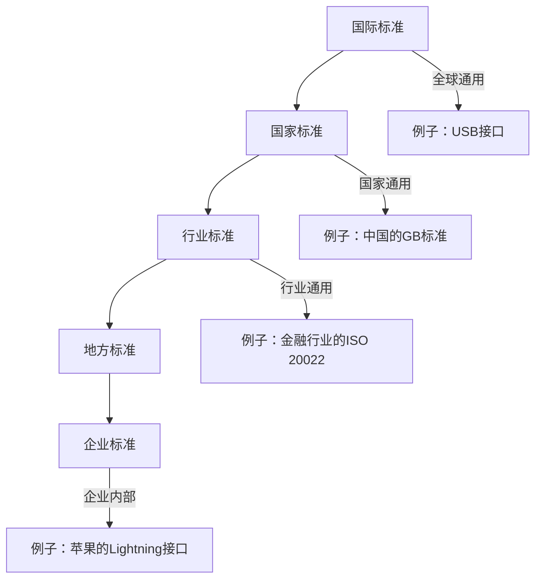

# Chapter 16: 标准化知识


```markdown
# 第16章：标准化知识

在上一章，我们学习了系统可靠性，了解了如何通过冗余设计让系统稳定运行。但即使系统可靠，如果不同设备或系统之间无法协同工作（比如你的手机充电器无法给电脑充电），也会带来很多麻烦。这时，**标准化**就像“通用语言”，让不同产品能互相配合。本章我们将学习标准化知识，了解它如何让技术发展更规范、更高效。


## 16.1 为什么需要标准化？

想象一下，你买了一个新手机，充电器却和旧手机的不通用，只能再买一个新充电器；或者不同品牌的电脑软件无法互相打开文件。这些问题，标准化都能解决。标准化通过制定共同规则，让产品、服务和流程保持一致，就像交通规则让车辆有序行驶，避免混乱。源材料中提到：“标准化是制定和实施共同规则的过程，确保产品、服务和流程的一致性和互操作性。” 它的核心作用是：**让不同系统“能对话”，让技术发展“有规矩”**。


## 16.2 标准化是什么？

根据源材料，标准化是“**在经济、技术、科学及管理等社会实践中，对重复性事物和概念通过制定、发布和实施标准达到统一，以获得最佳秩序和最大社会效益**”。简单来说：
- **制定规则**：比如制定USB接口标准，让所有充电器都能通用；
- **统一执行**：所有厂商都遵守这个标准，生产兼容的产品；
- **获得效益**：用户不用重复购买配件，厂商能降低生产成本。

标准化就像“技术界的交通规则”，让不同“车辆”（产品）在“道路”（系统）上顺畅通行。


## 16.3 标准的“层级”：从国际到企业

标准不是单一的，而是有不同层级，覆盖不同范围。源材料中提到，标准分为国际标准、国家标准、行业标准、地方标准和企业标准，就像“语言的层级”：

### 1. 国际标准：全球通用的“世界语”
国际标准由国际组织制定，比如ISO（国际标准化组织）、IEEE（电气电子工程师学会）。例如，USB接口标准就是国际标准，全球厂商都遵守，你的手机充电器能在不同国家使用。

### 2. 国家标准：每个国家的“通用语”
每个国家有自己的标准，比如中国的GB标准（如GB/T 1800-2000），美国的ANSI标准。例如，中国的电器安全标准，确保国内销售的电器符合安全要求。

### 3. 行业标准：特定领域的“专业语”
行业组织制定的标准，比如金融行业的ISO 20022（支付标准），或者电子行业的SJ标准（中国电子行业标准）。例如，银行系统用ISO 20022标准，确保不同银行的转账系统能互相通信。

### 4. 企业标准：企业内部的“方言”
大型企业自定的标准，比如苹果的Lightning接口标准（虽然不是国际标准，但苹果设备都遵守）。企业标准通常比行业标准更严格，比如苹果的充电器比普通充电器更耐用。

用mermaid画层级结构，更直观：



## 16.4 强制性标准 vs. 推荐性标准：必须遵守 vs. 自愿采用

标准还分为两种类型，就像“法律”和“建议”：

### 1. 强制性标准：必须遵守的“法律”
保障安全、健康或环境的标准，比如电器安全标准（GB 4706.1-2005），必须遵守。违反强制性标准的产品，禁止生产或销售。源材料中提到：“强制性标准，必须执行。不符合强制性标准的产品，禁止生产、销售和进口。”

### 2. 推荐性标准：自愿采用的“建议”
其他标准，比如产品性能标准（GB/T 19001-2016），企业可以自愿采用。但一旦采用，就具有约束力。例如，企业可以选择是否采用某个推荐性标准来提高产品质量。

用表格对比更清晰：
| 类型         | 特点                                                                 | 例子                                                                 |
|--------------|----------------------------------------------------------------------|----------------------------------------------------------------------|
| 强制性标准   | 必须遵守，违反会受处罚                                                 | 电器安全标准（GB 4706.1-2005）                                         |
| 推荐性标准   | 自愿采用，但采用后具有约束力                                           | 产品质量管理体系标准（GB/T 19001-2016）                                 |


## 16.5 标准化的价值：为什么它如此重要？

标准化不是“额外负担”，而是“技术发展的基石”。源材料中提到：“标准化降低成本，促进创新，并确保系统间的兼容性，是信息技术领域的基础。” 它的价值包括：

1. **降低成本**：统一标准让厂商不用为不同市场生产不同产品。例如，USB接口统一后，厂商只需生产一种充电器，成本降低。
2. **促进创新**：标准让开发者专注于创新，而不是解决兼容问题。例如，开发者可以基于USB标准开发新设备，不用考虑接口问题。
3. **确保兼容性**：标准让不同系统协同工作。例如，你的手机能通过USB连接电脑，因为两者都遵守USB标准。


## 16.6 常见误解：别踩这些坑

- **误解1**：“标准化会限制创新”。实际上，标准是“基础框架”，开发者可以在框架内创新。例如，USB标准允许不同厂商开发新设备（如USB-C），但都遵守接口规则。
- **误解2**：“推荐性标准没用”。实际上，推荐性标准能提高产品质量。例如，企业采用推荐性标准后，产品更可靠，客户更愿意购买。
- **误解3**：“国际标准比国家标准好”。实际上，标准的好坏取决于适用场景。例如，中国的国家标准更符合国内法规，而国际标准更适合全球市场。


## 检查你的理解
1. 标准化如何解决“充电器不通用”的问题？请举例说明。
2. 强制性标准和推荐性标准的主要区别是什么？
3. 为什么说标准化是“技术发展的基石”？


## 结论

本章我们学习了标准化知识：它是技术界的“通用语言”，通过制定共同规则，让不同产品能协同工作。标准分为不同层级（国际、国家、行业等）和类型（强制、推荐），其核心价值是降低成本、促进创新和确保兼容性。理解标准化，能帮你明白为什么不同品牌的设备能互相配合，以及为什么技术发展需要“规矩”。

下一章我们将进入[第十七章：软件工程基础](17_软件工程基础_.md)，了解如何通过标准化方法开发高质量的软件。请继续阅读。
```

---

Generated by [AI Codebase Knowledge Builder](https://github.com/The-Pocket/Tutorial-Codebase-Knowledge)