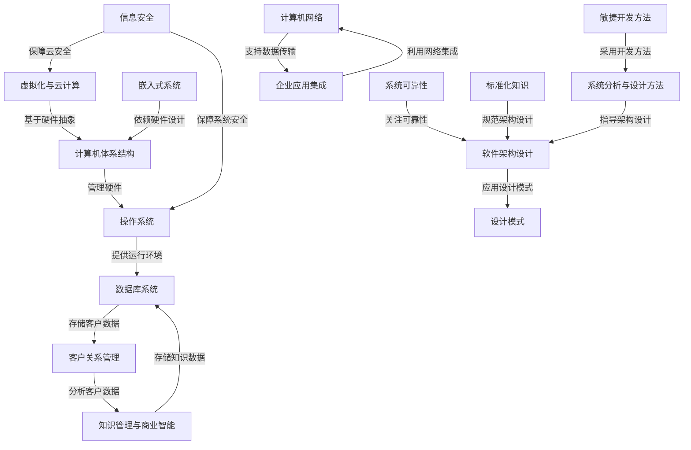

# Tutorial: 3aa

本项目全面介绍了计算机科学的核心领域，从硬件到软件的各个层面。**计算机体系结构**（0）是基础，定义了硬件如何协同工作；**操作系统**（1）作为中间层，管理硬件资源并为应用提供环境。**数据库系统**（2）负责高效存储和检索数据，而**计算机网络**（3）则连接设备实现资源共享。**软件架构设计**（4）规划系统整体结构，**设计模式**（5）提供可重用的解决方案，**敏捷开发方法**（6）优化开发流程。**信息安全**（7）保护系统免受威胁，**系统可靠性**（8）确保持续运行。**虚拟化与云计算**（9）通过资源抽象提升效率，**嵌入式系统**（10）专注于专用设备。**企业应用集成**（11）整合业务系统，**客户关系管理**（12）优化客户互动，**知识管理与商业智能**（13）支持决策。**标准化知识**（14）确保一致性和互操作性，**系统分析与设计方法**（15）定义系统需求和结构。

**Source Document:** [.\source\software_junior\3aa.md](.\source\software_junior\3aa.md)

## Chapters

1. [计算机体系结构
](01_计算机体系结构_.md)
2. [操作系统
](02_操作系统_.md)
3. [数据库系统
](03_数据库系统_.md)
4. [计算机网络
](04_计算机网络_.md)
5. [虚拟化与云计算
](05_虚拟化与云计算_.md)
6. [嵌入式系统
](06_嵌入式系统_.md)
7. [系统分析与设计方法
](07_系统分析与设计方法_.md)
8. [敏捷开发方法
](08_敏捷开发方法_.md)
9. [软件架构设计
](09_软件架构设计_.md)
10. [设计模式
](10_设计模式_.md)
11. [企业应用集成
](11_企业应用集成_.md)
12. [客户关系管理
](12_客户关系管理_.md)
13. [知识管理与商业智能
](13_知识管理与商业智能_.md)
14. [信息安全
](14_信息安全_.md)
15. [系统可靠性
](15_系统可靠性_.md)
16. [标准化知识
](16_标准化知识_.md)

---

Generated by [AI Codebase Knowledge Builder](https://github.com/The-Pocket/Tutorial-Codebase-Knowledge)