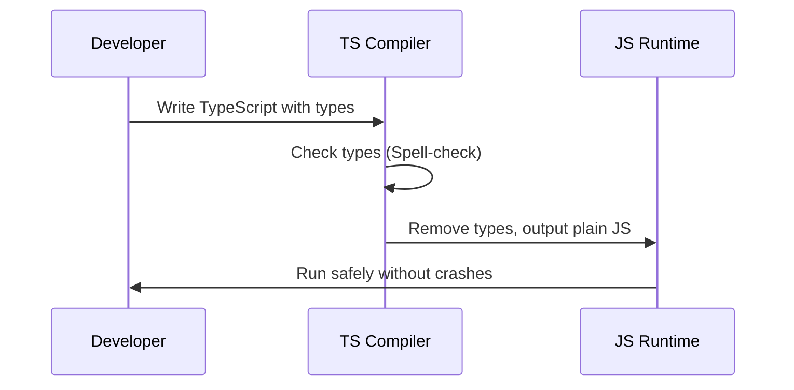

# Chapter 1: Static Typing

Welcome to your first step into TypeScript! If you've ever written JavaScript and been frustrated by a crash happening in the middle of your app running, you're in the right place. 

In this chapter, we'll explore TypeScript's core superpower: **Static Typing**. Think of it as a spell-checker for your code's logic, catching typos and mismatched data before the code ever runs.

## The Problem: A Surprise Crash

Imagine you're building a simple profile page. You write a JavaScript function to display a user's name in uppercase.

```javascript
// JavaScript
function getUserName(user) {
  return user.name.toUpperCase();
}
```

This looks fine! But what happens if someone passes a user without a name, or worse, passes `null`?

```javascript
// JavaScript
getUserName(null); 
// Runtime Error: Cannot read properties of null (reading 'name')
```

In JavaScript, this error only shows up *when the code runs* (runtime). If this code is deep inside your app, your users might see a broken screen. TypeScript was created to stop this exact problem.

## What is Static Typing?

In JavaScript, variables can hold any type of data at any time. This is called **dynamic typing**. It’s flexible, but dangerous—like driving a car without seatbelts.

**Static typing** means you define the "shape" of your data—what properties it has and what types those properties are—*before* the code runs. 

### The Spell-Checker Analogy

Imagine writing an essay. If you type "teh" instead of "the", a spell-checker draws a red line under it immediately. You don't have to print the essay and read it on paper to find the mistake.

TypeScript does exactly this for your code. It draws a "red line" (an error) in your editor the moment you write mismatched data, long before you even run the code.

## Solving the Use Case

Let's fix our `getUserName` function using static typing. We need to tell TypeScript exactly what a "User" looks like.

```typescript
// Define the shape of a User
type User = {
  name: string;
}
```

Here, we've created a custom type called `User`. It says: "Any variable claiming to be a User MUST have a `name` property, and that `name` MUST be a string."

Now, let's attach this rule to our function:

```typescript
// Apply the rule to the function parameter
function getUserName(user: User): string {
  return user.name.toUpperCase();
}
```

Now, let's try our dangerous call from earlier:

```typescript
// TypeScript catches the error instantly!
getUserName(null); 
// Error: Argument of type 'null' is not assignable to parameter of type 'User'.
```

Instead of crashing at runtime, TypeScript gives you an error in your editor immediately. You've just prevented a bug!

## Under the Hood: How Does This Work?

You might be wondering: if browsers and Node.js only understand JavaScript, how does TypeScript run? The secret is that **TypeScript doesn't run at all**. It's a compile-time tool.

Let's look at the step-by-step journey of your code:



1. You write TypeScript code with your type rules.
2. The TypeScript compiler (`tsc`) reads your code and checks if all the rules are followed.
3. If there's a rule violation, it throws an error and stops.
4. If everything is perfect, it **erases all the types** and outputs clean, standard JavaScript.

Because types are erased, the internal implementation of the compiled JavaScript looks exactly like what you would have written by hand:

```typescript
// What you write in TypeScript
function getUserName(user: User): string {
  return user.name.toUpperCase();
}
```

```javascript
// What TypeScript compiles to (plain JavaScript)
function getUserName(user) {
  return user.name.toUpperCase();
}
```

Notice how the `User` and `string` types are completely gone? TypeScript enforces the rules upfront, then steps out of the way so JavaScript can do what it does best.

## Conclusion

You've just learned the foundation of TypeScript! **Static Typing** allows you to define the shape of your data upfront, acting as a safety net that catches errors in your editor before they become runtime crashes. 

However, just knowing *how* to add types isn't enough. To make large projects truly safe and maintainable, we need to learn how to design types that accurately reflect our business logic—like defining exactly what statuses an order can have. We'll explore this in the next chapter: [Domain Type Design](02_domain_type_design_.md).

---

Generated by [AI Codebase Knowledge Builder](https://github.com/The-Pocket/Tutorial-Codebase-Knowledge)