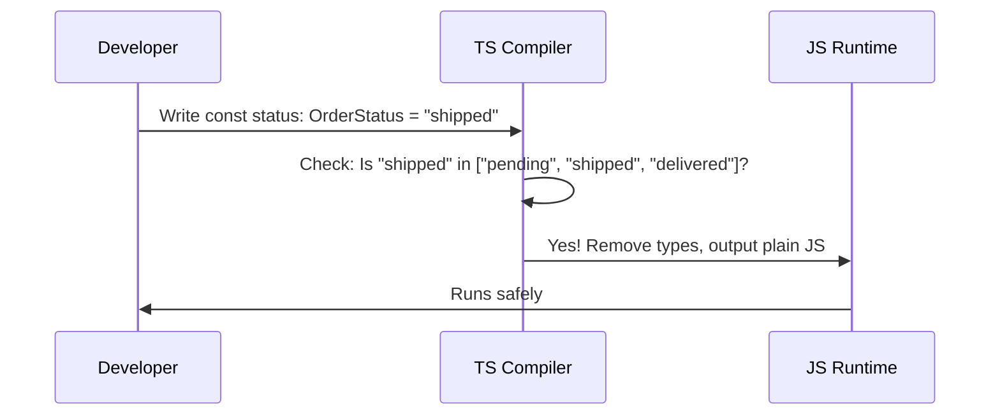

# Chapter 2: Domain Type Design

In [Chapter 1: Static Typing](01_static_typing_.md), we learned how to define the basic shape of our data—like making sure a `User` has a `name` that is a string. But just defining shapes isn't always enough. If we use types that are too broad, we leave room for confusing bugs. Let's see how to fix that.

## The Problem: The "Anything Goes" Trap

Imagine you're building an online store. You need to track the status of an order. You might start by defining the order like this:

```typescript
type Order = {
  id: number;
  status: string; // Too broad!
}
```

At first glance, this looks fine. But because `status` is just a `string`, TypeScript will allow *any* text at all.

```typescript
const myOrder: Order = { id: 1, status: "shipped" }; // OK
const weirdOrder: Order = { id: 2, status: "banana" }; // Also OK?!
```

"banana" is not a valid order status! But TypeScript won't complain because technically, "banana" is a string. Using broad types like `string` is like writing a legal contract that says "Payment is due in some text"—it leaves way too much room for interpretation.

## What is Domain Type Design?

**Domain Type Design** is the practice of using strict types to model real business rules. Instead of saying "status is some text," you say "status is strictly 'pending', 'success', or 'failed'." 

It's like drafting a strict legal contract that leaves no room for ambiguous interpretations. To do this, we use two powerful TypeScript features: **Literal Types** and **Union Types**.

### Concept 1: Literal Types

A Literal Type is a type that represents exactly one specific value. It's not just *any* string; it's *this exact* string.

```typescript
type ExactWord = "hello";
```

Now, only the exact text "hello" is allowed. Nothing else will work.

```typescript
let greeting: ExactWord = "hello"; // OK!
greeting = "hi"; // Error: Type '"hi"' is not assignable to type '"hello"'
```

### Concept 2: Union Types

A Union Type allows a variable to be one of *several* specified types. We use the pipe symbol (`|`) to separate the options, which means "OR".

```typescript
type Status = "pending" | "success" | "failed";
```

Now, a `Status` variable can be "pending", "success", or "failed". Nothing else.

## Solving the Use Case

Let's apply Domain Type Design to our order system. We will combine Literal Types and Union Types to create a strict contract for our order status.

```typescript
type OrderStatus = "pending" | "shipped" | "delivered";
```

Now, let's update our `Order` type to use this strict rule instead of a broad `string`.

```typescript
type Order = {
  id: number;
  status: OrderStatus;
}
```

Let's see what happens when we try to create orders now:

```typescript
const goodOrder: Order = { id: 1, status: "shipped" }; // OK!
```

```typescript
const badOrder: Order = { id: 2, status: "banana" }; 
// Error: Type '"banana"' is not assignable to type 'OrderStatus'.
```

By designing our types to match our business domain, TypeScript now acts as a strict legal enforcer, preventing impossible data from ever entering our system.

## Under the Hood: How Does This Work?

You might wonder how TypeScript checks these strict rules. Let's look at the step-by-step journey of what happens when you assign a value to a variable with a Domain Type.



1. You write your code and assign a value (like `"shipped"`) to your strict type.
2. The TypeScript compiler checks: "Is this exact value listed in my allowed Union of Literals?"
3. If it's not allowed, the compiler throws an error and stops.
4. If it is allowed, the compiler **erases the types** and outputs standard JavaScript.

Because types are erased, the compiled JavaScript doesn't know about your strict rules. It just sees a normal string.

```typescript
// What you write in TypeScript
const status: OrderStatus = "shipped";
```

```javascript
// What TypeScript compiles to (plain JavaScript)
const status = "shipped";
```

The safety net only exists at compile time—but that's exactly when you want it! It catches the bug before the code ever reaches your users.

## Conclusion

You've just learned how to level up your type definitions! **Domain Type Design** teaches us to stop using broad types like `string` for values that should only be a specific set of options. By combining **Literal Types** and **Union Types**, we can create strict, unambiguous contracts that model our real business rules.

But what if different statuses need to carry different data? For example, a "success" status might need a receipt number, while a "failed" status needs an error message. We'll explore how to model this advanced business logic in the next chapter: [Discriminated Unions](03_discriminated_unions_.md).

---

Generated by [AI Codebase Knowledge Builder](https://github.com/The-Pocket/Tutorial-Codebase-Knowledge)