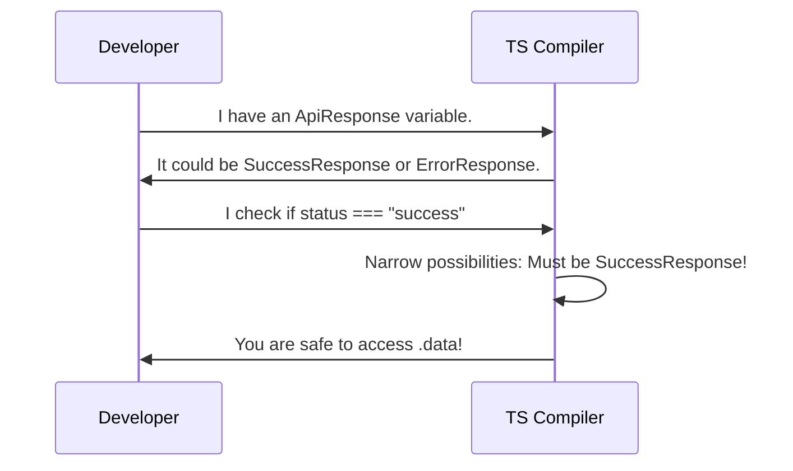

# Chapter 3: Discriminated Unions

In [Chapter 2: Domain Type Design](02_domain_type_design_.md), we learned how to use strict literal types (like `"success" | "error"`) to define exact states. But what if different states need to carry completely different data? 

## The Problem: The Messy Optional Trap

Imagine you are fetching data from an API. If it succeeds, you get the user's data. If it fails, you get an error message. You might be tempted to model it like this:

```typescript
type ApiResponse = {
  status: "success" | "error";
  data?: User;     // Optional, only for success
  error?: string;  // Optional, only for error
}
```

Because `data` and `error` are optional (`?`), TypeScript forces you to check if they exist before using them. But worse, this type allows impossible combinations! You could accidentally create an object that has both a `data` and an `error`, or neither. 

We need a way to say: "If it's a success, it MUST have data and NO error. If it's an error, it MUST have an error and NO data."

## What is a Discriminated Union?

A **Discriminated Union** is a pattern where you combine multiple object types into a union, but every object shares a specific literal property (called the **discriminant**) that tells TypeScript exactly which type it is.

### The Train Switchyard Analogy

Imagine a train switchyard. A train arrives and the operator looks at a single signal—the train's destination tag (the discriminant). 

If the tag says "Success", the switch routes the train down Track A, where a cargo crane (the `data` property) is waiting. If the tag says "Error", it routes down Track B, where a repair crew (the `error` property) is waiting. 

The signal ensures the train only goes down one isolated track. It can't be on both tracks at once, and you can't accidentally use the cargo crane on the error track.

## Solving the Use Case

Let's fix our `ApiResponse` using a Discriminated Union. We need two key concepts: separate object types and a shared discriminant.

### Step 1: Define each state separately

Instead of one big type, we create a distinct type for each possible outcome. Notice how each type has a `status` property with a specific literal value. This is our discriminant!

```typescript
type SuccessResponse = {
  status: "success"; // The discriminant
  data: User;
}
```

```typescript
type ErrorResponse = {
  status: "error";   // The discriminant
  error: string;
}
```

### Step 2: Combine them into a Union

Now, we use the union symbol (`|`) to say our API response can be either a success OR an error.

```typescript
type ApiResponse = SuccessResponse | ErrorResponse;
```

### Step 3: Use the discriminant to safely access data

Now, when we write code to handle the response, we check the `status`. Once TypeScript sees you checking the discriminant, it automatically knows which track you're on!

```typescript
function handleResponse(response: ApiResponse) {
  if (response.status === "success") {
    // TypeScript knows this is SuccessResponse!
    console.log(response.data); // Safe! ✅
  } else {
    // TypeScript knows this is ErrorResponse!
    console.log(response.error); // Safe! ✅
  }
}
```

If you tried to access `response.data` without checking the `status` first, TypeScript would throw an error, protecting you from accidentally accessing data that might not exist.

## Under the Hood: How Does This Work?

How does TypeScript know exactly which properties are safe to use? It uses the discriminant to narrow down the possibilities. 

Let's look at the step-by-step journey of what happens when you check the `status`:



1. You declare a variable with the union type `ApiResponse`.
2. TypeScript knows it could be either `SuccessResponse` or `ErrorResponse`.
3. You write an `if` statement checking the discriminant (`status === "success"`).
4. TypeScript eliminates the `ErrorResponse` possibility inside that block.
5. You can now safely access the unique properties of `SuccessResponse` (like `data`).

This process of narrowing down types based on a check is a core TypeScript feature. In fact, it's so important that we'll dedicate an entire chapter to it later! But for now, just know that the shared literal property is the "key" that unlocks this safety.

## Conclusion

You've just learned how to model different states safely using **Discriminated Unions**! By ensuring every state shares a literal property (the discriminant), you can combine them into a union and let TypeScript route your logic down the correct, isolated track. No more messy optional properties or impossible states.

But how exactly does TypeScript figure out that checking `status === "success"` makes `response.data` safe? This automatic "narrowing" of types is a superpower in itself, and we'll explore exactly how it works in the next chapter: [Type Narrowing](04_type_narrowing_.md).

---

Generated by [AI Codebase Knowledge Builder](https://github.com/The-Pocket/Tutorial-Codebase-Knowledge)