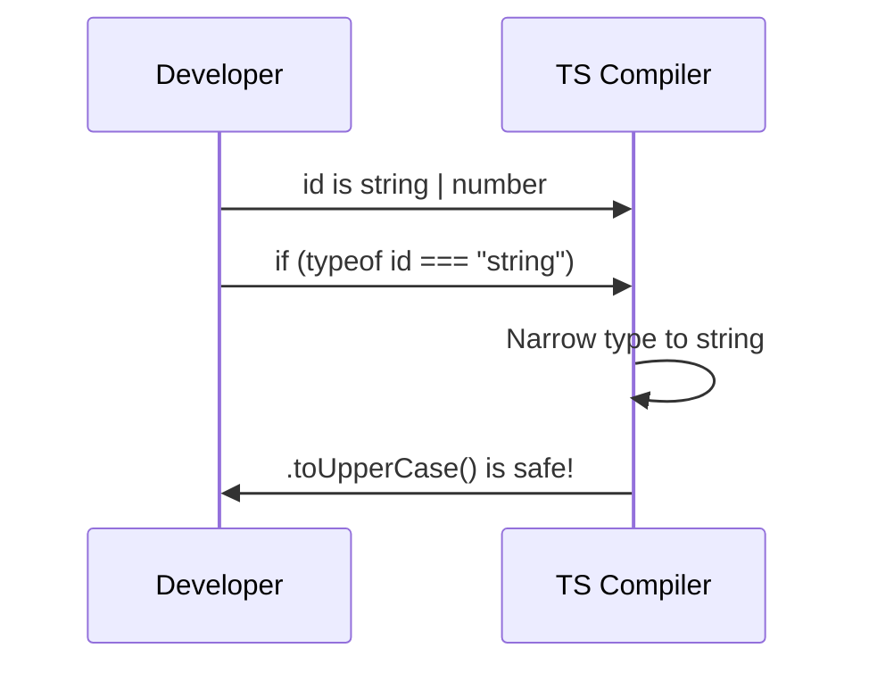

# Chapter 4: Type Narrowing

In [Chapter 3: Discriminated Unions](03_discriminated_unions_.md), we saw something magical. When we checked if `status === "success"`, TypeScript suddenly knew it was safe to access the `.data` property. How did TypeScript figure that out? 

The answer is a core TypeScript superpower called **Type Narrowing**.

## The Problem: The "I Don't Know What This Is" Error

Imagine you are building a function that accepts a user's ID. Sometimes your app passes the ID as a number (`123`), and sometimes as a string (`"123"`). You model this using a union type:

```typescript
function printId(id: string | number) {
  console.log(id.toUpperCase()); // Error!
}
```

TypeScript throws an error: `Property 'toUpperCase' does not exist on type 'number'`. 

Why? Because TypeScript only knows that `id` is *either* a string *or* a number. It has to prepare for the worst-case scenario. Since `number` doesn't have a `.toUpperCase()` method, TypeScript stops you from calling it, even if you happen to pass a string at runtime.

## What is Type Narrowing?

**Type Narrowing** is the process of refining a broad, ambiguous type (like `string | number`) into a specific one using conditional checks. 

### The Funnel Analogy

Imagine a funnel. You pour in a mixed stream of objects—some are strings, some are numbers. The funnel uses conditional checks (like `typeof`) as filters to sort the mixed stream into separate, categorized bins based on their shape. 

Once an object lands in the "string" bin, you know for a fact it's a string and can safely use string methods on it. TypeScript does exactly this with your code!

## Key Concept: `typeof` Narrowing

The most common way to narrow a type is using JavaScript's built-in `typeof` operator inside an `if` statement.

```typescript
function printId(id: string | number) {
  if (typeof id === "string") {
    console.log(id.toUpperCase()); // Safe! ✅
  } else {
    console.log(id.toFixed(2));    // Safe! ✅
  }
}
```

**What happens here?**
1. Inside the `if` block, TypeScript says: "If we got here, `id` MUST be a string." It narrows the type from `string | number` to just `string`.
2. Inside the `else` block, TypeScript says: "If it wasn't a string, it MUST be a number." It narrows the type to just `number`.

## Key Concept: Truthiness Narrowing

Sometimes, you don't care about the specific type; you just want to filter out `null` or `undefined`. You can do this with a simple truthiness check.

```typescript
function printName(name: string | null) {
  if (name) {
    console.log(name.toUpperCase()); // Safe! ✅
  }
}
```

**What happens here?**
By simply checking `if (name)`, you filter out the `null` possibility. Inside the `if` block, TypeScript narrows the type from `string | null` to just `string`.

## Key Concept: Discriminant Narrowing

This is exactly what we did in [Chapter 3: Discriminated Unions](03_discriminated_unions_.md)! When you check a shared literal property (the discriminant), TypeScript narrows the type to that specific object shape.

```typescript
type ApiResponse = 
  | { status: "success"; data: string }
  | { status: "error"; message: string };

function handleResponse(res: ApiResponse) {
  if (res.status === "success") {
    console.log(res.data);    // Safe! ✅
  } else {
    console.log(res.message); // Safe! ✅
  }
}
```

By checking `res.status`, you sort the response into the correct bin, allowing TypeScript to safely grant access to `data` or `message`.

## Under the Hood: How Does This Work?

How does TypeScript keep track of these types as it reads your code? It uses a process called **Control Flow Analysis**. 

Let's look at the step-by-step journey of what happens when you use a `typeof` check:



1. You declare a variable with a broad type (`string | number`).
2. You write a conditional check (`typeof id === "string"`).
3. The TypeScript compiler updates its internal notebook. Inside that specific block, it crosses out "number" and writes down just "string".
4. Because the compiler now knows the exact type, it allows you to use type-specific methods without errors.

### Diving Deeper into the Code

TypeScript's compiler literally walks through your code line-by-line, updating the type of variables as it goes. This is why assignment also works as a form of narrowing!

```typescript
let value: string | number = "hello";
// TS knows: value is string
value.toUpperCase(); // Safe! ✅

value = 42;
// TS knows: value is now number
value.toFixed(2); // Safe! ✅
```

Every time you assign a new value, write an `if` statement, or use a `switch`, TypeScript updates its understanding of the variable's type at that exact moment in the code.

## Conclusion

You've just learned how to take broad, ambiguous types and safely refine them! **Type Narrowing** acts like a funnel, using conditional checks like `typeof`, truthiness, or discriminants to filter a mixed stream of types into specific, categorized bins. This allows TypeScript to confidently let you use type-specific methods without errors.

Now that you know how to narrow types down to exactly what you need, what if you want to write a function that works safely with *any* type, while still keeping track of what that type is? We'll explore this in the next chapter: [Generics](05_generics_.md).

---

Generated by [AI Codebase Knowledge Builder](https://github.com/The-Pocket/Tutorial-Codebase-Knowledge)