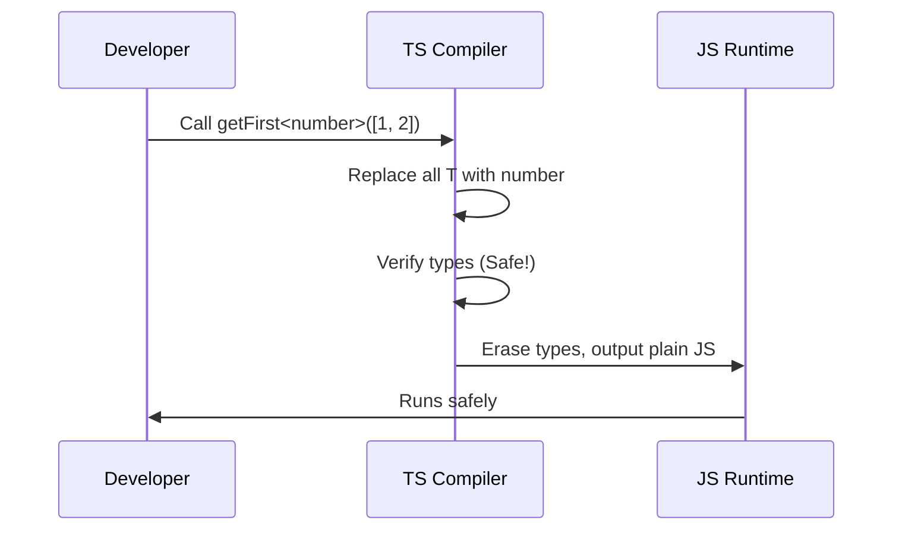

# Chapter 5: Generics

In [Chapter 4: Type Narrowing](04_type_narrowing_.md), we learned how to take a broad type like `string | number` and safely narrow it down to exactly what we need. But what if you want to write a function that works with *any* type, while still keeping all of TypeScript's safety nets in place? 

Welcome to the world of **Generics**!

## The Problem: Copy-Paste Code or Lost Safety

Imagine you need a simple helper function that returns the first item in an array. 

If you only care about numbers, you might write this:

```typescript
function getFirstNumber(arr: number[]): number | undefined {
  return arr[0];
}
```

But what if you also need to get the first string in an array of strings? You could copy and paste the function:

```typescript
function getFirstString(arr: string[]): string | undefined {
  return arr[0];
}
```

Copying code for every single type is exhausting. "Wait!" you might think, "Why not just use `any`?"

```typescript
function getFirstAny(arr: any[]): any {
  return arr[0];
}
```

Using `any` stops the copy-paste, but it **destroys your type safety**. If you pass an array of strings, TypeScript doesn't know the output is a string anymore. It just throws its hands up and says, "It could be anything!" We lose all the benefits we learned in [Chapter 1: Static Typing](01_static_typing_.md).

We need a way to say: "I don't care what type this array holds right now, but whatever type goes IN is the exact same type that comes OUT."

## What are Generics?

**Generics** are a way to create reusable code components that can work with any type while still maintaining type safety. 

### The Ice Mold Analogy

Think of an ice mold (or cookie cutter). The mold itself has a specific shape—let's say a star. You can pour different materials into that mold: water, chocolate, or clay. 

The mold doesn't care what material you use, but it guarantees that whatever comes out will have that star shape. 

In TypeScript, a Generic is like that empty mold. The `<T>` syntax is the placeholder for your material (the type). You get to decide what type fills that mold when you actually use the code.

## Key Concept 1: Generic Functions

Let's fix our `getFirst` function using a Generic. We will use `<T>` as our type placeholder.

```typescript
function getFirst<T>(arr: T[]): T | undefined {
  return arr[0];
}
```

Notice the `<T>` right after the function name. This tells TypeScript: "Hey, `T` is a placeholder for a type. I'll tell you what it is later." Then, we use `T` to describe the array and the return value.

Here is how you use it:

```typescript
const numbers = [1, 2, 3];
const firstNum = getFirst<number>(numbers); 
// firstNum is type: number | undefined
```

```typescript
const words = ["hello", "world"];
const firstWord = getFirst<string>(words); 
// firstWord is type: string | undefined
```

When we call `getFirst<number>`, we are pouring "number" into our mold. TypeScript replaces all the `T`s with `number`, ensuring we get perfect type safety without writing multiple functions!

## Key Concept 2: Generic Types

Generics aren't just for functions. You can use them to create flexible object types or interfaces. This is incredibly common for API responses.

Imagine an API that returns a `status` and some `data`. The `status` is always a string, but the `data` could be a User, a Product, or anything else.

```typescript
type ApiResponse<T> = {
  status: number;
  data: T;
};
```

Now we can create specific API responses by filling in the `T` mold:

```typescript
type User = { name: string };
type UserResponse = ApiResponse<User>;
```

TypeScript fills in the mold, making `data` safely a `User` type. No copy-pasting the entire `ApiResponse` structure!

## Key Concept 3: Generic Constraints

Sometimes `<T>` is a little *too* generic. Imagine you want to write a function that prints the length of something.

```typescript
function printLength<T>(value: T): void {
  console.log(value.length); // Error! 
}
```

TypeScript throws an error because `T` could be *anything*. A number doesn't have a `.length` property. We need to constrain our mold so it only accepts materials that have a length.

We do this using the `extends` keyword:

```typescript
function printLength<T extends { length: number }>(value: T): void {
  console.log(value.length); // Safe! ✅
}
```

Now, `T` can be any type, as long as it has a `length` property that is a number. Strings and arrays have a length, so they work perfectly. Numbers do not, so they are blocked.

```typescript
printLength("hello");      // OK! Strings have length
printLength([1, 2, 3]);    // OK! Arrays have length
printLength(123);          // Error! Numbers don't have length
```

## Under the Hood: How Does This Work?

You might wonder how TypeScript handles these placeholders. Let's look at the step-by-step journey of what happens when you call a generic function:



1. You call the function and explicitly provide the type (`<number>`).
2. The TypeScript compiler mentally replaces every `T` in that function with `number`.
3. It checks if the code is safe for numbers (it is!).
4. Just like with all TypeScript types, it **erases the generics completely** and outputs plain JavaScript.

Here is what the compiled JavaScript looks like:

```typescript
// What you write in TypeScript
function getFirst<T>(arr: T[]): T | undefined {
  return arr[0];
}
```

```javascript
// What TypeScript compiles to (plain JavaScript)
function getFirst(arr) {
  return arr[0];
}
```

All the generic syntax (`<T>`) vanishes! Generics are strictly a compile-time tool to help you write safe, reusable code without repeating yourself.

## Conclusion

You've just learned how to write flexible, reusable code with **Generics**! By using a type placeholder like `<T>`, you can create "molds" for functions and objects that work with any type, while still maintaining strict type safety. You also learned how to use `extends` to constrain generics so they only accept types with specific properties.

Now that you know how to create your own generic types, you'll be amazed to find out that TypeScript comes with a whole bunch of built-in generic helpers ready for you to use. We'll explore these in the next chapter: [Utility Types](06_utility_types_.md).

---

Generated by [AI Codebase Knowledge Builder](https://github.com/The-Pocket/Tutorial-Codebase-Knowledge)