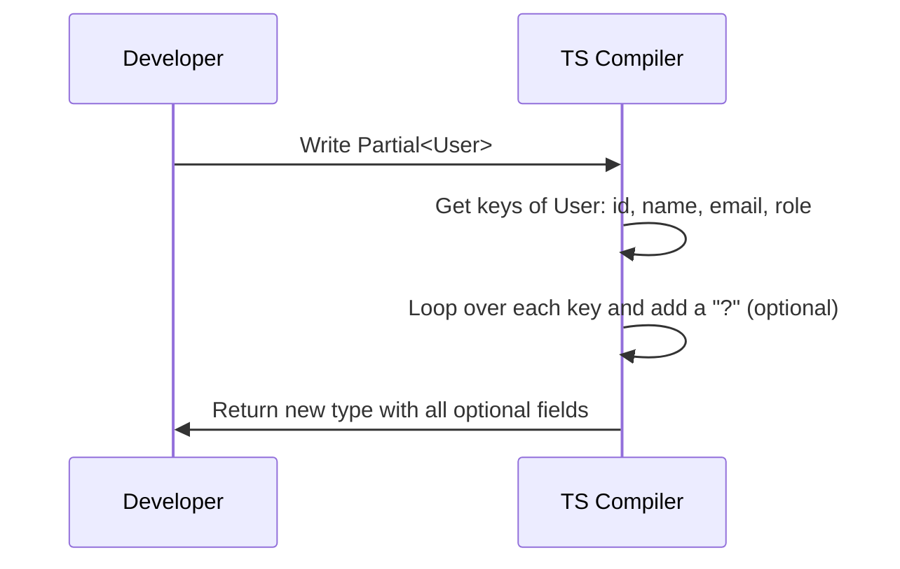

# Chapter 6: Utility Types

In [Chapter 5: Generics](05_generics_.md), we learned how to create reusable "molds" for our types using placeholders like `<T>`. But what if you don't want to build a mold from scratch? What if you already have a perfect type, but you just need a slightly different variation of it for a specific situation?

## The Problem: The Copy-Paste Trap

Imagine you have a `User` type for your application:

```typescript
type User = {
  id: number;
  name: string;
  email: string;
  role: string;
};
```

Now, think about the different places you use user data:
1. When **updating** a user, maybe they only want to change their email. You need a type where *all* fields are optional.
2. When showing a **preview** list of users, you only need the `id` and `name`. 
3. When **creating** a user, the database generates the `id`, so you shouldn't provide it.

You could copy and paste the `User` type and modify it for each case, but that's exhausting. Worse, if you add a `lastName` field to `User` later, you have to remember to update all your copied types!

## What are Utility Types?

**Utility Types** are built-in TypeScript tools that transform existing types into new variations. 

### The Kitchen Utensils Analogy

Think of your base `User` type as a block of cheese. You could take a knife and carefully carve it into slices or cubes every single time, but that takes forever. Instead, you use kitchen utensils—a cheese slicer or a dicer—to quickly transform the block into exactly the shape you need for a specific recipe.

TypeScript comes with a drawer full of these "utensils" right out of the box. Let's look at the most common ones!

## Key Concept 1: `Partial<T>`

The `Partial` utility type takes a type and makes **all of its properties optional**. It's like saying, "Give me this type, but I only care about filling in some of the fields."

Let's solve our **update user** problem:

```typescript
type UpdateUser = Partial<User>;

// Equivalent to:
// type UpdateUser = {
//   id?: number;
//   name?: string;
//   email?: string;
//   role?: string;
// };
```

Now, you can safely pass just the fields that changed:

```typescript
// Only updating the email? No problem!
const changes: UpdateUser = { email: "new@email.com" };
```

## Key Concept 2: `Pick<T, K>`

The `Pick` utility type lets you **select specific properties** from an existing type. It takes two ingredients: the base type, and a list of the property names you want to keep.

Let's solve our **user preview** problem:

```typescript
type UserPreview = Pick<User, "id" | "name">;

// Equivalent to:
// type UserPreview = {
//   id: number;
//   name: string;
// };
```

Now, you can't accidentally include too much information:

```typescript
const preview: UserPreview = { id: 1, name: "Tom" };
```

## Key Concept 3: `Omit<T, K>`

The `Omit` utility type is the exact opposite of `Pick`. It **removes specific properties** from a type. You tell it the base type and the properties you want to throw away.

Let's solve our **create user** problem (where we shouldn't provide the `id`):

```typescript
type CreateUser = Omit<User, "id">;

// Equivalent to:
// type CreateUser = {
//   name: string;
//   email: string;
//   role: string;
// };
```

Now, the database can generate the ID, and your type enforces that the user doesn't try to pass one:

```typescript
const newUser: CreateUser = { 
  name: "Alice", 
  email: "a@b.com", 
  role: "admin" 
};
```

## Under the Hood: How Does This Work?

How does TypeScript magically create these new types? It uses [Generics](05_generics_.md) combined with a feature called **Mapped Types**. A mapped type is essentially a `for` loop that runs over the keys of a type.

Let's look at the step-by-step journey of what happens when you use `Partial<User>`:



1. You write `Partial<User>`.
2. TypeScript grabs the list of keys from `User`: `id`, `name`, `email`, `role`.
3. It loops over each key and applies the `?` modifier, making them optional.
4. It hands you back a brand-new type definition!

If we were to write a simplified version of `Partial` ourselves using a mapped type, it would look like this:

```typescript
type MyPartial<T> = {
  [K in keyof T]?: T[K];
};
```

Let's break down this tiny loop:
* `keyof T` gets all the keys of the generic type `T` (like `"id" | "name"`).
* `[K in keyof T]` loops through each key, calling it `K`.
* `?` adds the optional modifier.
* `T[K]` keeps the original type of that property (like `number` for `id`).

## Conclusion

You've just learned how to use **Utility Types** to quickly slice, dice, and modify your base types! Instead of copying and pasting, tools like `Partial`, `Pick`, and `Omit` let you derive new variations from existing types safely. If your base type changes, your utility types automatically update too.

These transformations are incredibly useful when defining the shapes of data coming into and going out of your API. We'll explore exactly how to structure those shapes in the next chapter: [Data Transfer Objects (DTOs)](07_data_transfer_objects__dtos__.md).

---

Generated by [AI Codebase Knowledge Builder](https://github.com/The-Pocket/Tutorial-Codebase-Knowledge)