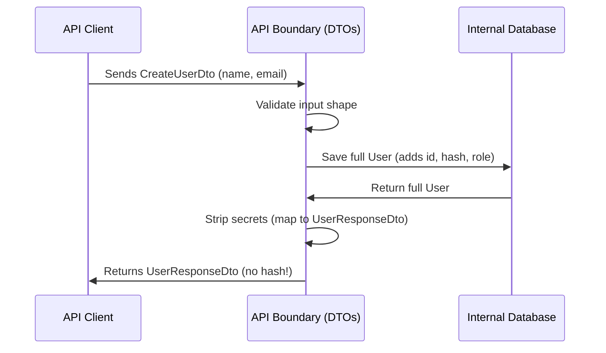

# Chapter 7: Data Transfer Objects (DTOs)

In [Chapter 6: Utility Types](06_utility_types_.md), we learned how to use tools like `Pick` and `Omit` to create variations of our types. Now, let's see why this is a superpower when building APIs and applications!

## The Problem: The Leaky Database

Imagine you have a `User` type that represents exactly how a user is stored in your database:

```typescript
type User = {
  id: string;
  name: string;
  email: string;
  passwordHash: string;
  role: "admin" | "user";
};
```

Now, think about what happens when a new user signs up. If your API accepts the raw `User` type, you might get this:

```typescript
const badInput: User = {
  id: "my-custom-id",       // Danger! DB should generate this
  name: "Alice",
  email: "a@b.com",
  passwordHash: "oops",     // Client shouldn't send a hash!
  role: "admin"             // Danger! Users shouldn't pick their role
};
```

If you use the same type for your database and your API request, you accidentally let clients do dangerous things. Similarly, if you return the raw `User` from your API, you might accidentally leak the `passwordHash` to the frontend!

## What are Data Transfer Objects (DTOs)?

A **Data Transfer Object (DTO)** is a strictly typed shape for data entering or leaving your system. It acts as a boundary guard.

### The Shipping Container Analogy

Imagine a busy international port. Ships carry all sorts of goods. To keep the port secure, every item entering or leaving must be packed into a standardized shipping container with a clear manifest (a DTO). 

The port doesn't care about the messy internal warehouse (your database). It only cares about the container's shape. If someone tries to smuggle an unauthorized item (like setting `role: "admin"`), the port rejects it because it doesn't fit the allowed container shape.

By separating your internal models from your DTOs, you clearly control exactly what data is allowed in, and what data is allowed out.

## Key Concept 1: Input DTOs

An **Input DTO** defines the shape of data coming *into* your system, like an API request body. It should only contain fields the client is allowed to provide.

We can use the `Omit` utility type we learned in [Chapter 6: Utility Types](06_utility_types_.md) to create this safely:

```typescript
// Clients can provide name and email, but NOT id, role, or passwordHash
type CreateUserDto = Omit<User, "id" | "role" | "passwordHash">;
```

Now, the client can only provide the fields that make sense:

```typescript
const goodInput: CreateUserDto = {
  name: "Alice",
  email: "alice@example.com"
}; // Safe! ✅
```

If they try to sneak in an `id` or `role`, TypeScript will block it at compile-time.

## Key Concept 2: Output DTOs

An **Output DTO** defines the shape of data going *out* of your system, like an API response. It should only contain fields the client is allowed to see.

We definitely want to remove the `passwordHash` before sending data to the frontend!

```typescript
// Return everything EXCEPT the passwordHash
type UserResponseDto = Omit<User, "passwordHash">;
```

Now, your API can safely return user data without worrying about accidental data leaks:

```typescript
const publicProfile: UserResponseDto = {
  id: "123",
  name: "Alice",
  email: "alice@example.com",
  role: "user"
}; // Safe! ✅ No password leak!
```

## Solving the Use Case

Let's put it all together in a simple API function. We'll use the `CreateUserDto` for input, and the `UserResponseDto` for output.

```typescript
function handleCreateUser(input: CreateUserDto): UserResponseDto {
  // 1. Hash the password (skipped for simplicity)
  // 2. Save to database, which generates an id and sets role
  const dbUser: User = saveToDatabase(input); 

  // 3. Return the safe public shape
  return dbUser; 
}
```

Because `dbUser` is of type `User`, and our function expects to return `UserResponseDto`, TypeScript will automatically ensure the `passwordHash` is stripped away (or at least, it will warn us if we try to return the raw `User` without omitting the secret fields)!

## Under the Hood: How Does This Work?

Let's look at the step-by-step journey of data flowing through your system boundaries using DTOs:



1. The client sends data matching the **Input DTO** (`CreateUserDto`).
2. The API boundary checks the data against the DTO shape.
3. The API does internal work (hashing passwords, generating IDs) and saves the full `User` to the database.
4. The database returns the full `User` model.
5. The API maps this to the **Output DTO** (`UserResponseDto`), stripping away the `passwordHash`.
6. The safe **Output DTO** is sent back to the client.

## Diving Deeper into the Code

In real applications, the mapping step (converting a `User` to a `UserResponseDto`) is crucial. You might write a simple helper function to do this safely:

```typescript
function toUserResponse(user: User): UserResponseDto {
  return {
    id: user.id,
    name: user.name,
    email: user.email,
    role: user.role,
  };
}
```

By explicitly picking the fields to return, you guarantee that no matter what gets added to the `User` model in the future, it won't accidentally leak to the client unless you add it to this function. 

Thanks to [Chapter 1: Static Typing](01_static_typing_.md), if you forget a field that is required by `UserResponseDto`, TypeScript will catch it immediately!

## Conclusion

You've just learned how to protect your application's boundaries using **Data Transfer Objects (DTOs)**! By defining strict shapes for data entering (`CreateUserDto`) and leaving (`UserResponseDto`) your system, you act like a secure port—ensuring only authorized goods pass through, and preventing dangerous leaks or invalid data.

However, there's a catch. TypeScript types only exist at compile time. What if a malicious client sends a request that *doesn't* match your DTO at runtime? TypeScript can't stop them once the code is running! We need a way to enforce these shapes when the application is live. We'll explore this in the next chapter: [Runtime Validation](08_runtime_validation_.md).

---

Generated by [AI Codebase Knowledge Builder](https://github.com/The-Pocket/Tutorial-Codebase-Knowledge)