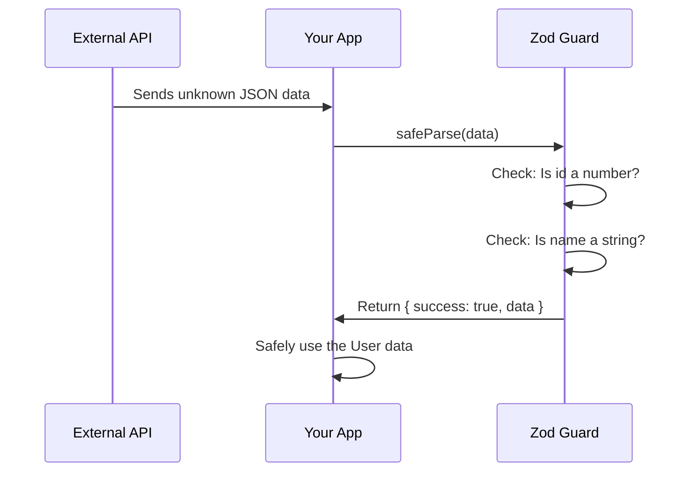

# Chapter 8: Runtime Validation

In [Chapter 7: Data Transfer Objects (DTOs)](07_data_transfer_objects__dtos__.md), we learned how to define strict shapes for data entering and leaving our API. But we ended with a scary thought: TypeScript types vanish when the code compiles. What happens when a malicious client sends bad data at runtime?

## The Problem: The Type Assertion Lie

Imagine you are fetching a user from an external API. You know the data should match your `User` type, so you write this:

```typescript
const data: unknown = await res.json();
const user = data as User; // 🚨 Lying to TypeScript!
```

Using `as User` is called a **type assertion**. It’s like wearing a police badge you bought at a toy store. You *look* like a cop to TypeScript, but you have no real authority. 

If the API actually returns `{ name: 123 }`, your code will compile perfectly, but it will crash the moment it runs when you try to call `user.name.toUpperCase()`. TypeScript is the map, but it can't stop bad data from sneaking in at runtime.

## What is Runtime Validation?

**Runtime Validation** is the practice of using tools to verify external data while the program is actually running. 

### The Border Security Checkpoint Analogy

Think of your application as a country. TypeScript is the map or the diplomatic agreement that says who *should* be allowed in. However, a map can't physically stop someone from crossing the border.

Runtime Validation is the actual **security checkpoint at the border**. When data arrives (from an API, a user form, or a file), the guard checks its "passport." If the data doesn't match the rules, it gets turned away before it can cause any harm inside your app.

## Key Concept 1: Enter Zod

To build our security checkpoint, we will use a popular library called **Zod**. Zod lets you define a schema (a blueprint) that works at *both* compile-time and runtime.

First, let's define our schema:

```typescript
import { z } from "zod";

const UserSchema = z.object({
  id: z.number(),
  name: z.string()
});
```

This looks very similar to a TypeScript type, but `z.object` and `z.string` are actual JavaScript functions that can check data while your app is running!

## Key Concept 2: The Single Source of Truth

You might be thinking: "Do I have to write a Zod schema AND a TypeScript type?" No! Zod can generate the TypeScript type for you.

```typescript
// Automatically creates the TypeScript type from the schema!
type User = z.infer<typeof UserSchema>;
```

Now, your Zod schema is the single source of truth. If you update the schema, your TypeScript type updates automatically. No more keeping two different definitions in sync!

## Key Concept 3: Checking the Passport

Zod gives us two main ways to check incoming data: `parse` and `safeParse`.

### `parse` - The Strict Guard
If the data is invalid, `parse` throws an error immediately, stopping the program.

```typescript
const badData = { name: 123 };
UserSchema.parse(badData); // Throws Error!
```

### `safeParse` - The Friendly Guard
`safeParse` doesn't throw an error. Instead, it returns a result object that tells you if it succeeded or failed. 

```typescript
const result = UserSchema.safeParse(badData);

if (!result.success) {
  console.log(result.error); // Handle the error nicely
} else {
  console.log(result.data);  // Safely use the data
}
```

Notice how `safeParse` returns an object with a `success` property? This is exactly the **Discriminated Union** pattern we learned in [Chapter 3: Discriminated Unions](03_discriminated_unions_.md)! It lets us safely narrow down whether we have valid data or an error.

## Solving the Use Case

Let's fix our API fetching problem using Zod. We will replace the dangerous `as User` lie with a proper security checkpoint.

```typescript
const data: unknown = await res.json();

// Check the passport!
const result = UserSchema.safeParse(data);

if (!result.success) {
  throw new Error("Invalid user data from API");
}

// TypeScript knows result.data is a valid User
const user = result.data; 
```

Now, if the API sends back `{ name: 123 }`, Zod catches it before it crashes your app. If the API sends back `{ id: 1, name: "Alice" }`, Zod validates it and TypeScript safely lets it through.

## Under the Hood: How Does This Work?

Let's look at the step-by-step journey of what happens when data hits our Zod checkpoint:



1. Your app receives raw, unknown data from the API.
2. You pass the data to Zod's `safeParse` method.
3. Zod loops through the schema and checks each field at runtime (e.g., `typeof data.name === "string"`).
4. If all checks pass, Zod returns the data in a `{ success: true, data }` object.
5. TypeScript now knows the data is safe and allows you to use it as a `User`.

## Diving Deeper into the Code

What is Zod actually doing under the hood? It's essentially automating the [Type Narrowing](04_type_narrowing_.md) process we learned earlier, but in a much more robust way.

If we didn't have Zod, we would have to write tedious manual checks like this:

```typescript
function isUser(data: unknown): data is User {
  return (
    typeof data === "object" &&
    data !== null &&
    "id" in data &&
    typeof data.id === "number" &&
    "name" in data &&
    typeof data.name === "string"
  );
}
```

That is exhausting to write and easy to mess up! Zod writes these checks for you, ensuring your runtime guards perfectly match your TypeScript types.

## Conclusion

You've just learned how to protect your application from the outside world! **Runtime Validation** acts as the security checkpoint at your app's border, ensuring that external data actually matches your TypeScript types before it can cause any damage. By using a library like Zod, you can define a schema once and automatically generate both your runtime checks and your [Static Typing](01_static_typing_.md).

Now that your code is safe and validated, how do you set up a real-world TypeScript project to compile and run all these amazing features? We'll explore that in the next chapter: [Project Configuration](09_project_configuration_.md).

---

Generated by [AI Codebase Knowledge Builder](https://github.com/The-Pocket/Tutorial-Codebase-Knowledge)