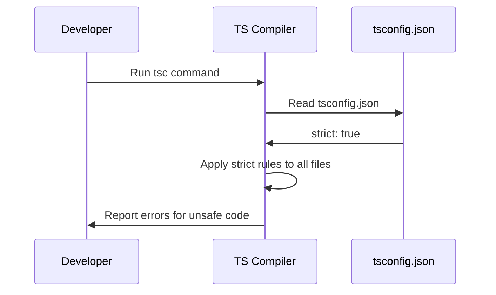

# Chapter 9: Project Configuration

In [Chapter 8: Runtime Validation](08_runtime_validation_.md), we learned how to guard our app's borders against bad external data using tools like Zod. But what about the rules inside our own codebase? How do we make sure the TypeScript compiler is actually checking our code as strictly as possible?

## The Problem: The Lenient Referee

Imagine playing a board game, but the referee lets players break the rules. "Oh, you moved 10 spaces instead of 3? That's fine, go ahead." That's what TypeScript is like by default! If you don't configure it, it might let you write unsafe code without complaining.

```typescript
// TypeScript without strict mode
function add(a, b) { // No types? Sure, no problem!
  return a + b;
}
```

This is dangerous, especially when using AI to generate code. AI might take shortcuts and omit types, and a lenient compiler won't catch them. We need a way to tell the compiler to be strict.

## What is Project Configuration?

Project configuration is handled by a file called `tsconfig.json`. It dictates how strictly the TypeScript compiler checks your code.

### The Board Game Analogy

Think of `tsconfig.json` as the rulebook and difficulty settings for a board game. It determines how strict the referee (the compiler) will be. Setting `strict: true` turns on all the hardest rules, ensuring neither you nor an AI can sneak in unsafe patterns.

## Key Concept 1: The `tsconfig.json` File

This is a JSON file sitting at the root of your project. It tells the TypeScript compiler exactly how to behave. You can generate a basic one using the terminal:

```bash
tsc --init
```

This creates a `tsconfig.json` file with lots of options, mostly commented out, waiting for you to choose your difficulty level.

## Key Concept 2: The `strict` Flag

The most important option in that file is `strict`. When you set it to `true`, you are telling TypeScript: "Be as harsh as possible. Don't let me make silly mistakes."

```json
{
  "compilerOptions": {
    "strict": true
  }
}
```

Enabling `strict: true` turns on several sub-rules. The most famous one is `noImplicitAny`, which stops you from creating variables or parameters without a type. It also turns on `strictNullChecks`, which stops you from using a variable that might be `null` without checking it first (like we learned in [Chapter 4: Type Narrowing](04_type_narrowing_.md)).

## Solving the Use Case: Taming the AI's Code

Let's say an AI writes this function for you:

```typescript
function shout(phrase) {
  return phrase.toUpperCase();
}
```

Without `strict: true`, the compiler sees `phrase` as `any` and says "Looks good to me!" But if you pass a number at runtime, it crashes.

With `strict: true` enabled, the compiler immediately draws a red line:

```typescript
function shout(phrase) { 
  // Error: Parameter 'phrase' implicitly has an 'any' type.
  return phrase.toUpperCase();
}
```

Now you are forced to fix it, applying the [Static Typing](01_static_typing_.md) we learned in Chapter 1:

```typescript
function shout(phrase: string): string {
  return phrase.toUpperCase(); // Safe! ✅
}
```

## Under the Hood: How Does This Work?

What happens when you run the compiler with a config file? Let's look at the step-by-step journey:



1. You run the TypeScript compiler (`tsc`).
2. The compiler looks for `tsconfig.json` in your project folder.
3. It reads the rules, like `strict: true`.
4. It applies these strict rules to every `.ts` file in your project.
5. If any code breaks the strict rules, the compiler throws an error and refuses to compile.

## Diving Deeper into the Code

While `strict` is the star of the show, `tsconfig.json` has a few other important settings you should know about to make your project run smoothly:

```json
{
  "compilerOptions": {
    "target": "ES2020",
    "outDir": "./dist",
    "rootDir": "./src"
  }
}
```

* `target`: Tells TypeScript which version of JavaScript to compile down to (e.g., modern ES2020 or older ES5 for older browsers).
* `outDir`: Where to put the compiled JavaScript files (keeping them separate from your `.ts` files).
* `rootDir`: Where your TypeScript source files live.

These settings ensure your code runs in the right environment and keeps your project folders organized.

## Conclusion

You've just learned how to take control of your TypeScript compiler using **Project Configuration**! By creating a `tsconfig.json` file and turning on `strict: true`, you set the difficulty to "hard mode," ensuring the referee catches every unsafe pattern—whether it comes from you or an AI. 

Now that your project is configured and safe, how do you split your code into manageable pieces across different files? We'll explore that in the next chapter: [Module Systems](10_module_systems_.md).

---

Generated by [AI Codebase Knowledge Builder](https://github.com/The-Pocket/Tutorial-Codebase-Knowledge)