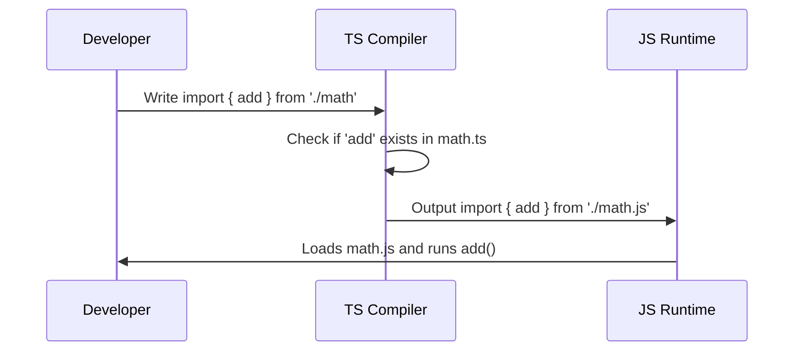

# Chapter 10: Module Systems

In [Chapter 9: Project Configuration](09_project_configuration_.md), we learned how to configure the TypeScript compiler to enforce strict rules. But as your project grows, putting all your code into one massive file becomes a nightmare. How do you split your code across multiple files and safely share it?

## The Problem: The Giant Monolith

Imagine an `index.ts` file with 5,000 lines of code. Finding anything is impossible. Naturally, you want to split your code into organized files like `users.ts` and `orders.ts`. 

But how do you use a function from `users.ts` inside `orders.ts`? You need a way to "export" code from one file and "import" it into another. However, JavaScript has two completely different ways to do this, and mixing them up causes disastrous runtime crashes!

## What are Module Systems?

A **Module System** is the set of rules determining how code is split, shared, and imported across files. 

### The Logistics Network Analogy

Think of your files as countries, and your exported functions as packages. A module system is the logistics network determining how those packages are delivered. 

Currently, there are two shipping networks available:
1. **CommonJS (CJS):** The old, reliable cargo ship network. It uses `require()` to receive packages and `module.exports` to send them.
2. **ES Modules (ESM):** The modern, fast airmail network. It uses `import` to receive packages and `export` to send them.

If a file tries to receive a package via airmail (`import`) but the sender shipped it on a cargo ship (`module.exports`), the package gets lost at the border, and your app crashes at runtime!

## Key Concept 1: CommonJS (The Cargo Ship)

CommonJS was the original module system built for Node.js. It loads modules synchronously, which was fine for servers but slow for browsers.

Here is how you export a package using CommonJS:

```javascript
// math.js - Sending the package
function add(a, b) { return a + b; }
module.exports = { add };
```

And here is how you import it:

```javascript
// main.js - Receiving the package
const { add } = require('./math');
console.log(add(1, 2)); // 3
```

Notice the `module.exports` and `require()` keywords. That's the CommonJS cargo ship in action.

## Key Concept 2: ES Modules (The Airmail)

ES Modules are the official, modern standard introduced in JavaScript. The browser and Node.js both support it natively today.

Here is how you export a package using ESM:

```typescript
// math.ts - Sending the package
export function add(a: number, b: number) {
  return a + b;
}
```

And here is how you import it:

```typescript
// main.ts - Receiving the package
import { add } from './math';
console.log(add(1, 2)); // 3
```

Notice the `export` and `import` keywords. This is the ESM airmail network. It's cleaner and allows tools to optimize your code better.

## Solving the Use Case: Preventing Border Crashes

The biggest trap beginners fall into is mixing these two systems. If you use `import` in one file and `module.exports` in another, you'll get a dreaded runtime error like `Cannot use import statement outside a module` or `require is not defined`.

How do we solve this? **Pick one system and stick to it.** For modern TypeScript projects, you should always choose **ES Modules**.

To enforce this, we configure our [Project Configuration](09_project_configuration_.md) (`tsconfig.json`) to use the ESM standard:

```json
{
  "compilerOptions": {
    "module": "ESNext"
  }
}
```

By setting `"module": "ESNext"`, you tell TypeScript: "I am only using the airmail network. If anyone accidentally tries to use `require()`, draw a red line under it!"

## Under the Hood: How Does This Work?

Let's look at the step-by-step journey of what happens when you use an ES Module `import` in your TypeScript code:



1. You write `import { add } from './math'` in your TypeScript file.
2. The TypeScript compiler checks `math.ts` to ensure `add` actually exists and the types match.
3. If it's safe, TypeScript compiles your code. Because we chose ESM, it leaves the `import` statement as-is (just changing the extension to `.js`).
4. The JavaScript runtime (Node or browser) reads the `import` statement, fetches `math.js`, and executes your code safely.

## Diving Deeper into the Code

Within the ES Modules system, there are two ways to send your packages: Named Exports and Default Exports.

**Named Exports** (The standard way):
You can export multiple items from a single file by name. The importing file *must* use the exact same name wrapped in curly braces.

```typescript
// tools.ts
export const hammer = "Hammer";
export const wrench = "Wrench";
```

```typescript
// main.ts
import { hammer } from './tools'; // Only get the hammer
```

**Default Exports** (The special delivery):
A file can only have *one* default export. It's the "main" thing the file does. When importing a default, you don't use curly braces, and you can name it whatever you want.

```typescript
// logger.ts
export default function log(msg: string) {
  console.log(msg);
}
```

```typescript
// main.ts
import logMessage from './logger'; // Name it whatever!
logMessage("Hello!");
```

## Conclusion

You've just learned how to organize your code across multiple files using **Module Systems**! By understanding the divide between the old CommonJS cargo ship (`require`) and the modern ES Modules airmail (`import`), you can prevent frustrating runtime import errors. For any new TypeScript project, stick to ES Modules and configure your `tsconfig.json` accordingly.

Congratulations! You've reached the end of our journey. You now have the foundational knowledge to write safe, maintainable, and well-structured TypeScript code, from designing strict types to validating data at runtime and configuring your project for success.

---

Generated by [AI Codebase Knowledge Builder](https://github.com/The-Pocket/Tutorial-Codebase-Knowledge)