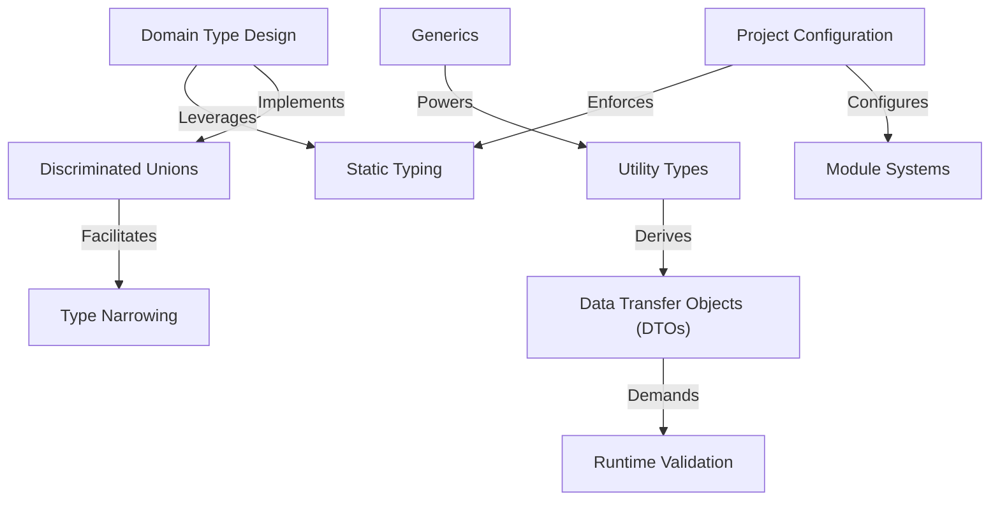

# Tutorial: ts

This project is a comprehensive learning guide for **TypeScript** specifically designed for programmers in the AI era. It teaches developers how to leverage **Static Typing** to write safer, more maintainable code and how to effectively review AI-generated outputs. The curriculum spans from *basic type definitions* and *Domain Type Design* to advanced patterns like *Generics* and *Discriminated Unions*, while emphasizing that TypeScript alone isn't a silver bullet—external data still requires **Runtime Validation**, and the overall codebase needs proper **Project Configuration** to enforce these standards.

**Source Repository:** [None](None)

## Chapters

1. [Static Typing
](01_static_typing_.md)
2. [Domain Type Design
](02_domain_type_design_.md)
3. [Discriminated Unions
](03_discriminated_unions_.md)
4. [Type Narrowing
](04_type_narrowing_.md)
5. [Generics
](05_generics_.md)
6. [Utility Types
](06_utility_types_.md)
7. [Data Transfer Objects (DTOs)
](07_data_transfer_objects__dtos__.md)
8. [Runtime Validation
](08_runtime_validation_.md)
9. [Project Configuration
](09_project_configuration_.md)
10. [Module Systems
](10_module_systems_.md)

---

Generated by [AI Codebase Knowledge Builder](https://github.com/The-Pocket/Tutorial-Codebase-Knowledge)