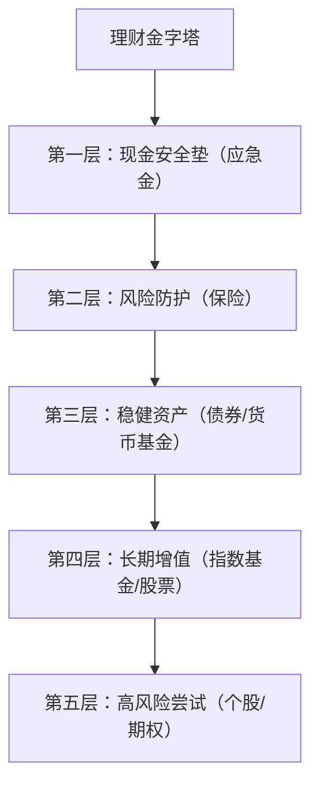

# Chapter 1: 理财金字塔 (Financial Pyramid)

想象一下，你要盖一座房子。你会先打地基，还是先盖屋顶？肯定是先打地基——地基不牢，房子会塌。理财也是一样！很多人刚接触理财，就急着买股票、买基金，结果遇到突发情况（比如失业、生病）时，只能亏本卖出，或者因为没存够钱，不敢开始投资。

理财金字塔就是一个“盖房子的顺序”：**先建最底层的安全地基，再慢慢往上加“楼层”（不同风险的投资）**。这样，你不会跳过关键步骤，也能更安心地理财。


## 1. 理财金字塔的五个层次（从下到上）
理财金字塔像一座房子，每一层都有不同的作用，越往下越基础，越往上风险越高。我们逐层来看：

### 第一层：现金安全垫（应急金）
- **作用**：应对突发情况（比如失业、生病），让你不用卖股票/基金。
- **例子**：存3-6个月的生活费（比如每月支出3000元，就存9000元）。放在货币基金（比如余额宝）或银行活期里，因为安全、随时能取。
- **为什么重要**：如果没应急金，市场大跌时，你可能因为需要钱而被迫卖出，亏了钱。

### 第二层：风险防护（保险）
- **作用**：防止意外（比如生病、意外）导致大额支出。
- **例子**：医保（国家给的）、商业保险（比如重疾险、意外险）。
- **为什么重要**：保险是“用小钱防大风险”，比如生病住院，医保报销后，商业保险能帮你覆盖剩下的费用，不会让你掏空积蓄。

### 第三层：稳健资产（债券/货币基金）
- **作用**：比存款收益高，波动比股票小，适合中期备用。
- **例子**：债券基金（买国债、企业债）、货币基金（余额宝、零钱通）。
- **为什么重要**：当你有1-3年的备用金时，可以放在这里，比存款多赚一点，又不会像股票那样波动大。

### 第四层：长期增值（指数基金/股票）
- **作用**：长期投资，让钱增值（比如养老、买房）。
- **例子**：标普500指数基金（买美国500家大公司）、沪深300指数基金（买中国A股大公司）。
- **为什么重要**：长期来看，股票/指数基金能跑赢通胀，让你实现财富增长。

### 第五层：高风险尝试（个股/期权）
- **作用**：追求高收益，但风险极高。
- **例子**：买某只股票（比如茅台）、买期权（看涨/看跌）。
- **为什么重要**：新手不建议碰！因为波动太大，容易亏钱。


## 2. 怎么一步步建理财金字塔？（举个例子）
假设你每月收入5000元，每月固定支出3000元，结余2000元，我们可以这样建金字塔：

1. **第一步：存应急金**  
   先存3个月生活费（3000元/月 × 3 = 9000元）。放在货币基金里（比如余额宝），随时能取。  
   *（这一步是“打地基”，必须先完成！）*

2. **第二步：买保险**  
   如果没医保，先买医保；再买商业保险（比如重疾险，每年交1000元）。  
   *（这一步是“建墙”，防止意外“拆房子”）*

3. **第三步：买稳健资产**  
   把结余的2000元，每月存1000元到债券基金（比如每年存12000元），剩下的1000元用于日常。  
   *（这一步是“盖一楼”，比存款多赚一点，又安全）*

4. **第四步：买长期增值资产**  
   等应急金存够，再每月存500元到标普500指数基金（比如每年存6000元）。  
   *（这一步是“盖二楼”，让钱长期增值）*

5. **第五步：高风险尝试（可选）**  
   如果还有钱，再考虑买个股（比如每月存200元），但新手不建议。  
   *（这一步是“盖阁楼”，风险高，别急着做）*


## 3. 内部逻辑：为什么这样顺序？
理财金字塔的顺序不是随意的，而是根据“风险优先级”来的：  
- 最底层（应急金、保险）是“保命”的，必须先做；  
- 中间层（稳健资产）是“稳收益”的，适合中期备用；  
- 最上层（高风险投资）是“博高收益”的，适合长期且能承受风险的人。  

用mermaid图展示这个逻辑：



或者用流程图说明顺序：

```mermaid
flowchart LR
    start[开始理财] --> step1[存3-6个月应急金]
    step1 --> step2[买医保/商业保险]
    step2 --> step3[买债券/货币基金]
    step3 --> step4[买指数基金/股票]
    step4 --> step5[尝试个股/期权（可选）]
    step5 --> end[完成理财金字塔]
```


## 4. 新手最容易犯的错：跳过底层
很多人刚理财，就急着买股票/基金，结果遇到以下情况：  
- 生病需要钱，只能卖股票，亏了20%；  
- 失业没收入，只能取钱，错过后面的上涨；  
- 听消息买个股，亏了钱，再也不敢理财。  

这些问题的根源，就是**没建好理财金字塔的底层**。记住：**理财不是“先赚钱”，而是“先保命”**。


## 5. 总结
理财金字塔的核心是“**先基础，后风险**”。就像盖房子，地基越牢，房子越稳。新手一定要先建好前两层（应急金、保险），再考虑后面的投资。这样，你不会因为意外而亏钱，也能更安心地让钱增值。

下一章我们会讲[资产配置](02_资产配置__asset_allocation__.md)，这是理财金字塔的具体应用——怎么把你的钱分配到不同的“楼层”里，让收益和风险平衡。

---

Generated by [AI Codebase Knowledge Builder](https://github.com/The-Pocket/Tutorial-Codebase-Knowledge)