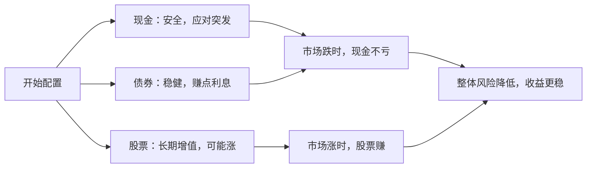

# Chapter 2: 资产配置 (Asset Allocation)

在前一章，我们学会了用**理财金字塔**来规划理财的顺序——先建好底层的应急金和保险，再考虑上层的投资。这一章，我们要解决一个更具体的问题：**怎么把金字塔里的钱“分配”到不同的资产里？** 这就是“资产配置”的核心——把鸡蛋放在不同的篮子里，避免所有钱一起亏。

## 1. 什么是资产配置？用“分蛋糕”来理解

想象一下，你有一块大蛋糕（比如10万元存款），要分给不同的人（不同资产）：  
- 有些人（现金）最安全，但分到的蛋糕少；  
- 有些人（股票）可能分到更多，但风险高；  
- 有些人（债券）介于中间，既不太安全也不太冒险。  

资产配置就是**给每个“人”分多少蛋糕**，让整体风险可控，收益更稳。  

简单来说：  
> 资产配置 = 把钱分成不同部分，分别投到现金、债券、股票等资产里，避免“把所有鸡蛋放在一个篮子”。

## 2. 为什么要做资产配置？举个例子

假设你有10万元，只买了股票（比如某只科技股）：  
- 如果股票涨了30%，你赚3万；  
- 但如果股票跌了30%，你亏3万，可能慌得卖掉，亏了钱。  

但如果用资产配置，把10万分成三部分：  
- 3万现金（应急金，安全）；  
- 4万债券（稳健，波动小）；  
- 3万股票（长期增值，波动大）。  

当股票跌30%时，你亏0.9万，但债券可能涨5%，赚0.2万，现金没亏。整体亏0.7万，比只买股票的3万亏得少。这就是资产配置的作用——**平衡风险，不让某类资产的大跌毁掉全部收益**。

## 3. 怎么做资产配置？三步走

### 第一步：确定你的“风险承受能力”
先问自己：**你能接受亏多少钱？**  
- 如果亏5%就睡不着，适合“保守型”；  
- 如果亏20%还能坚持，适合“平衡型”；  
- 如果亏50%也不怕，适合“激进型”。  

比如，假设你属于“平衡型”，能接受中等风险。

### 第二步：分配资产比例（用“理财金字塔”做参考）
根据理财金字塔的层次，给不同资产分配比例：  
- 现金（第一层）：10%（1万元，应急用）；  
- 债券（第三层）：30%（3万元，稳健收益）；  
- 股票/指数基金（第四层）：60%（6万元，长期增值）。  

用mermaid饼图展示：

### 第三步：选择具体资产（链接到后续章节）
- 现金：放货币基金（比如余额宝），安全随时取；  
- 债券：买债券基金（比如国债基金），波动比股票小；  
- 股票/指数基金：买宽基指数基金（比如标普500，第三章会讲），分散风险。  

## 4. 资产配置的“内部逻辑”：为什么这样分？

当你把钱分成现金、债券、股票后，会发生什么？用mermaid流程图说明：

## 5. 新手最容易犯的错：只投一类资产

很多人刚理财，就急着买股票，结果：  
- 市场大跌时，亏了钱，不敢再投；  
- 或者只买债券，收益太低，跑不赢通胀。  

记住：**资产配置不是“选最好的资产”，而是“选最适合你的组合”**。就像吃饭，不能只吃肉（股票），也不能只吃蔬菜（债券），要搭配着吃才健康。

## 6. 总结：资产配置是理财金字塔的“楼层分配”

理财金字塔的每一层（应急金、保险、债券、股票）都需要“分配”，而资产配置就是**给每一层分配具体的钱**。比如：  
- 应急金（第一层）：100%现金；  
- 保险（第二层）：100%保险产品；  
- 债券（第三层）：100%债券基金；  
- 股票（第四层）：100%指数基金。  

这样，你的理财金字塔才会“稳”，不会因为某层倒塌而全盘皆输。

下一章，我们会讲**宽基指数基金**——资产配置中最常用的“股票类资产”，教你怎么选具体的基金来分配钱。  
→ [宽基指数基金 (Broad-Based Index Funds)](03_宽基指数基金__broad_based_index_funds__.md)

---

Generated by [AI Codebase Knowledge Builder](https://github.com/The-Pocket/Tutorial-Codebase-Knowledge)