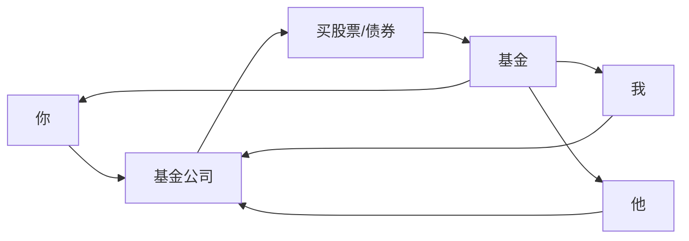

# Chapter 4: 基金 (Funds)

在前一章，我们学习了**宽基指数基金**——一个让你轻松拥有“市场拼图”的友好工具。这一章，我们要深入理解“基金”这个概念，它是理财中非常核心的工具，能帮你实现**分散投资**和**专业管理**，不用自己费心选个股。

## 1. 基金是什么？用“厨师做饭”来理解

想象一下，你想吃一顿丰盛的晚餐，但不想自己买食材、洗菜、切菜、炒菜（太麻烦！）。基金就像一个**专业厨师**：  
- 你把钱（食材）交给厨师（基金公司）；  
- 厨师用你的钱买一篮子食材（股票、债券等资产）；  
- 厨师做好“大餐”（基金），你直接吃（持有基金）。  

这样，你不用自己研究每家公司，也能拥有很多资产的一小部分，而且风险更分散。

## 2. 基金的本质： pooling money（凑钱投资）

基金的核心是**“凑钱”**：  
- 很多投资者（比如你、我、他）把钱凑在一起；  
- 基金公司用这些钱买一篮子资产（比如股票、债券）；  
- 每个投资者按比例拥有这篮子资产的一部分。  

用mermaid图展示这个流程：

## 3. 基金为什么好？解决新手的两个痛点

新手投资时，最怕两个问题：**选个股难**和**风险大**。基金刚好解决这两个问题：

### 痛点1：不想选个股，怕买错公司
如果你买一只股票，公司出问题（比如业绩下滑、被罚款），你会亏钱。但基金包含很多公司，就算某一家亏了，其他公司赚了，整体可能还是涨的。比如标普500指数基金里，就算苹果跌了，微软涨了，整体可能还是稳的。

### 痛点2：想分散风险，不用自己挑
基金已经帮你“分散”了风险——你不用研究每家公司，基金公司会按规则买资产，你直接拥有“一篮子资产”。就像买一篮子鸡蛋，而不是只买一个鸡蛋，摔了也不怕全碎。

## 4. 基金有哪些类型？

基金按投资方向分为几类，新手最需要知道的是：

### 1. 股票基金
主要买股票，风险高，长期收益潜力也高。比如：  
- 标普500指数基金（买美国500家大公司）；  
- 沪深300指数基金（买中国A股300家大公司）。

### 2. 债券基金
主要买债券，波动比股票小，适合稳健投资。比如：  
- 国债基金（买政府债券）；  
- 企业债基金（买公司债券）。

### 3. 混合基金
股票和债券都买，平衡风险和收益。比如：  
- 60%股票 + 40%债券的混合基金。

### 4. 指数基金（我们上一章学过）
不靠基金经理主观选股，而是复制某个指数（比如标普500）。这是新手最推荐的基金类型，因为**透明、成本低、分散**。

## 5. 怎么用基金？用“定投”更简单

新手最推荐的方法是**定投**（每月固定买一点），不用管市场涨跌。举个例子：

假设你每月结余1000元，想长期投资：  
- 每月1号，买500元标普500指数基金；  
- 每月15号，买500元沪深300指数基金。  

这样，市场涨的时候，你买的基金涨；市场跌的时候，你买的份额更多（因为同样的钱能买更多份额），长期下来，平均成本更低。

## 6. 基金的作用：用mermaid图总结

## 7. 内部实现：基金公司怎么帮你“买资产”？

当你买基金时，基金公司会做这些事（简单步骤）：  
1. 收集大家的钱（比如你买1000元，别人也买1000元）；  
2. 按规则买资产（比如指数基金按指数成分股比例买股票）；  
3. 每天更新持仓，确保和规则一致；  
4. 计算净值（每份基金值多少钱），让你知道自己的收益。  

这样，你不用自己选股票，直接拥有“一篮子资产”，而且成本低（因为不用研究每家公司）。

## 8. 新手最容易犯的错：只买一只基金

很多人刚理财，就只买一只基金（比如只买标普500），结果：  
- 如果标普500跌了，你亏了；  
- 或者只买债券基金，收益太低，跑不赢通胀。  

记住：**基金不是“选最好的”，而是“选最适合你的组合”**。就像吃饭，不能只吃肉（股票基金），也不能只吃蔬菜（债券基金），要搭配着吃才健康。

## 9. 总结：基金是“新手的友好工具”

基金就像一个“现成的投资篮子”，让你轻松拥有很多资产的一小部分，不用费心选个股，也能分散风险。它是资产配置中“股票类资产”的最好选择之一，尤其适合新手。

下一章，我们会讲**股票**——基金的“食材”之一，让你更懂基金里买的到底是什么。  
→ [股票 (Stocks)](05_股票__stocks__.md)

---

Generated by [AI Codebase Knowledge Builder](https://github.com/The-Pocket/Tutorial-Codebase-Knowledge)