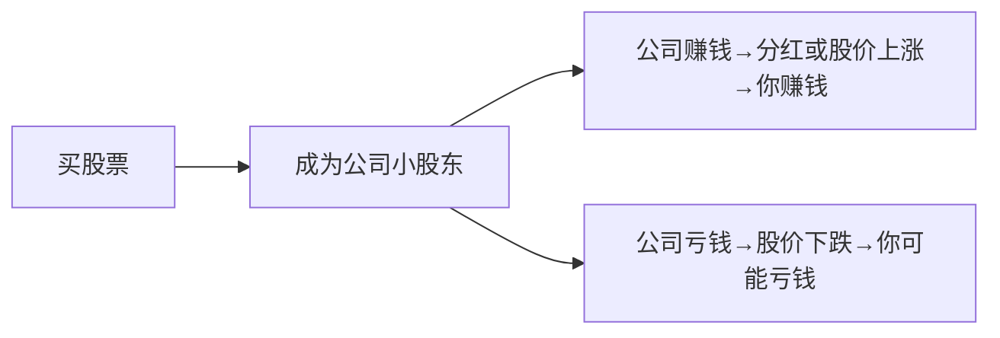

# Chapter 5: 股票 (Stocks)

在上一章，我们学习了**基金**——一个帮你轻松拥有“市场拼图”的专业工具。这一章，我们要深入看看基金里最常见的一种“拼图块”：**股票**。股票其实很简单，就像你成为一家公司的小股东，一起分享它的成长或亏损。

## 1. 股票是什么？用“奶茶店小老板”来理解

想象一下，你和朋友一起开奶茶店，每人出1000元，成为小老板。股票就是这样的“小老板凭证”——你买了苹果的股票，就是苹果公司的小股东之一，拥有它的一小部分所有权。

## 2. 股票能赚什么钱？

作为小股东，你有两种方式赚钱：  
- **分红**：如果奶茶店（公司）赚钱了，会把一部分利润分给小股东（比如每年给你50元）；  
- **股价上涨**：如果奶茶店越开越好，很多人想买它的“小老板凭证”，价格就会涨（比如你买的凭证从1000元涨到1500元，卖的时候赚500元）。

## 3. 股票会亏钱吗？

当然会！如果奶茶店生意不好（比如没人买奶茶），它的“小老板凭证”价格会跌（比如从1000元跌到500元），你可能亏500元。所以股票不是存款，短期会波动，长期可能增值，但需要承担风险。

## 4. 股票和基金的关系：基金是“奶茶店组合篮”

基金就像一个“奶茶店组合篮”，里面包含很多家奶茶店的“小老板凭证”（比如苹果、特斯拉、茅台）。当你买基金时，其实是间接买了这些股票，不用自己选。比如第四章学的**标普500指数基金**，里面包含500家美国大公司，你拥有这500家公司的一小部分，而不是只买一家，这样分散了风险。

## 5. 股票的流程：从买凭证到赚/亏钱

用mermaid图展示这个过程：

## 6. 内部实现：股票是怎么交易的？

当你买股票时，其实是和卖家通过**券商**（比如国内的证券公司）交易。基金公司买股票时，也是这样：把大家的钱凑起来，买很多股票，然后分给投资者。比如你买了1000元标普500基金，基金公司会用这1000元买500家公司的股票，你间接拥有这些公司的一小部分。

## 7. 新手最容易犯的错：只买一只股票

很多人刚理财，就急着买某只股票（比如只买苹果），结果：  
- 如果苹果亏了，你可能亏很多；  
- 或者只买一只股票，风险太高。  

记住：**股票不是“选最好的”，而是“选最适合你的组合”**。就像吃饭，不能只吃肉（股票），也不能只吃蔬菜（债券），要搭配着吃才健康。新手建议先通过基金接触股票，比如买标普500指数基金，分散风险。

## 8. 总结：股票是“长期增值的拼图块”

股票是基金里最常见的资产，也是长期增值的重要工具。它让你成为公司的小股东，分享成长，但也需要承担风险。新手不需要急着买个股，先通过基金（比如第四章学的宽基指数基金）接触股票，更安全。

下一章，我们要讲**定投**——一种适合新手的投资方法，教你如何定期买股票或基金，不用管市场涨跌，让投资更简单。  
→ [定投 (Dollar-Cost Averaging)](06_定投__dollar_cost_averaging__.md)

---

Generated by [AI Codebase Knowledge Builder](https://github.com/The-Pocket/Tutorial-Codebase-Knowledge)