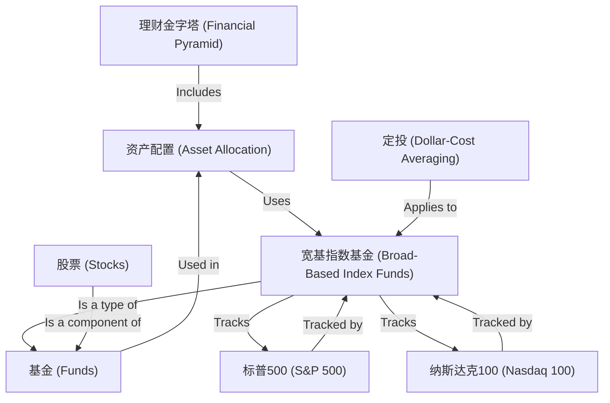

# Tutorial: tz

The `tz` project is a beginner-friendly guide to personal finance and investing. It teaches **core concepts** like the **Financial Pyramid** (a framework for prioritizing financial goals) and **Asset Allocation** (spreading investments to reduce risk). Key strategies include using **Broad-Based Index Funds** (which track market indices) and **Dollar-Cost Averaging** (investing regularly to avoid market timing). The project emphasizes understanding foundational tools like **Stocks** and **Funds**, with specific focus on popular indices like the **S&P 500** and **Nasdaq 100** to help new investors build a balanced, long-term portfolio.

**Source Repository:** [None](None)

## Chapters

1. [理财金字塔 (Financial Pyramid)
](01_理财金字塔__financial_pyramid__.md)
2. [资产配置 (Asset Allocation)
](02_资产配置__asset_allocation__.md)
3. [宽基指数基金 (Broad-Based Index Funds)
](03_宽基指数基金__broad_based_index_funds__.md)
4. [基金 (Funds)
](04_基金__funds__.md)
5. [股票 (Stocks)
](05_股票__stocks__.md)
6. [定投 (Dollar-Cost Averaging)
](06_定投__dollar_cost_averaging__.md)
7. [标普500 (S&P 500)
](07_标普500__s_p_500__.md)
8. [纳斯达克100 (Nasdaq 100)
](08_纳斯达克100__nasdaq_100__.md)

---

Generated by [AI Codebase Knowledge Builder](https://github.com/The-Pocket/Tutorial-Codebase-Knowledge)