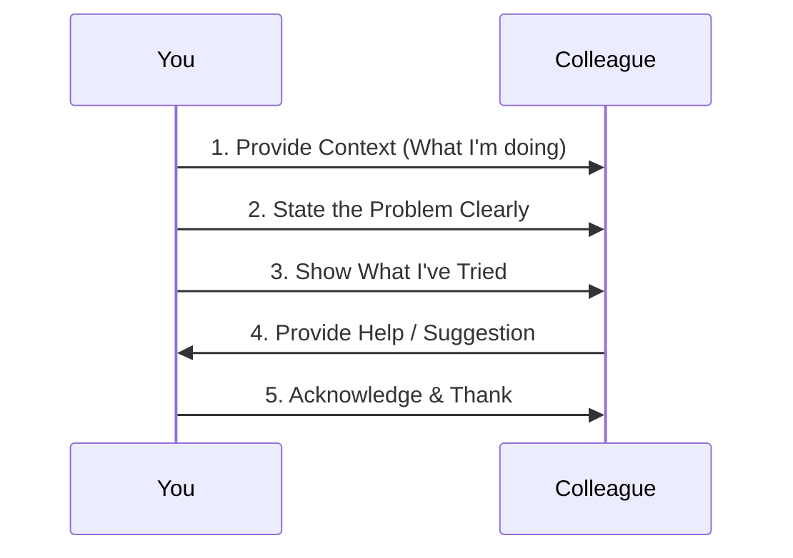

# Chapter 1: 职场沟通底层逻辑

Welcome to the first chapter! Let's start with the most fundamental skill in the workplace: communication.

Imagine this: You're working on a task and get stuck. You need help from a colleague. How do you ask?

*   **Option A:** "Hey, can you help me with this?" (Sends a message)
*   **Option B:** "Hi, I'm currently working on the user login feature. I've tried two methods to fix the password reset bug, but it's still not working. Could you take a quick look at my code to see if I'm missing something?" (Sends a message)

Which person would you rather help? Most likely, Option B. Why? Because they've given you context, shown they've tried to solve it themselves, and made it easy for you to help.

This chapter is about understanding the **underlying logic** behind effective workplace communication. It's the foundation upon which all other communication skills are built.

## What is "职场沟通底层逻辑"?

At its core, workplace communication is not about chatting or expressing your feelings. It's a tool to **get work done**.

Think of it like the foundation of a building. A strong foundation ensures the building is stable and won't collapse. In the same way, the underlying logic of communication ensures your interactions are clear, efficient, and lead to results.

Here are the three key principles:

1.  **Goal-Oriented:** Every communication should have a clear purpose. Are you asking for help? Reporting progress? Making a decision? Knowing your goal helps you structure your message.
2.  **Clarity and Structure:** Be clear and direct. Structure your information so others can understand it quickly. This means providing context, stating the problem, and suggesting a next step.
3.  **Build Trust:** Consistent, clear, and reliable communication builds trust. When people trust you, they are more willing to collaborate and help you.

The most important thing to remember is:

> **职场沟通不是表达情绪，而是推动事情。**
> (Workplace communication is not about expressing emotions, but about pushing things forward.)

## How to Apply It: A Simple Example

Let's go back to our example of asking for help. Let's break down why Option B is so much better.

### The "Bad" Way (Just Asking)

When you just ask "Can you help me?", you put all the work on the other person. They have to guess:
*   What are you working on?
*   What's the problem?
*   What have you already tried?

This is inefficient and can be frustrating for the person you're asking.

### The "Good" Way (Applying the Logic)

Let's see how the "good" way applies our three principles:

1.  **Goal-Oriented:** The goal is to get help fixing a bug.
2.  **Clarity and Structure:** The message is structured with context, problem, and effort.
    *   **Context:** "I'm working on the user login feature."
    *   **Problem:** "The password reset bug isn't working."
    *   **Effort:** "I've tried two methods already."
3.  **Build Trust:** By showing you've already tried to solve it, you demonstrate responsibility and respect for the other person's time.

Here's the full message again:

> "Hi, I'm currently working on the user login feature. I've tried two methods to fix the password reset bug, but it's still not working. Could you take a quick look at my code to see if I'm missing something?"

This small change makes a huge difference. It shows you're professional, prepared, and easy to work with.

## What's Happening Behind the Scenes?

When you communicate effectively, you create a smooth flow of information. Let's visualize this with a simple diagram.

This simple flow ensures that the interaction is productive for both parties. You get the help you need, and your colleague feels respected and valued.

## Where to Go From Here

Understanding this foundational logic is the first step. In the next chapter, we'll dive into a specific and crucial type of workplace communication: **how to report your work**. This is a skill you'll use every day to keep your manager informed and manage expectations.

[Next Chapter: 工作汇报能力](02_工作汇报能力_.md)

## Conclusion

In this chapter, we've learned that workplace communication is fundamentally different from casual conversation. It's a structured, goal-oriented process designed to move projects forward and build trust. By focusing on clarity, providing context, and showing effort, you can make your communication much more effective and professional.

Remember, the goal is not to express how you feel, but to make things happen. This simple shift in mindset is the key to successful workplace interactions.

---

Generated by [AI Codebase Knowledge Builder](https://github.com/The-Pocket/Tutorial-Codebase-Knowledge)