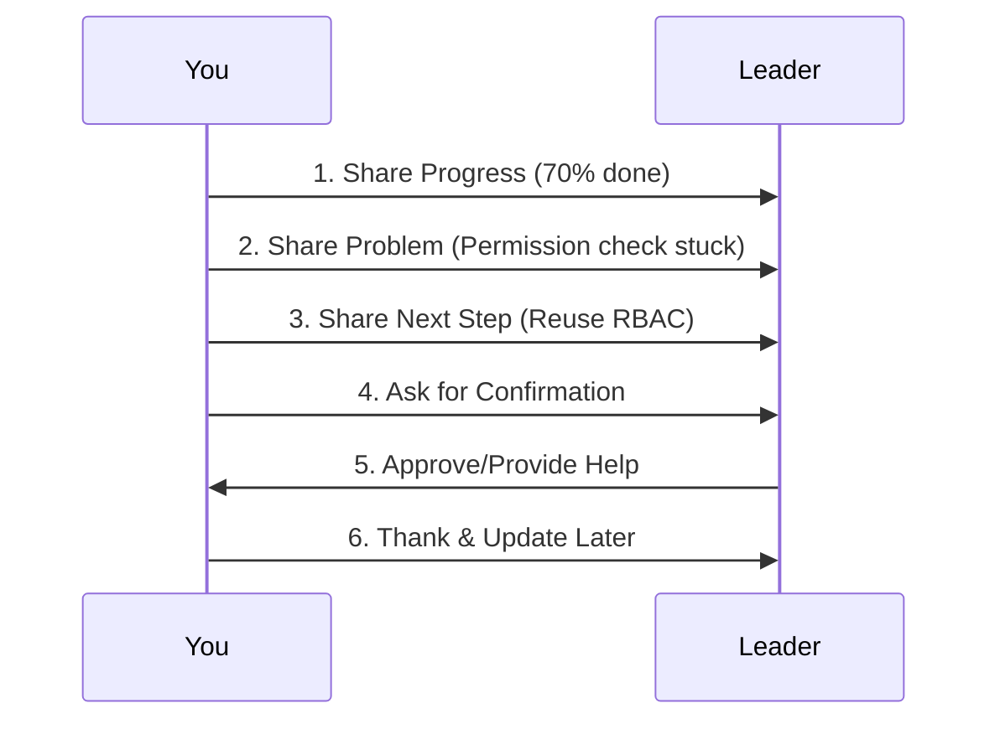

# Chapter 2: 工作汇报能力

Welcome back! In the previous chapter, we learned that workplace communication is a tool to **push things forward**, not just express feelings. One of the most important tools in this toolkit is **work reporting**—letting your leader know what you’re doing, where you are, and if you need help.  

Imagine this: You’re working on a project, and your leader asks, “How’s it going?” If you say, “Almost done,” they might think it’s ready tomorrow. But if you say, “I’ve finished 70%—I’m stuck on the permission check logic. I plan to reuse the old RBAC method—can you confirm if that’s okay?” they’ll know exactly what’s happening, what’s blocking you, and how to help.  

This chapter will teach you how to report work **clearly and systematically**—like a regular health check for your project. Let’s dive in!

## Why Work Reporting Matters
Work reporting is like a “project health report.” It tells your leader:  
- **What’s done**: Progress (e.g., “70% complete”).  
- **What’s stuck**: Problems (e.g., “Permission check logic is blocking me”).  
- **What’s next**: Next steps (e.g., “I’ll reuse the old RBAC method”).  
- **What you need**: Confirmation or support (e.g., “Need you to approve the RBAC approach”).  

Without this, your leader has to guess—wasting time and increasing stress. Good reporting builds trust because it shows you’re organized and proactive.

## The 4 Key Parts of a Good Report
Every report (daily, weekly, or risk-related) should include these four parts. Let’s break them down with simple examples:

### 1. Progress: What You’ve Done
Be specific. Instead of “I’m working on it,” say “I’ve finished 70% of the user login feature.”  

**Example**:  
> “I’ve completed 70% of the user login feature.”

### 2. Problem: What’s Blocking You
Don’t hide issues. Say what’s stuck and why.  

**Example**:  
> “I’m stuck on the permission check logic—can’t get the user roles to validate correctly.”

### 3. Next Step: What You’ll Do Next
Show you have a plan. This reassures your leader you’re not stuck.  

**Example**:  
> “I plan to reuse the old RBAC method from the previous project.”

### 4. Confirmation: What You Need
Ask for help or approval clearly. This avoids back-and-forth.  

**Example**:  
> “Can you confirm if reusing the old RBAC method is okay?”

## Types of Reports: Daily, Weekly, and Risk
Let’s look at how to apply these 4 parts to different reports:

### Daily Report (Quick & Focused)
Use this for daily check-ins. Keep it short—1-2 sentences.  

**Structure**:  
> Progress + Problem + Next Step + Confirmation  

**Example**:  
> “I’ve finished 70% of the user login feature. I’m stuck on the permission check logic. I’ll reuse the old RBAC method. Need you to confirm the approach.”

### Weekly/Monthly Report (Structured)
For longer periods, use a table to organize info.  

| Section       | Example                                                                 |
|--------------|-------------------------------------------------------------------------|
| **This Week’s Accomplishments** | Finished 70% of user login; Fixed 3 bugs in the cart feature.             |
| **Current Progress**          | User login is 70% done; Cart feature is 100% done.                        |
| **Problems**                 | Permission check logic is blocking user login.                           |
| **Next Week’s Plan**          | Finish user login; Start on the payment integration.                      |
| **Support Needed**           | Need approval for reusing the old RBAC method.                           |

### Risk Report (Proactive & Clear)
Don’t wait for things to blow up! Report risks early.  

**Structure**:  
> Current Plan + Risk + Impact + Suggestion  

**Example**:  
> “The user login was due Friday, but the permission check logic isn’t confirmed. If we don’t approve the RBAC method today, it might delay by 1-2 days. I suggest we proceed with the RBAC method and adjust later if needed.”

## Common Mistakes to Avoid
Here are some phrases that cause confusion—and how to fix them:  

| Bad Phrase               | Why It’s Bad                                  | Better Alternative                                  |
|--------------------------|----------------------------------------------|----------------------------------------------------|
| “I can’t do it.”          | Sounds negative; no solution.                  | “I’m stuck on X—can you help me with Y?”              |
| “It’s almost done.”       | Vague; leader doesn’t know when it’s ready.     | “I’ve finished 90%—only the testing is left.”         |
| “I thought you knew.”     | Blames others; increases tension.              | “I’ll make sure to update you next time.”             |
| “It’s not my fault.”      | Sounds like you’re avoiding responsibility.     | “Here’s what happened—let’s figure out how to fix it.” |

## How Reporting Works: A Simple Flow
When you send a report, here’s what happens (visualized with a diagram):  

This flow ensures your leader gets the info they need, and you get the support you need—fast!

## Why This Works: The “Template” Behind Reporting
Good reporting isn’t magic—it’s **structure**. Think of it like a template:  
1. **Fill in Progress**: What’s done?  
2. **Fill in Problem**: What’s stuck?  
3. **Fill in Next Step**: What’s next?  
4. **Fill in Confirmation**: What do you need?  

This template reduces “guesswork” for your leader. They don’t have to ask 10 questions—they get all the key info in one go.

## What’s Next?
In this chapter, we learned that work reporting is about **clarity and proactivity**. By using the 4-part structure, you’ll keep your leader informed, reduce stress, and build trust.  

In the next chapter, we’ll dive deeper into **upward communication**—how to talk to your leader effectively to align goals and manage expectations.  

[Next Chapter: 向上沟通](03_向上沟通_.md)

## Conclusion
Work reporting is a simple but powerful skill. Remember:  
- **Be specific** (no “almost done”).  
- **Share problems early** (don’t hide risks).  
- **Ask for help clearly** (no “I can’t do it”).  

With these tips, you’ll make your leader’s job easier—and yours too! Keep practicing, and soon reporting will feel natural.  

Stay tuned for the next chapter—we’re just getting started!

---

Generated by [AI Codebase Knowledge Builder](https://github.com/The-Pocket/Tutorial-Codebase-Knowledge)