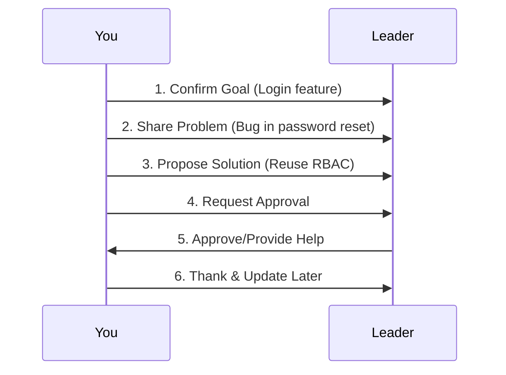

# Chapter 3: 向上沟通

Welcome back! In the previous chapter, we learned how to report your work clearly and proactively—like a project health check. Now, let’s dive into **upward communication**: how to talk to your leader effectively.  

Imagine this: You’re working on a project, and you hit a roadblock. Do you wait until the deadline to tell your leader, or do you speak up early? The answer is clear: **speak up early**. Upward communication is about aligning goals, managing expectations, and getting support—like a navigation system that keeps you and your leader on the same path.  

This chapter will teach you how to communicate with your leader in a way that builds trust, avoids misunderstandings, and gets you the help you need. Let’s get started!

## Why Upward Communication Matters
Upward communication is like a bridge between you and your leader. It ensures:  
- **You understand the goal**: No confusion about what you’re supposed to do.  
- **Your leader knows your progress**: They don’t have to guess if you’re on track.  
- **You get support when needed**: Resources, advice, or clarification.  
- **Risks are managed early**: Problems don’t blow up at the last minute.  

Without good upward communication, your leader might think everything is fine—until it’s too late. The core idea? **Leaders hate surprises, especially problems you don’t tell them about.**

## Key Concepts: How to Communicate Upward
Let’s break down the four pillars of upward communication:

### 1. Confirm the Goal (确认目标)
Before you start a task, make sure you and your leader are on the same page. What’s the goal? What does “done” look like?  

**Example**:  
> “I want to confirm: The goal of this task is to improve user login speed, right? And ‘done’ means the login time is under 2 seconds, correct?”

### 2. Prioritize Tasks (确认优先级)
If you have multiple tasks, ask your leader which one to focus on first. This shows you’re organized and respect their priorities.  

**Example**:  
> “I have three tasks: A, B, and C. If time is tight, which one should I prioritize?”

### 3. Manage Expectations (管理预期)
If you think a task might take longer or hit a roadblock, tell your leader early. Don’t wait until the deadline.  

**Example**:  
> “I’m working on task A, but I noticed a potential risk: The old system’s API might not support the new feature. This could delay things by 1-2 days. I’ll keep you updated.”

### 4. Request Resources (争取资源)
If you need help—like access to a tool, data, or a colleague’s time—ask clearly. Don’t assume your leader knows.  

**Example**:  
> “To finish task A, I need access to the database. Can you help me get that?”

## How to Apply It: A Step-by-Step Example
Let’s put this into practice with a real scenario. Suppose you’re working on a user login feature and hit a bug. Here’s how to communicate upward:  

1. **Confirm the goal**:  
   > “I’m working on the user login feature. The goal is to fix the password reset bug, right?”  

2. **Share progress and problem**:  
   > “I’ve tried two methods, but the bug is still there. I think it’s related to the old authentication system.”  

3. **Propose a next step**:  
   > “I plan to reuse the old RBAC method from the previous project. Can you confirm if that’s okay?”  

4. **Ask for support**:  
   > “I need you to approve the RBAC approach so I can move forward.”  

## What Happens When You Communicate Upward?
When you reach out to your leader, here’s the flow (visualized with a diagram):  

This flow ensures your leader gets the info they need, and you get the support to keep going. No surprises, no stress—just clear, proactive communication.

## Common Mistakes to Avoid
Here are some phrases that can cause problems—and how to fix them:  

| Bad Phrase               | Why It’s Bad                                  | Better Alternative                                  |
|--------------------------|----------------------------------------------|----------------------------------------------------|
| “I can’t do it.”          | Sounds negative; no solution.                  | “I’m stuck on X—can you help me with Y?”              |
| “It’s almost done.”       | Vague; leader doesn’t know when it’s ready.     | “I’ve finished 90%—only testing is left.”             |
| “I thought you knew.”     | Blames others; increases tension.              | “I’ll make sure to update you next time.”             |
| “This is impossible.”     | Too absolute; no room for discussion.           | “This is challenging—can we discuss a workaround?”    |

## Why This Works: The “Leader’s Mindset”
Leaders are busy. They don’t have time to guess what you need. By communicating upward clearly, you:  
- **Save their time**: They don’t have to ask 10 questions.  
- **Build trust**: They see you as proactive and reliable.  
- **Get results**: You get the help you need to finish your work.  

## What’s Next?
In this chapter, we learned how to communicate with your leader effectively—confirming goals, managing expectations, and getting support. This skill is key to building a strong working relationship with your leader.  

In the next chapter, we’ll dive into **peer communication**—how to collaborate with colleagues smoothly.  

[Next Chapter: 平级沟通](04_平级沟通_.md)

## Conclusion
Upward communication isn’t about being “nice” to your leader—it’s about being **clear and proactive**. Remember:  
- **Confirm goals** before you start.  
- **Share problems early** (don’t wait for deadlines).  
- **Ask for help clearly** (no vague requests).  

With these tips, you’ll make your leader’s job easier—and yours too! Keep practicing, and soon upward communication will feel natural.  

Stay tuned for the next chapter—we’re just getting started!

---

Generated by [AI Codebase Knowledge Builder](https://github.com/The-Pocket/Tutorial-Codebase-Knowledge)