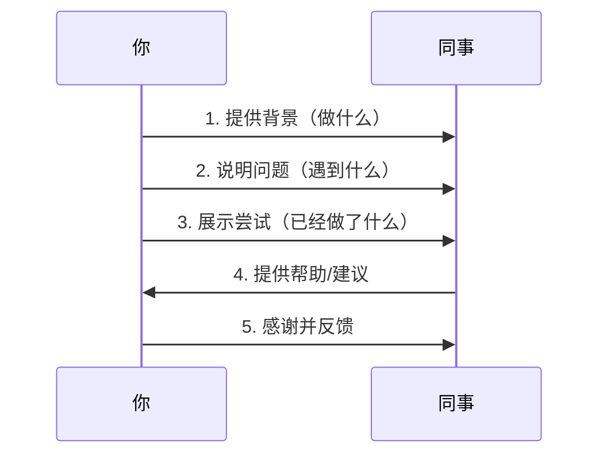

# Chapter 4: 平级沟通

在上一章[向上沟通](03_向上沟通.md)中，我们学会了如何和领导对齐目标、管理预期。现在，让我们把目光转向身边的同事——平级沟通。和同事协作时，你是否遇到过这样的场景？

同事小张突然发来消息：“哥，帮我看看这个bug！” 你是不是有点懵？不知道他在做什么，遇到了什么问题，甚至不知道该从哪里开始帮忙。而如果小张说：“我正在做用户登录功能，密码重置的bug一直没解决，我已经试了两种方法，但还是不行，你能帮我看看是不是我理解错了接口参数吗？” 你是不是更愿意帮忙？

平级沟通是团队协作的“润滑剂”，能让信息透明、责任清晰，避免无谓的误解和冲突。今天，我们就来学习如何做好平级沟通，让同事觉得你靠谱、省心。

## 为什么平级沟通很重要？
平级沟通的核心是**“让同事觉得你清楚、靠谱、不添乱”**。如果沟通不清，同事可能需要反复追问，甚至产生误会；如果处理不好冲突，团队氛围会变得紧张。反之，清晰的沟通能让协作更顺畅，提升团队效率。

## 平级沟通的三个关键：请求帮助、责任确认、冲突处理

### 1. 请求帮助：先给背景，再说问题
直接问“帮我看看”会让同事一头雾水，而提供背景能让对方快速理解你的需求。记住：**“先说你在做什么，再讲遇到了什么，最后展示你已经尝试过的方法”**。

**例子**：  
> “我正在处理订单支付功能，支付接口一直返回错误，我已经检查了网络和参数，但还是没找到原因，你能帮我看看是不是接口文档有更新吗？”

**为什么这样好？**  
- 同事知道你在做什么（背景），能快速定位问题；  
- 你展示了努力（尝试过的方法），显得认真；  
- 问题具体（接口文档），对方能直接给出建议。

### 2. 责任确认：明确谁负责什么
协作时，责任不清容易导致推诿。提前确认“谁负责什么、什么时候完成”，能避免后续扯皮。

**例子**：  
> “这个模块的用户认证部分由我负责，数据验证部分由你负责，我们约定周三前完成各自的代码，周四一起联调，可以吗？”

**为什么这样好？**  
- 责任清晰，不会互相推卸；  
- 时间明确，避免拖延；  
- 对方知道自己的任务，能提前安排。

### 3. 冲突处理：对事不对人
和同事有分歧时，聚焦问题本身，而不是指责对方。记住：**“讨论问题，不攻击人”**。

**例子**：  
> “我理解你的方案能提高效率，但我担心数据一致性问题，我们能不能一起看看有没有兼顾两者的方法？”

**为什么这样好？**  
- 避免情绪化，保持理性；  
- 对方更容易接受，愿意配合；  
- 最终能找到更好的解决方案。

## 平级沟通的流程：以“请求帮助”为例
当你需要同事帮忙时，可以按照以下步骤沟通，让过程更顺畅：

**步骤说明**：  
1. **提供背景**：告诉同事你在做什么（比如“做用户登录功能”）；  
2. **说明问题**：明确遇到的问题（比如“密码重置bug”）；  
3. **展示尝试**：说已经试过的方法（比如“试了两种方法”）；  
4. **请求帮助**：具体说明需要对方做什么（比如“看看接口参数”）；  
5. **感谢反馈**：帮忙后及时说“谢谢”，并反馈结果（比如“问题解决了，多亏你！”）。

## 常见错误 vs 正确做法
| 常见错误 | 为什么不好 | 正确做法 |
| --- | --- | --- |
| 直接问“帮我看看” | 没有上下文，同事不知道从哪里开始 | 先说背景、问题、尝试过的方法 |
| 同事帮忙后不感谢 | 让人觉得被利用，影响关系 | 及时说“谢谢，你帮了大忙！” |
| 出问题就甩锅 | 让人觉得不可靠，破坏信任 | 说“我检查一下，是不是我这边的问题” |
| 在群里公开质疑同事 | 伤害对方自尊，加剧矛盾 | 私下沟通，聚焦问题 |

## 总结
平级沟通的核心是**“清晰、靠谱、不添乱”**。记住三个关键：  
- 请求帮助要给背景；  
- 责任确认要清晰；  
- 冲突处理要对事不对人。  

这些技巧能让同事觉得你靠谱，协作更顺畅。下一章，我们将学习[会议沟通](05_会议沟通.md)，如何让会议更高效，避免无效讨论。

---

Generated by [AI Codebase Knowledge Builder](https://github.com/The-Pocket/Tutorial-Codebase-Knowledge)