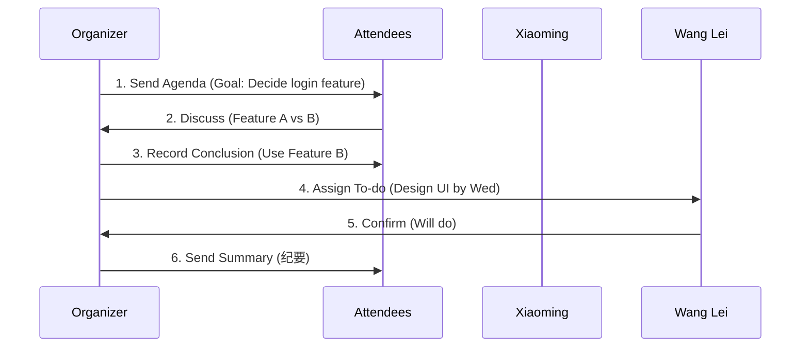

# Chapter 5: 会议沟通

Welcome back! In the previous chapter, we learned how to collaborate smoothly with colleagues through peer communication. Now, let’s tackle one of the most common (and often frustrating) workplace scenarios: **meetings**.  

Have you ever sat through a meeting that felt like a waste of time? Everyone talks, but nothing gets decided, and you leave with no idea what to do next. Or maybe you’ve been in a meeting where people argue without focusing on the problem. The good news? Meetings don’t have to be like that.  

This chapter will teach you how to make meetings **effective**—by focusing on clear conclusions, responsibilities, and next steps. Let’s dive in!


## Why Meeting Communication Matters
Meetings are like project milestones: they’re supposed to move work forward. But if a meeting ends without a conclusion, no one knows what to do next. The core idea? **A good meeting has three things: a clear conclusion, a responsible person, and a deadline.**  

Think of it like a roadmap: if you don’t know where you’re going or who’s driving, you’ll get lost. Meetings are the same—without these three elements, they’re just talk.


## The 3 Stages of Effective Meeting Communication
Let’s break down how to make meetings work, step by step:


### 1. Before the Meeting: Prepare (会前准备)
Before you even sit down, ask: *“What’s the goal of this meeting?”*  

**Key questions to ask**:  
- What problem are we trying to solve?  
- Who needs to be there?  
- What do we need to decide?  

**Example**:  
If you’re meeting to discuss a new feature, the goal might be: *“Decide whether to use Feature A or Feature B for the user login.”*  

**Why this works**: Preparing ensures everyone is on the same page and avoids wasting time on off-topic discussions.


### 2. During the Meeting: Record (会中记录)
As the meeting happens, take notes on three things:  
1. **Conclusion**: What was decided?  
2. **To-do**: What needs to be done?  
3. **Owner**: Who is responsible?  

**Example**:  
> **Conclusion**: We’ll use Feature A for the user login.  
> **To-do**: Test Feature A with 10 users by Friday.  
> **Owner**: Xiaoming.  

**Why this works**: Writing it down avoids forgetting and makes sure everyone knows their role.


### 3. After the Meeting: Sync (会后同步)
Send a meeting summary (called a “纪要” in Chinese) to everyone. This is like a “meeting report card”—it reminds everyone what was decided and what’s next.  

**Template for a meeting summary**:  
```text
会议主题：用户登录功能方案讨论  
会议时间：2024-05-20 14:00  
参会人员：Xiaoming, Lili, Wang Lei  

一、讨论内容  
1. 讨论了Feature A和Feature B的优缺点。  
2. 分析了用户反馈和开发成本。  

二、会议结论  
1. 采用Feature A（更符合用户习惯）。  
2. 优先级：高。  

三、待办事项  
任务：测试Feature A（10名用户）  
负责人：Xiaoming  
截止时间：2024-05-24（周五）  
```

**Why this works**: A summary keeps everyone aligned and ensures follow-through.


## How to Apply It: A Real-World Example
Let’s say you’re in a meeting to decide on a new feature. Here’s how to make it effective:  

1. **Before**: The organizer sends an agenda: *“Goal: Decide on the user login feature. Attendees: Xiaoming (dev), Lili (product), Wang Lei (design).”*  
2. **During**: The team discusses pros and cons. Xiaoming says, *“Feature A is easier to implement, but Feature B is more user-friendly.”* Lili adds, *“User surveys show 70% prefer Feature B.”*  
3. **Conclusion**: The team decides to use Feature B (prioritizing user experience).  
4. **To-do**: Wang Lei will design the UI for Feature B by Wednesday.  
5. **After**: The organizer sends a summary: *“Conclusion: Use Feature B. To-do: Wang Lei designs UI by Wednesday.”*  


## What Happens When You Use This Abstraction?
When you follow these steps, the meeting flow looks like this (visualized with a diagram):  



This flow ensures everyone knows what to do next—no more “I thought someone else was doing that!”


## Common Mistakes to Avoid
Here are some things that make meetings ineffective—and how to fix them:  

| Bad Habit               | Why It’s Bad                                  | Better Alternative                                  |
|------------------------|----------------------------------------------|----------------------------------------------------|
| No clear goal           | People talk about anything.                    | Send an agenda with a specific goal (e.g., “Decide login feature”). |
| No notes taken          | Everyone forgets what was decided.             | Assign someone to take notes (or do it yourself).     |
| No conclusion           | Meetings end with “we’ll talk later.”          | End with a clear conclusion (e.g., “We’ll use Feature B”). |
| No owner for tasks      | Tasks fall through the cracks.                 | Assign a specific person (e.g., “Wang Lei will design UI”). |


## Why This Works: The “Meeting Template” Behind It
Effective meetings aren’t magic—they’re **structure**. Think of it like a template:  
1. **Fill in the goal**: What problem are we solving?  
2. **Fill in the conclusion**: What did we decide?  
3. **Fill in the to-do**: What needs to be done?  
4. **Fill in the owner**: Who is responsible?  

This template reduces confusion and ensures meetings actually move work forward.


## What’s Next?
In this chapter, we learned how to make meetings effective by focusing on conclusions, responsibilities, and deadlines. This skill is key to saving time and getting things done.  

In the next chapter, we’ll dive into **written communication**—how to write clear messages, emails, and documents to avoid misunderstandings.  

[Next Chapter: 书面沟通能力](06_书面沟通能力_.md)


## Conclusion
Meetings don’t have to be a waste of time. By preparing, recording, and syncing, you can turn them into tools that move projects forward. Remember:  
- **Before**: Know the goal.  
- **During**: Take notes on conclusions, to-dos, and owners.  
- **After**: Send a summary.  

With these tips, you’ll make meetings work for you—not against you. Keep practicing, and soon you’ll be the one leading effective meetings!  

Stay tuned for the next chapter—we’re just getting started!

---

Generated by [AI Codebase Knowledge Builder](https://github.com/The-Pocket/Tutorial-Codebase-Knowledge)