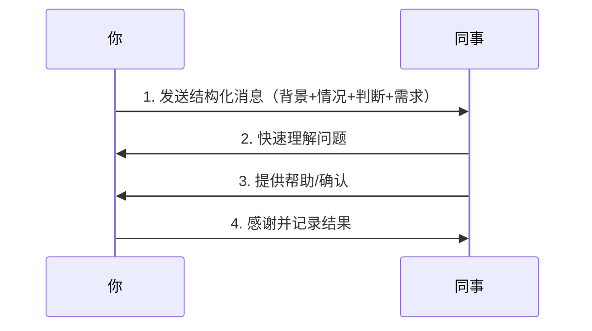

# Chapter 6: 书面沟通能力

Welcome back! In the previous chapter, we learned how to make meetings effective by focusing on conclusions, responsibilities, and deadlines. Now, let’s dive into **written communication**—a skill that often gets overlooked but is critical for avoiding misunderstandings in the workplace.  

Have you ever received a vague message like “Can you check this?” and felt confused about what to do? Or sent an email with a vague subject line like “Question” and waited hours for a reply? Written communication is like a “paper trail” for your thoughts—it ensures your message is clear, consistent, and easy to act on.  

This chapter will teach you how to write effective messages (for WeChat, emails, or documents) that save time, reduce confusion, and make you look professional. Let’s get started!


## Why Written Communication Matters
Written communication is different from verbal chat because it’s **permanent and shareable**. A vague message can lead to wasted time (e.g., someone asking you to repeat yourself) or mistakes (e.g., someone doing the wrong task). The core idea? **Clear writing = less back-and-forth = more productivity**.  

Think of it like a recipe: if you skip steps or use vague terms (“a little salt”), the dish might turn out wrong. Written communication is the same—you need to be specific to get the right result.


## The 3 Keys to Effective Written Communication
Let’s break down the three pillars of good written communication:


### 1. Clear Titles (标题明确)
A title is the first thing people see—make it tell them exactly what the message is about.  

**Bad Example**:  
> Subject: Question  

**Good Example**:  
> Subject: 请确认：用户登录功能接口字段变更方案  

**Why this works**: The good title tells the recipient *what* the message is about (interface field changes for user login) and *what you need* (confirmation). No guessing required!


### 2. Structured Content (结构清晰)
Organize your message with a logical flow: **Background → Current Situation → Your Judgment → What You Need**. This helps the recipient understand context quickly.  

**Template**:  
```text
背景：[你正在做什么]  
目前情况：[遇到了什么问题/进展]  
我的判断：[你对问题的分析/下一步计划]  
需要你确认：[具体需求，比如批准、建议]  
截止时间：[可选，比如“今天下班前”]  
```  

**Example (WeChat message)**:  
> 背景：我正在处理用户登录功能的密码重置bug。  
> 目前情况：已经试了两种方法，但接口返回的“token”字段还是无效。  
> 我的判断：可能是接口文档里的“token”字段类型写错了（应该是字符串，但文档里写的是数字）。  
> 需要你确认：能不能帮我核对一下接口文档里的“token”字段类型？  
> 截止时间：今天下午3点前。  

**Why this works**: The recipient knows exactly what you’re doing, what’s wrong, and what you need from them—all in one glance.


### 3. Document Important Matters (重要事项留文字证据)
For critical decisions (like meeting conclusions or requirement changes), always leave a written record. Verbal agreements can be forgotten, but a written note is a “safety net.”  

**Example (Meeting Summary)**:  
> 会议主题：用户登录功能方案讨论  
> 结论：采用“短信验证码+密码”方案（更符合用户习惯）。  
> 待办：小张负责设计短信验证码UI，明天中午前完成。  

**Why this works**: If someone forgets the decision later, you can point to the written summary—no more arguments about “who said what.”


## How to Apply It: A Real-World Example
Let’s say you need to ask a colleague for help with a bug. Here’s how to write a clear message:  

1. **Start with the background**: Tell them what you’re working on.  
2. **Explain the problem**: Be specific about what’s wrong.  
3. **Show your effort**: Mention what you’ve already tried.  
4. **Ask for help**: Tell them exactly what you need.  

**Before (Vague)**:  
> “哥，帮我看看这个bug！”  

**After (Clear)**:  
> “我正在处理用户登录的密码重置bug。已经试了两种方法，但接口返回的‘token’字段还是无效。我怀疑是接口文档里的‘token’字段类型写错了（应该是字符串，但文档里写的是数字）。你能帮我核对一下接口文档吗？今天下午3点前需要确认。”  


## What Happens When You Use This Abstraction?
When you write a clear message, the flow looks like this (visualized with a diagram):  



This flow saves time because the colleague doesn’t have to ask 10 questions—they get all the info they need in one go!


## Why This Works: The “Template” Behind It
Effective written communication isn’t magic—it’s **structure**. Think of it like a template:  
1. **Fill in the background**: What are you doing?  
2. **Fill in the current situation**: What’s wrong or what’s the progress?  
3. **Fill in your judgment**: What do you think is the issue?  
4. **Fill in what you need**: What do you want the recipient to do?  

This template reduces “guesswork” and ensures your message is actionable.


## A Simple Code Example: Message Template
If you want to automate your message structure (e.g., for WeChat or emails), you can use a simple template. Here’s a Python example (super beginner-friendly!):

```python
def create_message(background, situation, judgment, need, deadline=None):
    message = f"背景：{background}\n目前情况：{situation}\n我的判断：{judgment}\n需要你确认：{need}"
    if deadline:
        message += f"\n截止时间：{deadline}"
    return message

# Example usage:
msg = create_message(
    background="我正在处理用户登录的密码重置bug",
    situation="已经试了两种方法，但接口返回的‘token’字段还是无效",
    judgment="我怀疑是接口文档里的‘token’字段类型写错了",
    need="你能帮我核对一下接口文档吗？",
    deadline="今天下午3点前"
)
print(msg)
```  

**Output**:  
```
背景：我正在处理用户登录的密码重置bug
目前情况：已经试了两种方法，但接口返回的‘token’字段还是无效
我的判断：我怀疑是接口文档里的‘token’字段类型写错了
需要你确认：你能帮我核对一下接口文档吗？
截止时间：今天下午3点前
```  

This code helps you avoid forgetting parts of your message—just fill in the blanks!


## Common Mistakes to Avoid
Here are some things that make written communication ineffective—and how to fix them:  

| Bad Habit               | Why It’s Bad                                  | Better Alternative                                  |
|------------------------|----------------------------------------------|----------------------------------------------------|
| Vague titles           | Recipients don’t know what the message is about. | Use specific titles (e.g., “请确认：XX接口变更”).     |
| No structure           | People have to read the whole message to find info. | Use the “背景-情况-判断-需求” template.              |
| No evidence for critical matters | Verbal agreements get forgotten. | Send a written summary (e.g., meeting notes).       |
| Too long messages       | People skip reading.                          | Keep it concise—focus on the key points.             |


## What’s Next?
In this chapter, we learned how to write clear, structured messages that save time and reduce confusion. This skill is key to building trust with colleagues and leaders.  

In the next chapter, we’ll dive into the **underlying logic of emotional management**—how to handle workplace emotions without letting them control your actions.  

[Next Chapter: 情绪管理底层逻辑](07_情绪管理底层逻辑_.md)


## Conclusion
Written communication is a simple but powerful tool. Remember:  
- **Use clear titles** (no “Question” or “Help”).  
- **Structure your message** (background → situation → judgment → need).  
- **Document important matters** (leave a paper trail).  

With these tips, you’ll make your messages easy to understand and act on. Keep practicing, and soon written communication will feel natural!  

Stay tuned for the next chapter—we’re just getting started!

---

Generated by [AI Codebase Knowledge Builder](https://github.com/The-Pocket/Tutorial-Codebase-Knowledge)