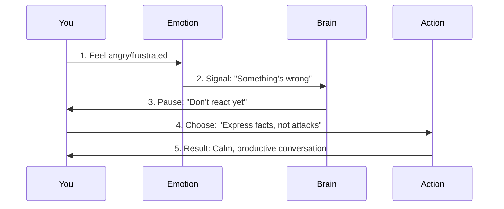

# Chapter 7: 情绪管理底层逻辑

Welcome back! In the previous chapter, we learned how to write clear, structured messages to avoid misunderstandings. Now, let’s dive into a skill that often gets overlooked but is critical for workplace success: **emotional management**.  

Have you ever felt angry when a colleague criticized your work, or anxious when a deadline was approaching? These emotions are normal, but if they control your actions, they can lead to mistakes or conflicts. The good news? Emotions are not enemies—they’re signals. This chapter will teach you how to use these signals to make better decisions, not worse ones. Let’s get started!


## Why Emotional Management Matters
Emotions are like a car’s dashboard: they tell you something is wrong (e.g., “low fuel” = anxiety, “check engine” = frustration). If you ignore them, you might crash. The core idea? **Emotions are signals, not enemies—learn to listen, then act.**  

Think of it like a traffic light: when you feel angry (red light), pause before reacting. When you feel calm (green light), you can move forward. This simple shift can save you from saying or doing things you’ll regret.


## The 3 Keys to Emotional Management
Let’s break down the three pillars of good emotional management:


### 1. Identify the Emotion (识别情绪)
First, name what you’re feeling. Is it anger? Anxiety? Frustration? Naming the emotion helps you understand it.  

**Example**:  
If a colleague says, “Your code has too many bugs,” you might feel:  
- **Anger**: “They’re attacking me!”  
- **Frustration**: “I worked so hard, and it’s not good enough.”  
- **Anxiety**: “What if they think I’m bad at my job?”  

**Why this works**: Naming the emotion takes away its power. Instead of “I’m upset,” you can say, “I’m feeling frustrated because my effort wasn’t recognized.”


### 2. Pause Before Deciding (暂停决策)
Emotions make you want to react quickly (e.g., yelling back, quitting). Instead, pause. Take a deep breath, count to 10, or step away for 5 minutes.  

**Example**:  
When you feel angry after a criticism, don’t reply immediately. Say:  
> “I need a moment to think about this. Can we talk later?”  

**Why this works**: Pausing gives your brain time to calm down. You’ll make a better decision when you’re not driven by emotion.


### 3. Express Facts, Not Attacks (表达事实，不攻击)
When you do speak, focus on the problem, not the person. Use “I” statements to share your feelings without blaming.  

**Example**:  
Instead of:  
> “You’re so unfair! You never appreciate my work!”  

Say:  
> “I feel frustrated when my code is criticized without specific feedback. Can you tell me which parts need improvement?”  

**Why this works**: This keeps the conversation focused on solving the problem, not on fighting.


## How to Apply It: A Real-World Example
Let’s say you’re criticized by your leader for a project delay. Here’s how to manage your emotions:  

1. **Identify the emotion**: You feel frustrated and anxious.  
2. **Pause**: Take a deep breath. Don’t reply right away.  
3. **Express facts**: Say:  
   > “I understand the project is delayed. I’d like to discuss what went wrong and how we can fix it.”  

This approach shows you’re professional, not emotional. Your leader will respect you more for handling it calmly.


## What Happens When You Use This Abstraction?
When you manage your emotions, the flow looks like this (visualized with a diagram):  



This flow ensures your emotions don’t control your actions. You stay in charge.


## A Simple Template to Practice
To help you remember, use this template when you feel emotional:  

```text
1. What am I feeling? (e.g., angry, anxious)  
2. Why? (e.g., "I feel angry because my work was criticized.")  
3. What do I need? (e.g., "I need specific feedback to improve.")  
4. How will I say it? (e.g., "Can you tell me which parts need work?")  
```  

**Example**:  
> 1. I’m feeling frustrated.  
> 2. Because my code was criticized without details.  
> 3. I need to know which parts to fix.  
> 4. I’ll say: “Can you share specific feedback on the code?”  


## Why This Works: The “Signal-Response” Logic
Emotions are your body’s way of telling you to pay attention. For example:  
- **Anxiety**: “I’m worried about the deadline—maybe I need to ask for help.”  
- **Anger**: “My boundary was crossed—maybe I need to set a limit.”  

By listening to these signals, you can address the root cause, not just the emotion. This makes you more resilient and less reactive.


## Common Mistakes to Avoid
Here are some things that make emotional management hard—and how to fix them:  

| Bad Habit               | Why It’s Bad                                  | Better Alternative                                  |
|------------------------|----------------------------------------------|----------------------------------------------------|
| React immediately       | Emotions drive bad decisions.                  | Pause (take a breath, step away).                    |
| Blame others           | Focuses on fighting, not solving.               | Use “I” statements (e.g., “I feel frustrated”).      |
| Ignore emotions        | They’ll come back stronger later.               | Name the emotion (e.g., “I’m feeling anxious”).      |
| Let emotions control you | You might say or do something you regret.       | Choose to respond, not react.                        |


## What’s Next?
In this chapter, we learned that emotions are signals, not enemies. By identifying them, pausing, and expressing facts, you can stay in control.  

In the next chapter, we’ll dive into **pressure management**—how to handle stress when tasks pile up.  

[Next Chapter: 压力管理](08_压力管理_.md)


## Conclusion
Emotional management isn’t about suppressing feelings—it’s about using them to make better choices. Remember:  
- **Name your emotions**: “I’m feeling frustrated.”  
- **Pause before reacting**: Give yourself time to calm down.  
- **Express facts, not attacks**: Focus on solving the problem.  

With these tips, you’ll handle workplace emotions like a pro. Keep practicing, and soon you’ll feel more in control!  

Stay tuned for the next chapter—we’re just getting started!

---

Generated by [AI Codebase Knowledge Builder](https://github.com/The-Pocket/Tutorial-Codebase-Knowledge)