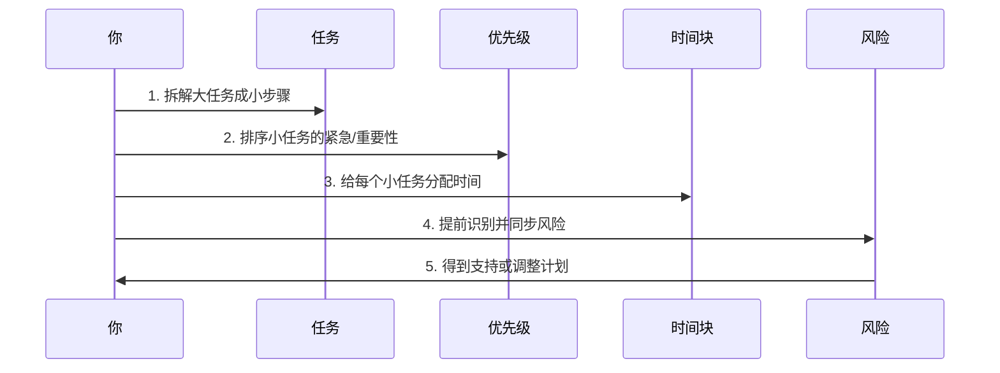

# Chapter 8: 压力管理

Welcome back! In the previous chapter, we learned how to manage emotions without letting them control your actions. Now, let’s tackle a common workplace challenge: **pressure management**—what to do when tasks pile up, deadlines loom, and you feel overwhelmed.  

Imagine this: You’re assigned a big project with a tight deadline. You look at the to-do list and think, *“I’ll never finish this!”* But what if you could break it down into small, manageable steps? This chapter will teach you how to handle pressure by organizing tasks, prioritizing, and taking care of yourself. Let’s get started!


## Why Pressure Management Matters
Pressure is like a heavy backpack—you can’t carry it forever without getting tired. The key is to **unpack the backpack** (break down tasks) and **wear it comfortably** (prioritize and rest). When you manage pressure well, you stay productive instead of burning out.


## Key Concepts: How to Handle Pressure
Let’s break down the four core ideas:


### 1. Break Down Tasks (拆解任务)
Big tasks feel scary, but small steps feel doable. Think of a project like a puzzle—break it into pieces first.  

**Example**:  
If your task is “Develop a user login feature,” split it into:  
- Design the login page UI  
- Write the password verification API  
- Test the feature  
- Launch it  


### 2. Prioritize (优先级排序)
Not all tasks are equal. Focus on what’s **urgent and important** first.  

**Simple Rule**:  
- Urgent + Important: Do these now (e.g., fix a critical bug).  
- Important + Not Urgent: Plan these (e.g., build a new feature).  
- Urgent + Not Important: Delegate or skip (e.g., reply to non-critical emails).  


### 3. Share Risks Early (风险同步)
Don’t wait for problems to blow up. Tell your team or leader about risks *before* they happen.  

**Example**:  
> “This task was due Friday, but the API documentation isn’t confirmed yet. If we don’t fix this today, it might delay by 1-2 days. I suggest we proceed with the current plan and adjust later.”  


### 4. Manage Your Energy (体力管理)
Pressure drains your energy. To stay sharp, take care of your body:  
- **Sleep**: Get 7-8 hours of sleep (tired brains make bad decisions).  
- **Exercise**: A 10-minute walk can reduce stress.  
- **Avoid “Hard Carrying”**: Don’t work through lunch or skip breaks—rest is productive!  


## How to Apply It: A Step-by-Step Example
Let’s say you have a big project with a tight deadline. Here’s how to use pressure management:


### Step 1: Break Down the Task
Use a simple template to split the big task into small steps:  

```text
任务目标：完成用户登录功能  
步骤1：设计登录页UI  
步骤2：写密码验证接口  
步骤3：测试功能  
步骤4：上线  
当前卡点：API文档没确认  
风险点：如果文档不确认，项目会延期  
需要支持：产品确认API文档  
今天能完成：设计登录页UI  
```  


### Step 2: Prioritize
Rank the steps by urgency:  
1. **Urgent + Important**: Fix the API documentation (since it blocks progress).  
2. **Important + Not Urgent**: Design the UI (can do after documentation is confirmed).  


### Step 3: Set Time Blocks
Assign time to each step:  
- 9-11 AM: Confirm API documentation (with product).  
- 2-4 PM: Design the login page UI.  


### Step 4: Share Risks
Tell your leader about the delay risk:  
> “I’m working on the user login feature. The API documentation isn’t confirmed yet. If we don’t fix this today, it might delay by 1-2 days. I’ll keep you updated.”  


## What Happens When You Use This Abstraction?
When you manage pressure, the flow looks like this (visualized with a diagram):  




## A Simple Code Example: Task Breakdown
If you want to organize your tasks digitally, use a simple function to break down big tasks:  

```python
# 任务拆解模板
def break_down_task(big_task, steps, current_block, risk, support, today_task):
    return {
        "任务目标": big_task,
        "步骤": steps,
        "当前卡点": current_block,
        "风险点": risk,
        "需要支持": support,
        "今天能完成": today_task
    }

# 示例：用户登录功能
login_task = break_down_task(
    big_task="完成用户登录功能",
    steps=["设计登录页UI", "写密码验证接口", "测试", "上线"],
    current_block="API文档没确认",
    risk="如果文档不确认，项目会延期",
    support="需要产品确认API文档",
    today_task="设计登录页UI"
)
print(login_task)
```  

**Output**:  
```python
{
    "任务目标": "完成用户登录功能",
    "步骤": ["设计登录页UI", "写密码验证接口", "测试", "上线"],
    "当前卡点": "API文档没确认",
    "风险点": "如果文档不确认，项目会延期",
    "需要支持": "需要产品确认API文档",
    "今天能完成": "设计登录页UI"
}
```  

This code helps you structure your tasks so you don’t feel lost. Just fill in the blanks!


## Why This Works: The “Unpack the Backpack” Logic
Pressure comes from feeling overwhelmed by big tasks. By breaking them down, you turn “I can’t do this” into “I can do this step.” Prioritizing and sharing risks keep you from working on the wrong things, and energy management ensures you don’t burn out.


## Common Mistakes to Avoid
Here are some things that make pressure worse—and how to fix them:  

| Bad Habit               | Why It’s Bad                                  | Better Alternative                                  |
|------------------------|----------------------------------------------|----------------------------------------------------|
| Try to do everything at once | You’ll get tired and make mistakes.            | Break tasks into small steps.                       |
| Ignore risks            | Problems blow up at the last minute.           | Share risks early (e.g., “This might delay the project”). |
| Skip rest              | Tired brains make bad decisions.               | Take breaks, sleep well, and exercise.               |
| Work through lunch      | You’ll burn out faster.                        | Step away from your desk—rest is productive!          |


## What’s Next?
In this chapter, we learned how to manage pressure by organizing tasks, prioritizing, and taking care of yourself. This skill is key to staying calm and productive when things get busy.  

In the next chapter, we’ll dive into **职场边界感 (Workplace Boundaries)**—how to say no, protect your time, and avoid being overwhelmed by others’ requests.  

[Next Chapter: 职场边界感](09_职场边界感_.md)


## Conclusion
Pressure isn’t about working harder—it’s about working smarter. By breaking down tasks, prioritizing, and sharing risks, you can turn a mountain of work into a series of small hills. Remember to take care of your energy too—rest is not lazy, it’s necessary!  

With these tips, you’ll handle pressure like a pro. Keep practicing, and soon you’ll feel in control even when things get busy!  

Stay tuned for the next chapter—we’re just getting started!

---

Generated by [AI Codebase Knowledge Builder](https://github.com/The-Pocket/Tutorial-Codebase-Knowledge)