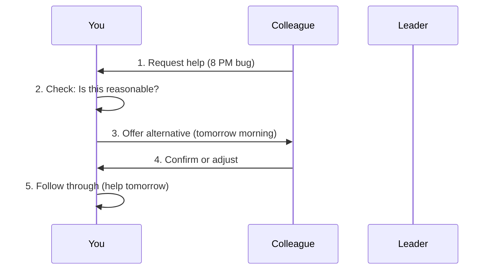

# Chapter 9: 职场边界感

Welcome back! In the previous chapter [压力管理](08_压力管理.md), we learned how to break down tasks and manage priorities to avoid feeling overwhelmed. But sometimes, pressure doesn’t just come from your own workload—it comes from others’ requests: a colleague asking you to help with their task, a leader adding last-minute work, or even messages after hours. This is where **职场边界感 (workplace boundaries)** comes in.  

Imagine this: A colleague messages you at 8 PM asking you to fix a bug for their project. You’re tired, but you don’t want to say “no” and seem unhelpful. How do you handle this? This chapter will teach you how to set clear boundaries without being rude—like building a “fence” around your work time to protect your energy. Let’s get started!


## Why Workplace Boundaries Matter
Boundaries are like the lines around your personal space. They tell others: *“This is my work time, my responsibilities, and my limits.”* Without boundaries, you might end up doing others’ work, working late every day, or feeling resentful. The core idea? **Boundaries aren’t about being cold—they’re about protecting your work order and avoiding burnout.**  


## Key Concepts: What Are Boundaries?
Let’s break down the three pillars of workplace boundaries:


### 1. Boundaries Are Order, Not Coldness
Boundaries aren’t about ignoring others—they’re about being clear about what you can and can’t do. Think of it like a library: the rules (no loud talking, return books on time) aren’t mean—they keep the space organized for everyone.  

**Example**:  
If a colleague asks you to help with their task, you can say: *“I can help, but I need to finish my own work first. Can we schedule it for tomorrow morning?”* This is polite, but it sets a boundary.


### 2. Reject Unreasonable Requests (With Alternatives)
When someone asks for something that’s not your job or conflicts with your priorities, you don’t have to say “no” bluntly. Offer a solution instead.  

**Example**:  
Instead of: *“I can’t help you.”*  
Say: *“I’m busy with my own tasks right now. Would you like me to show you how to fix it, or should we ask our leader to reassign priorities?”*  


### 3. Avoid the “People-Pleaser” Trap
People-pleasers say “yes” to everything to avoid conflict, but this leads to overwork and resentment. Boundaries let you say “no” without guilt.  

**Example**:  
If a leader asks you to do an extra task, you can say: *“I can take this on, but I need to delay my current task. Which one should I prioritize?”* This shows you’re responsible, not just agreeable.


## How to Apply It: A Step-by-Step Example
Let’s use the 8 PM bug request scenario. Here’s how to handle it with boundaries:


### Step 1: Check If the Request Is Reasonable
Ask yourself: *“Is this my job? Does it conflict with my current tasks? Is it urgent?”*  

In our example: The bug isn’t urgent (it’s 8 PM), and it’s not your job. So, it’s a boundary situation.


### Step 2: Offer a Polite Alternative
Instead of ignoring the message, respond with a solution.  

**Example**:  
> “Hi, I’m finishing up my work for today. I can help you with the bug tomorrow morning—would 9 AM work? Or do you need it sooner?”  


### Step 3: If It’s Urgent, Confirm Priorities
If the request *is* urgent (e.g., a critical bug that affects users), you can ask your leader to clarify priorities.  

**Example**:  
> “I understand this is urgent. If I help with this, my current task (the user login feature) might be delayed. Should I prioritize the bug or the feature?”  


## What Happens When You Use This Abstraction?
When you set boundaries, the flow looks like this (visualized with a diagram):  




## A Simple Template for Boundaries
To make it easy, use this template when someone asks for help:  

```text
1. Acknowledge the request: “I see you need help with X.”  
2. State your current situation: “I’m currently working on Y.”  
3. Offer a solution: “I can help with X tomorrow at [time], or would you like me to show you how to do it?”  
```  

**Example**:  
> “I see you need help with the bug. I’m finishing my user login feature right now. I can help you with the bug tomorrow at 9 AM—does that work?”  


## Why This Works: The “Fence” Analogy
Boundaries are like a fence around your work time. They don’t keep others out—they just tell them where your “property” starts and ends. By being clear, you:  
- **Protect your energy**: You don’t work late every day.  
- **Build trust**: Others know you’re reliable (because you finish your own work first).  
- **Avoid resentment**: You don’t feel like you’re being taken advantage of.  


## Common Mistakes to Avoid
Here are some things that make boundaries hard—and how to fix them:  

| Bad Habit               | Why It’s Bad                                  | Better Alternative                                  |
|------------------------|----------------------------------------------|----------------------------------------------------|
| Say “yes” to everything | You’ll get overworked and resentful.            | Use the template: Acknowledge → State → Offer.        |
| Ignore requests         | People might think you’re unhelpful.            | Respond politely, even if you can’t help right away.   |
| Blame others           | Focuses on conflict, not solutions.             | Focus on your own workload (e.g., “I need to finish my task first”). |
| Feel guilty for saying “no” | Boundaries are normal—everyone needs them.       | Remember: You’re protecting your work order.          |


## What’s Next?
In this chapter, we learned how to set clear boundaries to protect your time and energy. This skill is key to staying productive without burning out.  

In the next chapter, we’ll dive into **被批评时的情绪管理 (Emotional Management When Criticized)**—how to handle feedback without letting it hurt your confidence.  

[Next Chapter: 被批评时的情绪管理](10_被批评时的情绪管理.md)


## Conclusion
Workplace boundaries aren’t about being mean—they’re about being clear. By using the “Acknowledge → State → Offer” template, you can say “no” politely and protect your work rhythm. Remember: Boundaries are your “fence”—they keep your work life organized, not lonely.  

With these tips, you’ll handle requests like a pro. Keep practicing, and soon boundaries will feel natural!  

Stay tuned for the next chapter—we’re just getting started!

---

Generated by [AI Codebase Knowledge Builder](https://github.com/The-Pocket/Tutorial-Codebase-Knowledge)