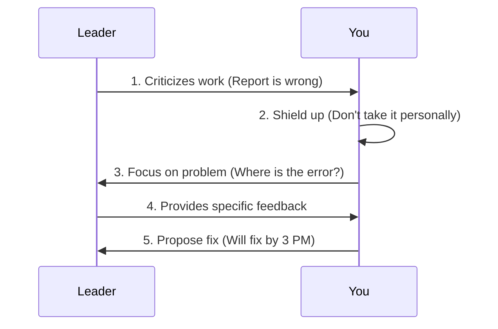

# Chapter 10: 被批评时的情绪管理

Welcome back! In the previous chapter, [职场边界感](09_职场边界感_.md), we learned how to protect our time and energy by setting clear limits. But what happens when you *do* make a mistake, and your leader or colleague criticizes your work? 

Imagine this: You worked late to finish a report, but your leader looks at it and says, "This data is completely wrong, and the format is messy. Redo it." Your heart sinks. You might feel angry ("I worked so hard!"), want to cry, or feel the urge to argue back. 

This is a completely normal reaction. However, how you handle this moment defines your professional growth. This chapter will teach you **被批评时的情绪管理**—how to use a "shield" to accept constructive feedback without letting it crush your confidence. Let's dive in!

## Why This Matters: The Shield Analogy

Think of criticism as a ball thrown at you. If you have no protection, it hits your heart and hurts ("I'm terrible at my job"). But if you wear a **shield**, the ball bounces off, and you can look at it objectively ("Ah, the report has errors").

The core idea is simple but powerful: **批评工作 ≠ 否定人**. 

Criticizing your work does not mean they are denying your value as a person. It just means a specific task didn't meet the standard. By separating the two, you can turn criticism into an opportunity to improve, rather than a reason to feel bad.

## The 3 Keys to Handling Criticism

Let's break down how to use your "shield" step-by-step:

### 1. Separate Work from Self (分离工作与个人价值)
When criticized, your brain might panic and think, "They hate me" or "I'm a failure." Stop that thought. Remind yourself: *They are criticizing the report, not me.* 

**Example**: 
Instead of thinking: *"My boss thinks I'm stupid."*
Think: *"My boss thinks the data analysis in this report is incorrect."*

### 2. Focus on the Problem, Not Excuses (聚焦问题，而非辩解)
When we feel attacked, our instinct is to defend ourselves: "But I tried!" or "It's not my fault!" This usually makes things worse. Instead, act like a detective. Focus on finding out exactly where the work fell short.

**Example**:
Instead of: *"But I stayed up late doing this!"*
Say: *"I understand this didn't meet expectations. Could you point out which specific data points are incorrect?"*

### 3. Avoid Breaking Down or Silence (避免崩溃或沉默)
Silence makes you look uncooperative, while crying or yelling makes you look fragile. You don't have to be happy about the criticism, but you should stay calm. Acknowledge the feedback and propose a next step.

**Example**:
> "I see the issue now. I will fix the data and send you a revised version by 3 PM."

## How to Apply It: A Step-by-Step Example

Let's go back to our bad report scenario. Here is how you handle it using the shield:

1. **Pause and Shield Up**: Take a deep breath. Don't reply immediately if you are feeling emotional.
2. **Acknowledge**: Show you heard them without making excuses.
   > "I understand the report's data is incorrect."
3. **Ask for Specifics**: Clarify the exact problem.
   > "Could you clarify which sections need to be recalculated?"
4. **Propose a Fix**: Give a concrete plan and deadline.
   > "I will correct the data and send a revised version by 3 PM today."

## What Happens Behind the Scenes?

When you successfully use your "shield," the interaction changes from an emotional argument into a productive problem-solving session. Here is what the flow looks like:



This flow shows that you are in control. You are not running away, and you are not fighting back—you are simply fixing a problem.

## A Simple Template to Practice

To help you remember, you can use a simple code-like template to structure your response when criticized. Here is a beginner-friendly Python function that generates a professional response:

```python
def handle_criticism(issue, specific_question, fix_plan, deadline):
    # Acknowledge the problem without excuses
    print(f"I understand the {issue} didn't meet expectations.")
    # Ask for specifics to focus on the problem
    print(f"Could you clarify {specific_question}?")
    # Propose a concrete fix
    print(f"I will {fix_plan} and update you by {deadline}.")

# Example usage:
handle_criticism(
    issue="report data",
    specific_question="which sections need recalculation",
    fix_plan="correct the data analysis",
    deadline="3 PM today"
)
```

**Output**:
```text
I understand the report data didn't meet expectations.
Could you clarify which sections need recalculation?
I will correct the data analysis and update you by 3 PM today.
```

This simple script shows how easy it is to structure a calm, professional response. Just fill in the blanks!

## Common Mistakes to Avoid

Here are some things that make criticism worse—and how to fix them:

| Bad Habit | Why It’s Bad | Better Alternative |
|---|---|---|
| "But I worked so hard on this!" | Focuses on effort, not the result. | "I understand it didn't meet standards. Where should I focus the fix?" |
| Total silence | Looks like you're ignoring the feedback. | "I hear you. Let me review the issues and get back to you." |
| "It's not my fault, the data was bad." | Sounds defensive and avoids responsibility. | "I see the problem. I'll fix it and check the data source to avoid this next time." |
| Taking it personally | Leads to emotional breakdown or resentment. | Remember: "They are criticizing the work, not me." |

## Why This Works: The "Improvement Mindset"

By treating criticism as a shielded event, you shift your mindset from "I am being attacked" to "I am receiving data to improve." 

Leaders don't expect you to be perfect. They *do* expect you to handle feedback professionally. When you respond calmly, ask for specifics, and propose a fix, you actually build trust. Your leader will think, *"This person can handle feedback and grow."*

## Conclusion

Congratulations! You've reached the final chapter of our `work_base` tutorial. 

In this chapter, we learned that **被批评时的情绪管理** is about wearing a shield. Remember:
- **Separate work from self**: Criticizing your work is not denying your value.
- **Focus on the problem**: Don't make excuses; ask where it fell short.
- **Propose a fix**: Show you are proactive about improving.

By combining all the skills you've learned in this series—from clear communication to boundary setting and emotional management—you are now well-equipped to navigate the workplace with confidence and stability. Keep practicing these skills, and you will continue to grow as a professional!

---

Generated by [AI Codebase Knowledge Builder](https://github.com/The-Pocket/Tutorial-Codebase-Knowledge)