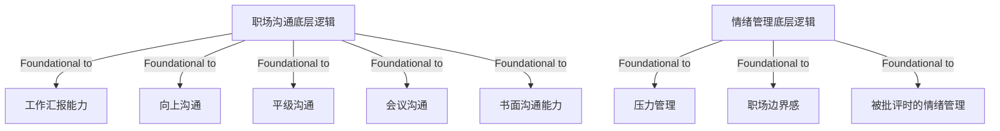

# Tutorial: work_base

This project is a beginner-friendly guide to **workplace communication** and **emotion management**. Its main purpose is to teach you how to communicate effectively in the workplace (to advance tasks, reduce misunderstandings, and build trust) and manage your emotions (so emotions don’t control your actions). It covers core principles (like "communication is for pushing things, not expressing feelings") and specific skills such as work reporting, upward/peer communication, meeting/written communication, stress management, setting boundaries, and handling criticism—all designed to help you work steadily, collaborate well, and grow in your career.

## Chapters

1. [职场沟通底层逻辑
](01_职场沟通底层逻辑_.md)
2. [工作汇报能力
](02_工作汇报能力_.md)
3. [向上沟通
](03_向上沟通_.md)
4. [平级沟通
](04_平级沟通_.md)
5. [会议沟通
](05_会议沟通_.md)
6. [书面沟通能力
](06_书面沟通能力_.md)
7. [情绪管理底层逻辑
](07_情绪管理底层逻辑_.md)
8. [压力管理
](08_压力管理_.md)
9. [职场边界感
](09_职场边界感_.md)
10. [被批评时的情绪管理
](10_被批评时的情绪管理_.md)

---

Generated by [AI Codebase Knowledge Builder](https://github.com/The-Pocket/Tutorial-Codebase-Knowledge)