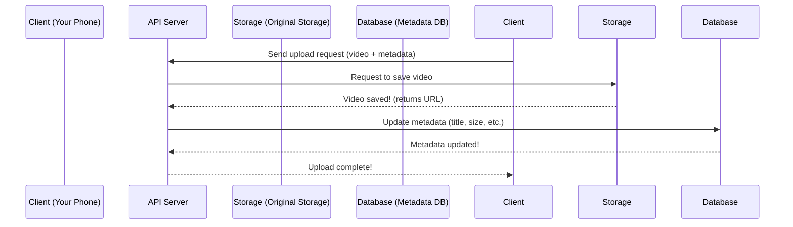

# Chapter 1: API Servers

## Introduction: The "Waitstaff" of YouTube

Imagine YouTube as a giant restaurant. When you upload a video, leave a comment, or search for a cat video, you’re interacting with the restaurant’s **waitstaff**—not the chefs who cook the food (that’s video streaming!).  

API Servers are these waitstaff. They handle all the "non-cooking" tasks: taking your upload order, updating your video’s title, or finding videos matching your search. They don’t stream videos (that’s the CDN’s job, like the chefs serving food), but they make sure your interactions with YouTube work smoothly.  

In this chapter, we’ll learn what API Servers are, how they work, and why they’re essential for a platform like YouTube.


## What Do API Servers Do?

API Servers are the "brain" of user interactions. They:  
- **Accept requests** from clients (your phone, computer, or TV).  
- **Process logic** (e.g., "upload this video," "add a comment").  
- **Coordinate with other systems** (like databases or storage) to complete tasks.  

Think of it like ordering food: you tell the waiter (API Server) what you want, and they relay it to the kitchen (storage/transcoding) and update your bill (metadata database).


## A Simple Use Case: Uploading a Video

Let’s walk through a real example: **uploading a video**. Here’s the flow:  
1. You click "Upload" in the YouTube app.  
2. The app sends a request to the API Server: *"I want to upload this video!"*  
3. The API Server checks if you’re allowed (using [Pre-Signed URLs](02_pre_signed_urls_.md), Chapter 2).  
4. It tells the storage system to save the video (more on this in [Original Storage](03_original_storage_.md), Chapter 3).  
5. It updates your video’s metadata (title, description) in the database (see [Metadata Database](04_metadata_database_.md), Chapter 4).  

No video streaming happens here—just the "paperwork" to make your upload work!


## How API Servers Work: A Step-by-Step Flow

Let’s visualize this with a simple sequence diagram. Imagine you’re uploading a video called "My Cat’s Adventure.mp4":



### What’s Happening Here?
1. **Client sends a request**: Your phone tells the API Server, "I’m uploading a video!"  
2. **API Server delegates to Storage**: The server asks the storage system to save the video (like a waiter telling the kitchen to cook).  
3. **Storage confirms**: The storage system says, "Video saved!" and gives a link.  
4. **API Server updates the database**: The server records your video’s title, size, etc., in the database (like the waiter writing your order on a ticket).  
5. **Client gets a response**: The server tells your phone, "Upload done!"  


## Internal Implementation: A Tiny Code Example

API Servers are just programs that listen for requests and run logic. Here’s a *super simplified* example of how a server might handle an upload:

```python
# server.py (simplified)
def handle_upload(request):
    # 1. Get video and metadata from the request
    video = request.files["video"]
    title = request.form["title"]
    
    # 2. Save video to storage (we’ll learn this in Chapter 3)
    storage.save(video)  # Returns a URL like "s3://videos/123.mp4"
    
    # 3. Update metadata in the database (Chapter 4)
    db.update(title=title, video_url=storage_url)
    
    # 4. Tell the client it worked!
    return "Upload successful!"
```

### What’s This Code Doing?
- **Step 1**: Grabs the video file and its title from your request.  
- **Step 2**: Tells the storage system to save the video (we’ll dive into storage in Chapter 3).  
- **Step 3**: Updates the database with the video’s title and where it’s stored (Chapter 4).  
- **Step 4**: Sends a success message back to your phone.  

This is the "waitstaff" logic—simple, but critical!


## Why API Servers Matter

Without API Servers, YouTube couldn’t:  
- Let you upload videos.  
- Let you comment on videos.  
- Let you search for videos.  

They’re the glue that connects your actions to the rest of the system. Think of them as the restaurant’s front desk—they take your requests and make sure everything else works behind the scenes.


## Next Steps

In this chapter, we learned what API Servers are and how they handle user interactions. In the next chapter, we’ll explore **Pre-Signed URLs**—a key security feature that ensures only authorized users can upload videos.  

[Next Chapter: Pre-Signed URLs](02_pre_signed_urls_.md)

---

Generated by [AI Codebase Knowledge Builder](https://github.com/The-Pocket/Tutorial-Codebase-Knowledge)