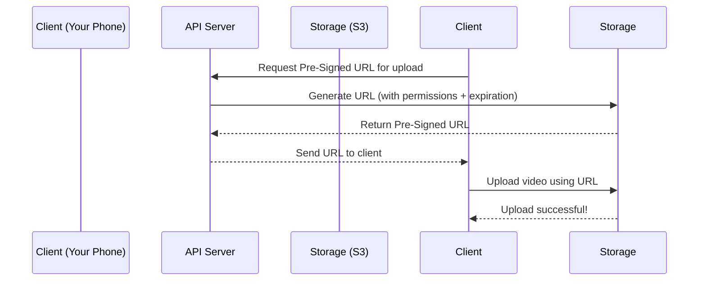

# Chapter 2: Pre-Signed URLs

In the previous chapter, we learned about **API Servers**—the "waitstaff" of YouTube that handle user requests like uploading videos. But how do we ensure that only authorized users can upload videos? That’s where **Pre-Signed URLs** come in! They’re like giving someone a one-time-use key to your house that only works for a specific door and expires after an hour. Let’s dive in!


## What Problem Do Pre-Signed URLs Solve?

Imagine you’re running a restaurant, and you want to let customers drop off their own dishes (video uploads) without letting just anyone walk into the kitchen. Pre-Signed URLs solve this by:  
- **Granting temporary access**: Only the person with the URL can upload.  
- **Limiting permissions**: The URL only works for uploading (not deleting or viewing other videos).  
- **Expiring automatically**: The key stops working after a set time (e.g., 1 hour).  

Without Pre-Signed URLs, anyone could upload videos to your storage, leading to chaos (or worse, security breaches)!  


## Key Concepts: What Is a Pre-Signed URL?

A Pre-Signed URL is a special link that:  
1. **Is time-limited**: It expires after a set duration (e.g., 1 hour).  
2. **Has permissions**: It only allows specific actions (like uploading a video).  
3. **Is generated by a trusted source**: Only the API Server (our "waitstaff") can create these URLs.  

Think of it as a **temporary parking pass** for your video upload—valid for one hour, and only for your car (your video)!  


## How Do Pre-Signed URLs Work? A Simple Example

Let’s walk through uploading a video called "My Cat’s Adventure.mp4" using a Pre-Signed URL:  

1. **Client asks for a Pre-Signed URL**: Your phone sends a request to the API Server: *"I want to upload a video—give me a temporary key!"*  
2. **API Server generates the URL**: The server creates a URL that:  
   - Points to the storage system (e.g., `s3://videos/123.mp4`).  
   - Expires in 1 hour.  
   - Only allows "PUT" (upload) actions.  
3. **Client uses the URL to upload**: Your phone sends the video directly to the storage system using this URL.  
4. **Storage accepts the upload**: Since the URL is valid and within the time limit, the video is saved.  
5. **URL expires**: After 1 hour, the URL stops working—no more uploads!  


## Generating a Pre-Signed URL: A Tiny Code Example

Here’s how the API Server might generate a Pre-Signed URL (simplified):

```python
# server.py (simplified)
import boto3  # AWS SDK for Python (used for S3 storage)

def generate_presigned_url(bucket_name, object_key, expiration=3600):
    s3_client = boto3.client('s3')
    response = s3_client.generate_presigned_url(
        'put_object',
        Params={'Bucket': bucket_name, 'Key': object_key},
        ExpiresIn=expiration  # 1 hour (3600 seconds)
    )
    return response
```

### What’s This Code Doing?
- **Step 1**: We use the AWS SDK to talk to S3 (our storage system).  
- **Step 2**: We ask S3 to generate a URL for uploading (`put_object`).  
- **Step 3**: We set the URL to expire in 1 hour (`3600` seconds).  
- **Step 4**: We return the URL to the client.  

The client then uses this URL to upload the video directly to S3—no need for the API Server to handle the file!  


## How the Client Uses the Pre-Signed URL

Once the client has the URL, it uploads the video like this (simplified):

```python
# client.py (simplified)
import requests

def upload_video(url, video_file):
    with open(video_file, 'rb') as f:
        response = requests.put(url, data=f)
    return response.status_code == 200  # True if upload succeeded
```

### What’s Happening?
- The client sends the video file directly to the storage system using the Pre-Signed URL.  
- If the URL is valid and not expired, the upload succeeds!  


## Internal Implementation: Step-by-Step Flow

Let’s visualize the entire process with a sequence diagram:



### What’s Happening Here?
1. **Client asks for a URL**: Your phone tells the API Server, "I need to upload a video—give me a key!"  
2. **API Server generates the URL**: The server asks the storage system to create a temporary, permission-limited URL.  
3. **Storage returns the URL**: The storage system gives the URL back to the API Server.  
4. **API Server sends the URL to the client**: The server forwards the URL to your phone.  
5. **Client uploads the video**: Your phone sends the video directly to the storage system using the URL.  
6. **Storage confirms**: The storage system says, "Video saved!"  


## Why Pre-Signed URLs Matter

Pre-Signed URLs are critical for security because:  
- **They limit access**: Only the person with the URL can upload.  
- **They expire**: No lingering keys that could be misused.  
- **They reduce load on API Servers**: The client uploads directly to storage, so the API Server doesn’t have to handle large files.  


## Next Steps

In this chapter, we learned how Pre-Signed URLs work and why they’re essential for secure video uploads. In the next chapter, we’ll explore **Original Storage**—the place where your videos are first saved before being processed.  

[Next Chapter: Original Storage](03_original_storage_.md)

---

Generated by [AI Codebase Knowledge Builder](https://github.com/The-Pocket/Tutorial-Codebase-Knowledge)