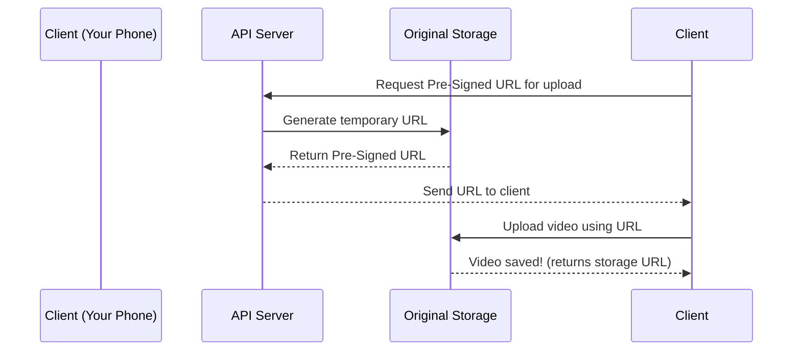

# Chapter 3: Original Storage

In the previous chapter, we learned about **Pre-Signed URLs**—the temporary keys that let you securely upload videos to YouTube. Now, where do those videos actually go once they’re uploaded? That’s where **Original Storage** comes in! Think of it as YouTube’s "digital vault" where your videos are first stored in their original, unprocessed form.


## What Is Original Storage?

Original Storage is like a giant digital filing cabinet for your videos. When you upload a video, it lands here first—exactly as you uploaded it, with all its original quality and format. This is the "master copy" of your video, just like a film negative is the original source before making copies for theaters.

Why keep the original? Because we might need to:
- Re-transcode the video later (e.g., if a new format becomes popular).
- Fix issues with the original upload.
- Keep a high-quality backup for future use.


## A Simple Use Case: Uploading a Video to Original Storage

Let’s walk through what happens when you upload "My Cat’s Adventure.mp4" to YouTube:

1. **You get a Pre-Signed URL**: From the API Server (Chapter 2), you get a temporary URL to upload your video.
2. **You upload the video**: Your phone sends the video file directly to Original Storage using that URL.
3. **Original Storage saves it**: The video is stored as-is—no changes, no compression.
4. **You get a confirmation**: The storage system tells your phone, "Video saved!"


## Key Concepts: What Makes Original Storage Special?

### 1. **Blob Storage**
Original Storage uses "blob storage"—a type of storage that’s great for holding large files (like videos) without worrying about folders or files. It’s like a giant digital dropbox where you can dump files and get a link back.

### 2. **Immutable (Mostly)**
Once a video is saved here, it’s hard to change. This is good because:
- It preserves the original quality.
- It prevents accidental edits (you’d edit a copy, not the original).

### 3. **Scalable**
YouTube handles billions of videos, so Original Storage needs to scale infinitely. It’s built to add more storage as more videos are uploaded—no limits!


## How to Use Original Storage: A Tiny Code Example

Let’s see how the API Server (from Chapter 1) might save a video to Original Storage. We’ll use a simplified example with Python and a fake storage system:

```python
# server.py (simplified)
def save_to_original_storage(video_file, video_id):
    # 1. Save the video to storage (like a digital vault)
    storage_url = blob_storage.save(video_file, f"original/{video_id}.mp4")
    
    # 2. Return the URL so we can find it later
    return storage_url
```

### What’s This Code Doing?
- **Step 1**: It tells the storage system to save the video file with a unique ID (e.g., `original/123.mp4`).
- **Step 2**: It gives back a link to the video (e.g., `s3://videos/original/123.mp4`), so we can find it later.

The client (your phone) uses this URL to upload the video directly—no API Server involvement needed for the actual file transfer!


## Internal Implementation: What Happens Under the Hood?

When you upload a video to Original Storage, here’s the step-by-step flow:



### What’s Happening Here?
1. **Client asks for a URL**: Your phone tells the API Server, "I need to upload a video—give me a key!"  
2. **API Server generates the URL**: The server asks Original Storage to create a temporary, permission-limited URL.  
3. **Storage returns the URL**: The storage system gives the URL back to the API Server.  
4. **API Server sends the URL to the client**: The server forwards the URL to your phone.  
5. **Client uploads the video**: Your phone sends the video directly to Original Storage using the URL.  
6. **Storage confirms**: The storage system says, "Video saved!" and gives a permanent link.  


## Why Original Storage Matters

Without Original Storage:
- YouTube couldn’t keep your videos in their original quality.
- Transcoding (Chapter 5) wouldn’t have a source to work from.
- You’d lose the ability to reprocess videos later.

It’s the foundation of YouTube’s video pipeline—everything starts here!


## Next Steps

In this chapter, we learned about Original Storage—the digital vault where your videos are first saved. In the next chapter, we’ll explore the **Metadata Database**—where YouTube stores all the details about your videos (like titles, descriptions, and who uploaded them).  

[Next Chapter: Metadata Database](04_metadata_database_.md)

---

Generated by [AI Codebase Knowledge Builder](https://github.com/The-Pocket/Tutorial-Codebase-Knowledge)