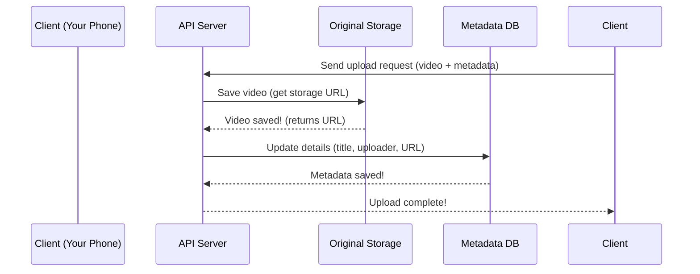

# Chapter 4: Metadata Database

In the last chapter, we learned about **Original Storage**—the digital vault where your videos are first saved. But wait—how does YouTube remember *what* your video is called, who uploaded it, or how big it is? That’s where the **Metadata Database** comes in! Think of it as YouTube’s "digital notebook" that keeps track of all the details about your videos—without holding the actual videos themselves.


## What Is a Metadata Database?

Imagine a library: the books are the videos (stored in Original Storage), and the library catalog is the Metadata Database. The catalog tells you the book’s title, author, and where to find it—just like the database tells YouTube the video’s title, uploader, and where the video is stored.  

Metadata is just a fancy word for "details" about something. For a video, that includes:  
- **Title**: What the video is called (e.g., "My Cat’s Fun Day").  
- **Uploader**: Who uploaded it (e.g., "catlover123").  
- **Size**: How big the video file is (e.g., 500 MB).  
- **Upload Date**: When you uploaded it (e.g., 2024-05-20).  
- **Storage URL**: Where the video is saved in Original Storage (e.g., `s3://original/123.mp4`).  


## Why Do We Need a Separate Database?

Storing videos (big files) and metadata (small text) in the same place would be slow and inefficient. Like keeping a book and its catalog card in the same box—hard to find the card quickly! The Metadata Database lets YouTube:  
- **Find videos fast**: Search for "cat videos" by looking at titles/descriptions, not the actual videos.  
- **Keep things organized**: Separate the "what" (metadata) from the "where" (storage).  
- **Update details easily**: Change a video’s title without touching the video file itself.  


## A Simple Use Case: Uploading a Video

Let’s say you upload a video called "My Cat’s Adventure.mp4" with the title "My Cat’s Fun Day" and your username "catlover123". Here’s what the Metadata Database does:  

1. **You upload the video**: Your phone sends the video to Original Storage (Chapter 3) using a Pre-Signed URL (Chapter 2).  
2. **Original Storage saves it**: It gives back a storage URL (e.g., `s3://original/123.mp4`).  
3. **API Server updates metadata**: The API Server (Chapter 1) takes the video’s title, uploader, and storage URL, then saves them to the Metadata Database.  
4. **You see the video in your library**: YouTube uses the database to show your video with the correct title and uploader.  


## How to Use the Metadata Database (Simple Example)

Let’s look at a tiny code snippet of how the API Server might update the database when you upload a video:

```python
# server.py (simplified)
def update_metadata(video_id, title, uploader):
    # 1. Get the storage URL from Original Storage (Chapter 3)
    storage_url = original_storage.get_url(video_id)  # Returns "s3://original/123.mp4"
    
    # 2. Save the video’s details to the Metadata Database
    db.save(video_id, {
        "title": title,
        "uploader": uploader,
        "size": "500 MB",  # From Original Storage
        "upload_date": "2024-05-20",
        "storage_url": storage_url
    })
    
    # 3. Tell the client it worked!
    return "Metadata updated!"
```

### What’s This Code Doing?
- **Step 1**: It asks Original Storage for the video’s storage URL (where the video is saved).  
- **Step 2**: It saves all the video’s details (title, uploader, size, etc.) to the Metadata Database.  
- **Step 3**: It sends a success message back to your phone.  


## What Happens Under the Hood?

When you upload a video, here’s the step-by-step flow (visualized with a sequence diagram):



### Breakdown:
1. **Client sends a request**: Your phone tells the API Server, "I’m uploading a video!"  
2. **API Server saves to Original Storage**: The server asks Original Storage to save the video and gets a storage URL.  
3. **API Server updates the database**: The server records the video’s title, uploader, and storage URL in the Metadata Database.  
4. **Client gets a response**: The server tells your phone, "Upload done!"  


## Why the Metadata Database Matters

Without the Metadata Database:  
- YouTube couldn’t show your video’s title or uploader.  
- Searching for videos would be impossible (you’d have to check every video file!).  
- Updating a video’s details (like changing the title) would be slow and risky.  

It’s the "brain" that remembers all the important stuff about your videos—so YouTube can find and display them easily.


## Next Steps

In this chapter, we learned that the Metadata Database is like a library catalog for YouTube—it stores all the details about your videos so YouTube can find and display them. In the next chapter, we’ll explore **Video Transcoding**—how YouTube turns your original video into different formats for different devices (like phones, TVs, or computers).  

[Next Chapter: Video Transcoding](05_video_transcoding_.md)

---

Generated by [AI Codebase Knowledge Builder](https://github.com/The-Pocket/Tutorial-Codebase-Knowledge)