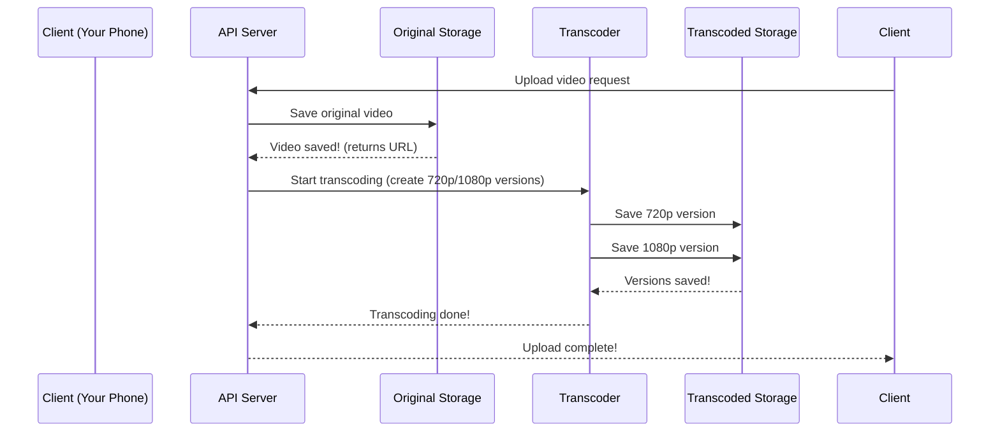

# Chapter 5: Video Transcoding

In the previous chapter, we learned about the **Metadata Database**—YouTube’s "digital notebook" that stores details about your videos. But wait—how does YouTube make your video play on your phone, your TV, or your computer? That’s where **Video Transcoding** comes in! Think of it as a "video translator" that turns your original video into different versions so it works on any device—just like translating a book into multiple languages for different readers.


## What Problem Does Video Transcoding Solve?

Imagine you upload a video from your phone (which records in a specific format) and try to watch it on your smart TV. The TV might not understand the phone’s format, so the video won’t play! Transcoding solves this by:  
- **Creating multiple versions**: One for phones, one for TVs, one for computers.  
- **Optimizing for each device**: Smaller files for phones (to save data), higher quality for TVs (to look good on big screens).  
- **Ensuring compatibility**: Making sure your video plays everywhere, no matter the device.  

Without transcoding, your video might only work on the device you uploaded it from—no fun for your friends watching on their TVs!


## What Is Video Transcoding?

Transcoding is the process of converting a video from one format (or resolution) to another. For example:  
- **Original video**: "My Cat’s Adventure.mp4" (1080p, 30 MB).  
- **Transcoded versions**:  
  - "My Cat’s Adventure_720p.mp4" (for phones, smaller file).  
  - "My Cat’s Adventure_1080p.mp4" (for TVs, same as original).  
  - "My Cat’s Adventure_480p.mp4" (for slow internet, tiny file).  

It’s like taking a single photo and resizing it for a phone wallpaper, a poster, and a thumbnail—all from the same original image!


## A Simple Use Case: Uploading a Video

Let’s say you upload "My Cat’s Adventure.mp4" to YouTube. Here’s what happens with transcoding:  

1. **You upload the video**: Your phone sends the video to Original Storage (Chapter 3) using a Pre-Signed URL (Chapter 2).  
2. **Metadata is saved**: The Metadata Database (Chapter 4) records the video’s title, uploader, and storage URL.  
3. **Transcoding starts**: A special system (the "transcoder") takes your original video and creates multiple versions.  
4. **Versions are saved**: The transcoded videos are stored in a new place (Transcoded Storage, Chapter 9).  
5. **You can watch it anywhere**: When you watch the video on your phone, YouTube serves the 720p version; on your TV, it serves the 1080p version.  


## Key Concepts: Formats and Resolutions

### 1. **Formats**  
Videos have different "formats" (like languages for books). Common formats include MP4, AVI, and MOV. Transcoding converts between these so devices can understand them.  

### 2. **Resolutions**  
Resolution is how clear the video is (like font size in a book). Higher resolution (e.g., 1080p) looks better on big screens, but uses more data. Lower resolution (e.g., 480p) is smaller and works on slow internet.  

### 3. **Codecs**  
Codecs are like "translators" for videos. They compress (make smaller) or decompress (make bigger) videos. Examples: H.264, VP9. Transcoding uses codecs to change formats/resolutions.  


## How Transcoding Works: A Step-by-Step Example

Let’s walk through transcoding "My Cat’s Adventure.mp4" into a 720p version:  

1. **Original video is loaded**: The transcoder gets the video from Original Storage (Chapter 3).  
2. **Resolution is changed**: The transcoder shrinks the video from 1080p to 720p (like resizing a photo).  
3. **Format is adjusted**: The transcoder converts the video to a format your phone can play (e.g., MP4).  
4. **New video is saved**: The 720p version is stored in Transcoded Storage (Chapter 9).  


## Internal Implementation: What Happens Under the Hood?

When you upload a video, here’s the step-by-step flow (visualized with a sequence diagram):



### What’s Happening Here?
1. **Client uploads the video**: Your phone sends the video to the API Server.  
2. **Original Storage saves it**: The server asks Original Storage to save the video (Chapter 3).  
3. **Transcoder starts working**: The server tells the transcoder to create multiple versions.  
4. **Transcoded Storage saves versions**: The transcoder sends the new videos to Transcoded Storage (Chapter 9).  
5. **Client gets a response**: The server tells your phone, "Upload done!"  


## How to Use Transcoding (Simple Code Example)

Here’s a tiny snippet of how the transcoder might process a video (simplified):

```python
# transcoder.py (simplified)
def transcode_video(original_url, resolutions):
    # 1. Load the original video from Original Storage
    original_video = load_from_storage(original_url)  # From Chapter 3
    
    # 2. Create versions for each resolution
    for res in resolutions:
        new_video = change_resolution(original_video, res)  # e.g., 720p
        save_to_transcoded_storage(new_video)  # To Chapter 9
    
    # 3. Tell the API Server it’s done
    return "Transcoding complete!"
```

### What’s This Code Doing?
- **Step 1**: It loads the original video from Original Storage (Chapter 3).  
- **Step 2**: It creates a new version for each resolution (e.g., 720p, 1080p) and saves them to Transcoded Storage (Chapter 9).  
- **Step 3**: It sends a success message back to the API Server.  


## Why Transcoding Matters

Without transcoding:  
- Your video might not play on your TV or phone.  
- YouTube would use huge amounts of storage (no smaller versions).  
- Streaming would be slow (big files take longer to load).  

Transcoding makes YouTube work for everyone—no matter their device or internet speed!


## Next Steps

In this chapter, we learned how Video Transcoding turns your original video into multiple versions for different devices. In the next chapter, we’ll explore the **DAG (Directed Acyclic Graph) Model**—a smart way to organize transcoding tasks so they run efficiently.  

[Next Chapter: DAG (Directed Acyclic Graph) Model](06_dag__directed_acyclic_graph__model_.md)

---

Generated by [AI Codebase Knowledge Builder](https://github.com/The-Pocket/Tutorial-Codebase-Knowledge)