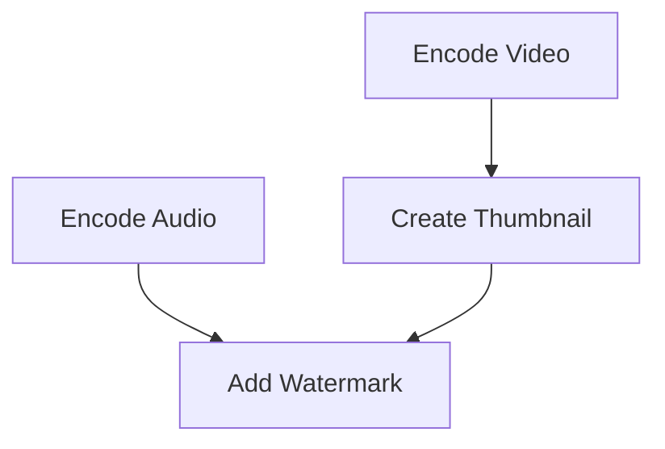
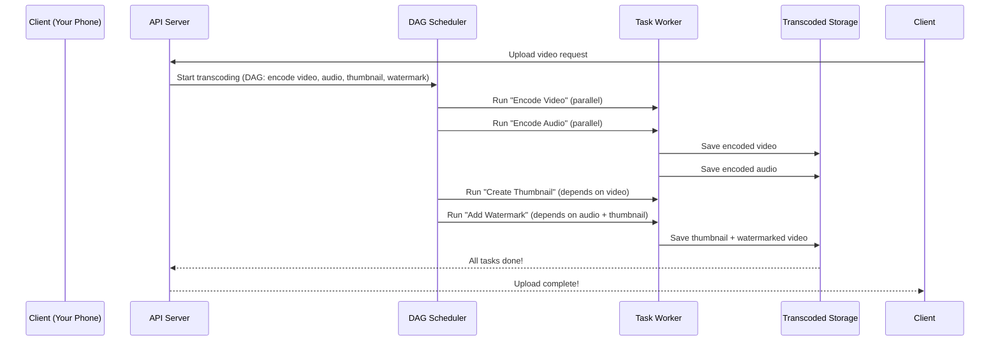

# Chapter 6: DAG (Directed Acyclic Graph) Model

In the previous chapter, we learned about **Video Transcoding**—how YouTube turns your original video into different versions for phones, TVs, and computers. But transcoding is complex! It involves multiple steps like encoding, creating thumbnails, and adding watermarks. How do we organize these steps so they run efficiently? That’s where the **DAG (Directed Acyclic Graph) Model** comes in! Think of it as a "recipe" for video processing that tells us which steps must be done in order (like boiling water before adding pasta) and which can be done at the same time (like chopping veggies while water boils).


## What Problem Does the DAG Model Solve?

Imagine you’re making a big meal: you need to boil water, chop veggies, cook pasta, and make a sauce. If you do everything in the wrong order (like adding pasta before boiling water), the meal fails! The DAG model solves this by:  
- **Defining dependencies**: Which steps must come first (e.g., "boil water" before "add pasta").  
- **Allowing parallelism**: Which steps can run at the same time (e.g., "chop veggies" while "boil water").  

For video transcoding, this means:  
- **Sequential tasks**: You can’t create a thumbnail until the video is encoded.  
- **Parallel tasks**: You can encode the video and audio at the same time (they don’t depend on each other).  

Without the DAG model, transcoding would be slow and chaotic—like trying to cook a meal without a recipe!


## What Is a DAG?

A DAG is a graph (like a flowchart) with:  
- **Nodes**: Tasks (e.g., "encode video", "create thumbnail").  
- **Edges**: Dependencies (which task must come before another).  

The "acyclic" part means there are no loops—you can’t have a task that depends on itself (like "boil water before boiling water" doesn’t make sense!).  

Think of it as a **recipe flowchart**:  
- Node 1: Boil water (must be done first).  
- Node 2: Chop veggies (can be done while water boils).  
- Node 3: Add pasta (depends on Node 1).  
- Node 4: Make sauce (depends on Node 2).  


## A Simple Use Case: Transcoding a Video

Let’s say you upload "My Cat’s Adventure.mp4" and YouTube needs to:  
1. Encode the video to 720p.  
2. Encode the audio to a compatible format.  
3. Create a thumbnail (small preview image).  
4. Add a watermark (YouTube’s logo).  

Here’s how the DAG model organizes these tasks:  

- **Sequential tasks**: You can’t create a thumbnail (Node 3) until the video is encoded (Node 1).  
- **Parallel tasks**: You can encode the video (Node 1) and audio (Node 2) at the same time—they don’t depend on each other.  


## Visualizing the DAG: A Simple Example

Let’s draw this as a DAG:



### What’s Happening Here?
- **Node A (Encode Video)**: Must be done first.  
- **Node B (Encode Audio)**: Can run at the same time as Node A.  
- **Node C (Create Thumbnail)**: Depends on Node A (needs the encoded video).  
- **Node D (Add Watermark)**: Depends on Nodes B and C (needs both audio and thumbnail).  


## How the DAG Model Works in Practice

When you upload a video, the DAG model:  
1. **Defines the workflow**: The API Server (Chapter 1) tells the transcoder which tasks to run (e.g., "encode video, audio, thumbnail, watermark").  
2. **Schedules tasks**: The DAG Scheduler (Chapter 7) figures out which tasks can run in parallel and which must wait.  
3. **Runs tasks**: Task Workers (Chapter 8) execute each task (e.g., a worker encodes the video, another creates the thumbnail).  


## Internal Implementation: Step-by-Step Flow

Let’s walk through what happens when you upload "My Cat’s Adventure.mp4":



### What’s Happening Here?
1. **Client uploads the video**: Your phone sends the video to the API Server.  
2. **API Server triggers transcoding**: The server tells the DAG Scheduler to start processing.  
3. **DAG Scheduler runs parallel tasks**: It tells two Task Workers to encode the video and audio at the same time.  
4. **Task Workers save results**: The workers send the encoded video/audio to Transcoded Storage (Chapter 9).  
5. **DAG Scheduler runs sequential tasks**: It tells another worker to create a thumbnail (needs the encoded video) and add a watermark (needs audio + thumbnail).  
6. **Client gets a response**: The server tells your phone, "Upload done!"  


## How to Use the DAG Model (Simple Code Example)

Here’s a tiny snippet of how the DAG Scheduler might define tasks (simplified):

```python
# dag_scheduler.py (simplified)
def create_dag():
    # 1. Define tasks (nodes)
    tasks = {
        "encode_video": {"depends_on": []},  # No dependencies
        "encode_audio": {"depends_on": []},  # No dependencies
        "create_thumbnail": {"depends_on": ["encode_video"]},  # Depends on video
        "add_watermark": {"depends_on": ["encode_audio", "create_thumbnail"]}  # Depends on audio + thumbnail
    }
    return tasks
```

### What’s This Code Doing?
- **Step 1**: It defines four tasks (encode video, audio, thumbnail, watermark).  
- **Step 2**: It sets dependencies:  
  - "create_thumbnail" can’t run until "encode_video" is done.  
  - "add_watermark" can’t run until "encode_audio" and "create_thumbnail" are done.  


## Why the DAG Model Matters

The DAG model is critical for YouTube because:  
- **It organizes complex workflows**: Transcoding has many steps—DAGs make sure they run in the right order.  
- **It enables parallelism**: Running tasks at the same time speeds up processing (like chopping veggies while boiling water).  
- **It’s scalable**: DAGs can handle thousands of videos at once by splitting tasks into parallel workers.  


## Next Steps

In this chapter, we learned how the DAG model organizes video transcoding tasks like a recipe—defining which steps must be done in order and which can run at the same time. In the next chapter, we’ll explore the **Resource Manager**—the "traffic cop" that assigns tasks to workers efficiently.  

[Next Chapter: Resource Manager](07_resource_manager_.md)

---

Generated by [AI Codebase Knowledge Builder](https://github.com/The-Pocket/Tutorial-Codebase-Knowledge)