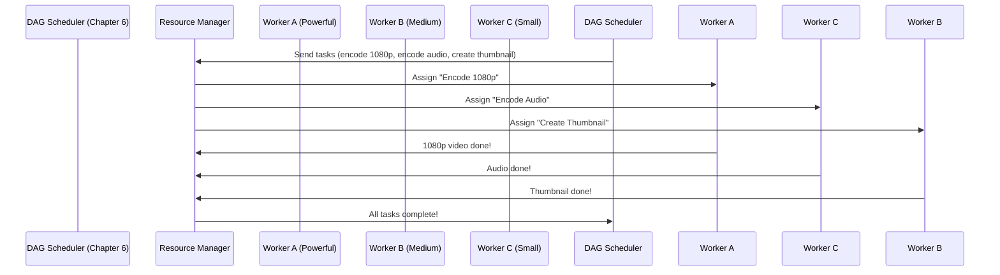

# Chapter 7: Resource Manager

In the previous chapter, we learned about the **DAG (Directed Acyclic Graph) Model**—a recipe that organizes video transcoding tasks like boiling water before adding pasta. But who "cooks" these tasks? That’s where the **Resource Manager** comes in! Think of it as the restaurant manager who assigns cooks to different orders based on order complexity and cook expertise—ensuring the kitchen runs smoothly and efficiently.


## What Problem Does the Resource Manager Solve?

Imagine a busy kitchen: if every cook tries to do every task (chop veggies, boil water, cook pasta) at the same time, chaos ensues! The Resource Manager solves this by:  
- **Assigning tasks to workers**: Telling each worker (like a cook) which task to do.  
- **Optimizing efficiency**: Making sure complex tasks go to experienced workers, and simple tasks go to others.  
- **Preventing overload**: Not letting one worker handle too many tasks at once.  

For YouTube, this means:  
- **Efficient transcoding**: Transcoding a 4K video (complex) goes to a powerful worker, while a 480p video (simple) goes to a smaller worker.  
- **Faster processing**: Tasks run in parallel without wasting resources.  


## What Is the Resource Manager?

The Resource Manager is the "traffic cop" of YouTube’s transcoding system. It:  
1. **Tracks workers**: Knows which workers are available (like a manager knowing which cooks are free).  
2. **Assigns tasks**: Takes tasks from the DAG (Chapter 6) and gives them to workers.  
3. **Optimizes load**: Makes sure no worker is overworked (like a manager balancing orders).  


## A Simple Use Case: Transcoding "My Cat’s Adventure.mp4"

Let’s say you upload "My Cat’s Adventure.mp4" and the DAG (Chapter 6) defines these tasks:  
- **Task 1**: Encode video to 1080p (complex).  
- **Task 2**: Encode audio to MP3 (simple).  
- **Task 3**: Create a thumbnail (medium complexity).  

Here’s how the Resource Manager handles this:  

1. **DAG sends tasks**: The DAG Scheduler (Chapter 6) sends these tasks to the Resource Manager.  
2. **Resource Manager checks workers**: It looks at its list of available workers (e.g., Worker A: powerful, Worker B: medium, Worker C: small).  
3. **Assigns tasks**:  
   - Task 1 (1080p encoding) goes to Worker A (powerful).  
   - Task 2 (audio encoding) goes to Worker C (small, since it’s simple).  
   - Task 3 (thumbnail) goes to Worker B (medium).  
4. **Workers execute tasks**: Each worker does its job and sends the result back.  


## Visualizing the Flow: A Simple Diagram

Let’s draw this as a sequence diagram to see how it works:



### What’s Happening Here?
1. **DAG sends tasks**: The DAG Scheduler tells the Resource Manager which tasks to run.  
2. **Resource Manager assigns tasks**: It picks the right worker for each task (powerful for complex, small for simple).  
3. **Workers do their jobs**: Each worker executes its task and reports back.  
4. **Resource Manager confirms completion**: It tells the DAG Scheduler all tasks are done.  


## How to Use the Resource Manager (Simple Code Example)

Here’s a tiny snippet of how the Resource Manager might assign tasks (simplified):

```python
# resource_manager.py (simplified)
def assign_tasks(tasks, workers):
    # 1. Sort tasks by complexity (e.g., 1080p > thumbnail > audio)
    sorted_tasks = sorted(tasks, key=lambda t: t.complexity, reverse=True)
    
    # 2. Assign each task to the best worker
    for task in sorted_tasks:
        # Find the worker with the right skill (e.g., powerful for 1080p)
        worker = find_best_worker(task, workers)
        worker.assign(task)
    
    return "Tasks assigned!"
```

### What’s This Code Doing?
- **Step 1**: It sorts tasks from most complex to least (like a manager prioritizing big orders).  
- **Step 2**: It finds the best worker for each task (e.g., powerful worker for 1080p) and assigns the task.  


## Internal Implementation: What Happens Under the Hood?

When the Resource Manager gets tasks from the DAG, here’s the step-by-step flow:  

1. **Receive tasks**: The DAG Scheduler sends a list of tasks (e.g., encode video, audio, thumbnail).  
2. **Check worker availability**: The Resource Manager looks at its worker pool (Chapter 8) to see who’s free.  
3. **Match tasks to workers**: It uses a "skill matrix" (e.g., Worker A can do 1080p, Worker C can do audio).  
4. **Send tasks to workers**: It tells each worker which task to run.  
5. **Track progress**: It waits for workers to finish and reports back to the DAG.  


## Why the Resource Manager Matters

The Resource Manager is critical for YouTube because:  
- **It speeds up transcoding**: By assigning tasks to the right workers, it reduces wait times.  
- **It saves resources**: No worker is overworked, so YouTube doesn’t waste money on unused servers.  
- **It scales**: As more videos are uploaded, the Resource Manager can add more workers (like hiring more cooks during a busy dinner rush).  


## Next Steps

In this chapter, we learned how the Resource Manager acts as the "traffic cop" for transcoding tasks—assigning them to workers efficiently. In the next chapter, we’ll explore **Task Workers**—the "cooks" who actually do the transcoding work!  

[Next Chapter: Task Workers](08_task_workers_.md)

---

Generated by [AI Codebase Knowledge Builder](https://github.com/The-Pocket/Tutorial-Codebase-Knowledge)