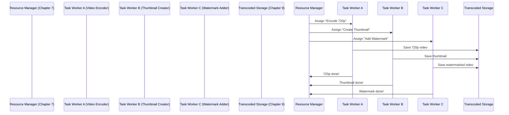

# Chapter 8: Task Workers

In the previous chapter, we learned about the **Resource Manager**—the "traffic cop" that assigns transcoding tasks to workers efficiently. But who actually *does* the work? That’s where **Task Workers** come in! Think of them as the "specialized chefs" in YouTube’s kitchen—each one focuses on a specific task, like encoding a video or creating a thumbnail, and they work together to get your video ready for streaming.


## What Problem Do Task Workers Solve?

Imagine a kitchen where every chef tries to do every job (chop veggies, boil water, cook pasta) at the same time. Chaos! Task Workers solve this by:  
- **Specializing in one task**: One worker encodes videos, another creates thumbnails, another adds watermarks.  
- **Working in parallel**: Multiple workers can run at the same time, speeding up processing.  
- **Being independent**: If one worker is busy, others can still work—no bottlenecks!  

For YouTube, this means:  
- **Faster transcoding**: Your video gets processed quickly because tasks are split between workers.  
- **Scalability**: As more videos are uploaded, YouTube can add more workers (like hiring more chefs during a busy dinner rush).  


## What Are Task Workers?

Task Workers are individual programs (or "workers") that execute specific tasks from the DAG (Chapter 6) assigned by the Resource Manager (Chapter 7). They’re like:  
- **Video Encoder**: Converts your original video into 720p, 1080p, or other formats.  
- **Thumbnail Creator**: Makes a small preview image of your video.  
- **Watermark Adder**: Puts YouTube’s logo on your video.  

Each worker is good at one thing—just like a chef who’s an expert at making sauces, not baking bread!


## A Simple Use Case: Transcoding "My Cat’s Adventure.mp4"

Let’s say you upload "My Cat’s Adventure.mp4" and the Resource Manager (Chapter 7) assigns these tasks:  
1. **Encode video to 720p** (Task Worker A).  
2. **Create a thumbnail** (Task Worker B).  
3. **Add a watermark** (Task Worker C).  

Here’s how Task Workers handle this:  

1. **Resource Manager sends tasks**: The Resource Manager tells each worker which task to do.  
2. **Workers do their jobs**:  
   - Task Worker A encodes the video to 720p.  
   - Task Worker B creates a thumbnail from the original video.  
   - Task Worker C adds a watermark to the encoded video.  
3. **Workers send results back**: Each worker saves their output to Transcoded Storage (Chapter 9) and tells the Resource Manager they’re done.  


## How Task Workers Work: A Step-by-Step Example

Let’s visualize this with a sequence diagram to see how Task Workers fit into the bigger picture:



### What’s Happening Here?
1. **Resource Manager assigns tasks**: It tells each worker which job to do (like a manager assigning orders to chefs).  
2. **Workers execute tasks**: Each worker does its specific job (encoding, thumbnail, watermark).  
3. **Workers save results**: They send their output to Transcoded Storage (Chapter 9) so it can be streamed later.  
4. **Workers report back**: They tell the Resource Manager they’re done, so the manager knows the task is complete.  


## How to Use Task Workers (Simple Code Example)

Here’s a tiny snippet of how a Task Worker might process a task (simplified):

```python
# task_worker.py (simplified)
def process_task(task):
    # 1. Check what task to do (e.g., "encode_video", "create_thumbnail")
    if task.type == "encode_video":
        encoded_video = encode_video(task.original_video)  # From Chapter 5
        save_to_transcoded_storage(encoded_video)  # To Chapter 9
    elif task.type == "create_thumbnail":
        thumbnail = create_thumbnail(task.original_video)
        save_to_transcoded_storage(thumbnail)
    return "Task done!"
```

### What’s This Code Doing?
- **Step 1**: It checks what kind of task it’s been given (e.g., encode video or create thumbnail).  
- **Step 2**: It does the specific task (like encoding the video or making a thumbnail).  
- **Step 3**: It saves the result to Transcoded Storage (Chapter 9) so YouTube can use it later.  


## Why Task Workers Matter

Task Workers are critical for YouTube because:  
- **They speed up processing**: By splitting tasks between specialized workers, transcoding happens faster.  
- **They’re scalable**: YouTube can add more workers as more videos are uploaded—no limits!  
- **They’re efficient**: Each worker focuses on one task, so they do it well (like a chef who’s an expert at making sauces).  


## Next Steps

In this chapter, we learned that Task Workers are the "specialized chefs" that execute transcoding tasks assigned by the Resource Manager. In the next chapter, we’ll explore **Transcoded Storage**—the place where all your video’s versions (720p, 1080p, thumbnails) are stored so they can be streamed to your device.  

[Next Chapter: Transcoded Storage](09_transcoded_storage_.md)

---

Generated by [AI Codebase Knowledge Builder](https://github.com/The-Pocket/Tutorial-Codebase-Knowledge)