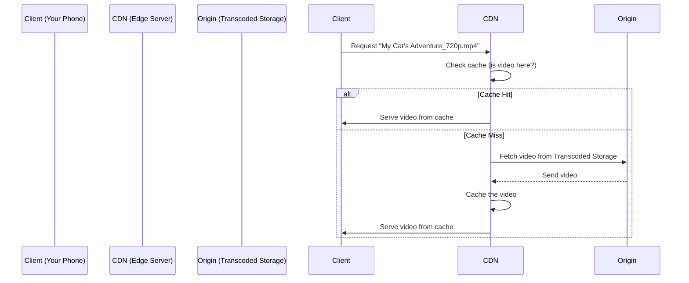
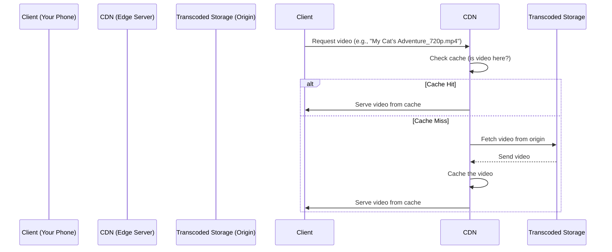

# Chapter 10: Content Delivery Network (CDN)

In the previous chapter, we learned about **Transcoded Storage**—the digital pantry where YouTube stores all the processed versions of your videos (like 720p, 1080p, and thumbnails). But wait—how does YouTube get these videos to you *fast* when you’re watching them on your phone or TV? That’s where the **Content Delivery Network (CDN)** comes in! Think of it as YouTube’s "neighborhood delivery service"—it takes videos from the central pantry (Transcoded Storage) and puts them in local stores (edge servers) so you can get them quickly, no matter where you are.


## What Problem Does a CDN Solve?

Imagine you’re ordering a pizza from a restaurant across town. If the restaurant has to deliver it directly to your house, it takes forever—especially if you live far away! A CDN solves this by:  
- **Caching videos locally**: Storing copies of popular videos in servers close to you (like a local pizza shop).  
- **Reducing latency**: You get your video faster because it doesn’t have to travel across the country.  
- **Handling traffic spikes**: If millions of people watch the same video, the CDN serves it from local servers instead of overwhelming the central pantry (Transcoded Storage).  

Without a CDN, YouTube would be slow—like waiting an hour for a pizza from across town!


## What Is a CDN?

A CDN is a global network of servers that **caches** (stores) video content and delivers it to users from locations closest to them. It’s like having multiple neighborhood grocery stores instead of one central supermarket—you get your items faster from the store nearest to you.  

Key parts of a CDN:  
- **Origin Server**: The central pantry (Transcoded Storage, Chapter 9) where videos are originally stored.  
- **Edge Servers**: Local stores (servers) that cache copies of videos. When you request a video, the CDN checks if it’s in an edge server near you.  
- **Cache**: A temporary storage space on edge servers for popular videos.  


## A Simple Use Case: Watching "My Cat’s Adventure.mp4"

Let’s say you’re in New York and want to watch "My Cat’s Adventure.mp4" (a 720p version) on your phone. Here’s how the CDN makes it fast:  

1. **You request the video**: Your phone asks YouTube for the video.  
2. **CDN checks edge servers**: The CDN looks for the video in a server near New York.  
3. **Video is cached**: If the video is there, the CDN serves it to you instantly.  
4. **Video isn’t cached**: If not, the CDN fetches it from the origin (Transcoded Storage in, say, California) and caches it in the New York server for future users.  
5. **You watch the video**: The CDN streams the video to your phone—fast and smooth!  


## How Does a CDN Work? A Step-by-Step Example

Let’s break down the flow when you watch a video:  

1. **Client requests video**: Your phone sends a request to the CDN (e.g., "Give me 'My Cat’s Adventure_720p.mp4'").  
2. **CDN checks cache**: The CDN looks for the video in an edge server near you.  
3. **Cache hit**: If the video is there, the CDN serves it to you.  
4. **Cache miss**: If not, the CDN fetches the video from the origin (Transcoded Storage) and caches it in the edge server.  
5. **Serve the video**: The CDN streams the video to your phone.  


## Visualizing the Flow: A Simple Diagram

Let’s draw this as a sequence diagram to see how it works:



### What’s Happening Here?
- **Client asks for a video**: Your phone tells the CDN, "I want to watch this video!"  
- **CDN checks its cache**: It looks for the video in a local server.  
- **Cache hit**: If the video is there, it serves it instantly.  
- **Cache miss**: If not, it gets the video from the origin (Transcoded Storage) and caches it for next time.  


## Why CDNs Matter for YouTube

CDNs are critical because:  
- **They make streaming fast**: You don’t have to wait for videos to load from far away.  
- **They reduce load on the origin**: Transcoded Storage (Chapter 9) doesn’t get overwhelmed by millions of requests.  
- **They handle traffic spikes**: If a video goes viral, the CDN serves it from local servers instead of crashing the origin.  


## How to Use a CDN (Simple Code Example)

Here’s a tiny snippet of how a CDN might handle a video request (simplified):

```python
# cdn_server.py (simplified)
def serve_video(video_id, resolution):
    # 1. Check if the video is in the cache (edge server)
    if cache.has(video_id, resolution):
        return cache.get(video_id, resolution)  # Serve from cache
    
    # 2. If not, fetch from the origin (Transcoded Storage)
    video = origin.fetch(video_id, resolution)  # From Chapter 9
    
    # 3. Cache the video for next time
    cache.save(video_id, resolution, video)
    
    # 4. Serve the video to the client
    return video
```

### What’s This Code Doing?
- **Step 1**: It checks if the video is in the CDN’s cache (local server).  
- **Step 2**: If not, it gets the video from the origin (Transcoded Storage, Chapter 9).  
- **Step 3**: It saves the video in the cache so next time it’s faster.  
- **Step 4**: It sends the video to your phone.  


## Internal Implementation: What Happens Under the Hood?

When you request a video, here’s the step-by-step flow (visualized with a sequence diagram):



### What’s Happening Here?
1. **Client asks for a video**: Your phone tells the CDN, "I want to watch this video!"  
2. **CDN checks its cache**: It looks for the video in a local server.  
3. **Cache hit**: If the video is there, it serves it instantly.  
4. **Cache miss**: If not, it gets the video from Transcoded Storage (Chapter 9) and caches it.  
5. **Serve the video**: The CDN streams the video to your phone.  


## Why CDNs Are Essential for YouTube

Without CDNs:  
- YouTube would be slow—videos would take minutes to load, even on fast internet.  
- Transcoded Storage (Chapter 9) would crash from too many requests (like a central supermarket running out of pizza dough).  
- Viral videos would cause outages (like a pizza shop getting 1,000 orders at once and not being able to handle it).  

CDNs make YouTube work for everyone—no matter where you are or how many people are watching the same video!


## Conclusion

In this chapter, we learned that a CDN is like YouTube’s neighborhood delivery service—it caches videos in local servers to make streaming fast and smooth. It’s the final piece of the puzzle that gets your video from the central pantry (Transcoded Storage) to your device in seconds.  

By now, you’ve learned how YouTube handles every step of the video journey: from uploading (API Servers, Chapter 1) to transcoding (Chapters 5-9) to delivering (CDN, Chapter 10). Each part works together to make YouTube the fast, reliable platform we know!  

Congratulations—you’ve completed the tutorial! Now you understand how YouTube works behind the scenes. Keep exploring, and happy streaming!

---

Generated by [AI Codebase Knowledge Builder](https://github.com/The-Pocket/Tutorial-Codebase-Knowledge)