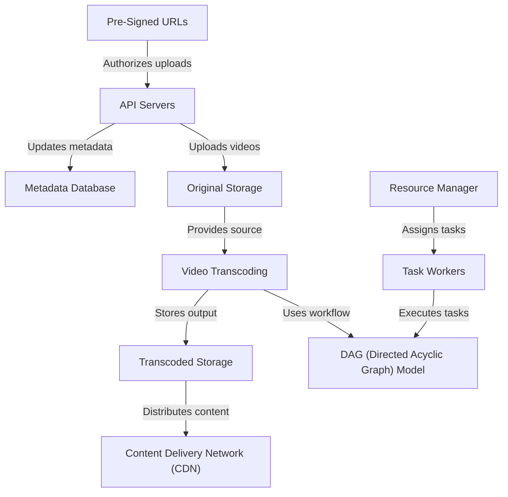

# Tutorial: youtube

This project designs a scalable video streaming system similar to YouTube. It handles **video uploads** from users, **transcodes** videos into multiple formats for different devices, and **streams** content efficiently using a global **Content Delivery Network (CDN)**. The system uses a **Metadata Database** to store video information, **Original Storage** for uploaded videos, and **Transcoded Storage** for processed versions. A **DAG Model** organizes transcoding tasks, while a **Resource Manager** assigns work to **Task Workers**. **Pre-Signed URLs** ensure secure uploads, and **API Servers** manage user interactions.

**Source Repository:** [None](None)

## Chapters

1. [API Servers
](01_api_servers_.md)
2. [Pre-Signed URLs
](02_pre_signed_urls_.md)
3. [Original Storage
](03_original_storage_.md)
4. [Metadata Database
](04_metadata_database_.md)
5. [Video Transcoding
](05_video_transcoding_.md)
6. [DAG (Directed Acyclic Graph) Model
](06_dag__directed_acyclic_graph__model_.md)
7. [Resource Manager
](07_resource_manager_.md)
8. [Task Workers
](08_task_workers_.md)
9. [Transcoded Storage
](09_transcoded_storage_.md)
10. [Content Delivery Network (CDN)
](10_content_delivery_network__cdn__.md)

---

Generated by [AI Codebase Knowledge Builder](https://github.com/The-Pocket/Tutorial-Codebase-Knowledge)